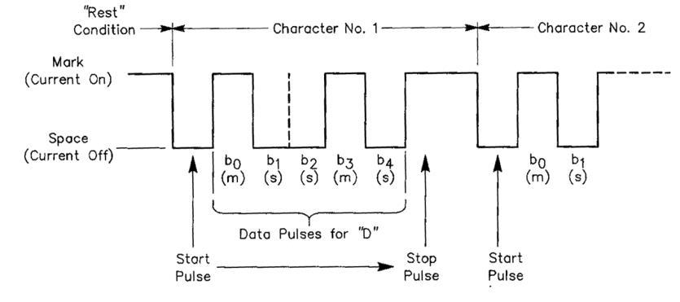
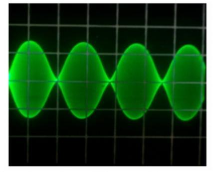
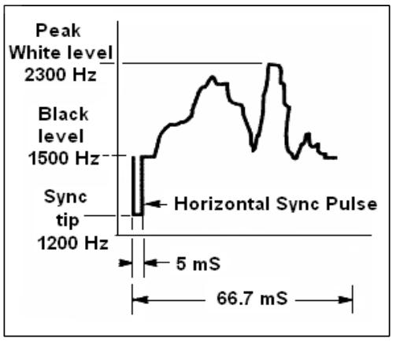

# Darbas radijo eteryje

## HAM kalba

- Radijo mėgėjai angliškai vienas kitą vadina - „**ham**“ - tai santrumpa, kurios etimologija nėra aiški iki šiol. Lietuviškai neformalioje kalboje radijo mėgėjai vienas kitą vadina „hamu“ (hamais - dgsk.).
- Būdami radijo mėgėjais mes vienas į kitą visada kreipiamės vardu (ar slapyvardžiu), niekada nenaudojame _pone_ ar _panele_, nesikreipiame pavarde. Tarp _hamų_ tai taip pat yra priimtina ir bendraujant raštu.
- Radijo mėgėjų etiketas teigia, kad mes atsisveikindami raštu naudojame `73` (bet ne `geriausių 73` ar `didžiausias 73`), taip pat nerašome formalių išsireiškimų, tokių kaip _pagarbiai_.
- Jeigu anksčiau esate dirbęs CB radijo eteryje, nebenaudokite CB kalbos subtilybių ir vietoj jų išmokite mėgėjiško radijo kalbą. Iš Jūsų, kaip iš radijo mėgėjų bendruomenės nario, tikimasi, kad žinote dažnus mėgėjiško radijo posakius - jie Jums padės pritapti šioje bendruomenėje.
- Vykstant radijo pokalbiui tinkamai naudokite [Q kodus](/lt/q-code/) tačiau stenkitės neperlenkti lazdos naudodami šiuos kodus. Visada galite vietoje jų naudoti visiems suprantamus posakius. Tačiau, kai kurie Q kodai ilgainiui tapo natūraliu reiškiniu netgi balso pokalbiuose, pvz.:

|                   |                                            |
| ----------------- | ------------------------------------------ |
| **QRG**           | dažnis                                     |
| **QRM**           | žmogiškos kilmės trukdžiai                 |
| **QRN**           | atmosferos trukdžiai (statiniai išlydžiai) |
| **QRP**           | mažos galios stotis                        |
| **QRT**           | palieku eterį, baigiu ryšio seansą         |
| **QRV**           | esu pasiruošęs                             |
| **QRX**           | palaukite, atsitraukiu                     |
| **QRZ**           | kas mane kvietė?                           |
| **QSB**           | fedingas                                   |
| **QSL (kortelė)** | kortelė, kuri patvirtina ryšį              |
| **QSL**           | aš patvirtinu ryšį                         |
| **QSO**           | kontaktas                                  |
| **QSY**           | dažnio keitimas                            |
| **QTH**           | vieta, kurioje yra Jūsų radijo stotis      |

- Prie paprastai naudojamų Q kodų, balso pokalbiuose pritapo ir kelios [trumpos frazės, kurios kilo iš CW](#populiariausios-cw-santrumpos), tokios kaip 73, 88, OM (draugas, šnek. k. senis, angl. _old man_), YL (mergina, moteris, angl. _young lady_).
- Teisingai naudokite vieną ir vienintelę [tarptautinę fonetinę abėcėlę](/lt/phonetic-alphabet/). Griežtai venkite _išsigalvojimų_, kurie gali skambėti įdomiai ar juokingai Jūsų kalboje, tačiau tai nepadės korespondentui suprasti, ką norėjote pasakyti. Nenaudokite skirtingų fonetinių žodžių tame pačiame sakinyje.

:::danger Pavyzdys
`CQ from ON9UN, oscar november nine uniform november, ocean nancy nine united nations...`
:::

- Labiausiai mėgėjiškame radijo eteryje paplitusi kalba yra anglų. Jeigu norite susisiekti su stotimis visame pasaulyje, tai daugumą korespondentų pavyks „prisišaukti“ naudojant būtent šią kalbą. Savaime suprantama, kad du, abiems gerai žinoma kalba kalbantys radijo mėgėjai, puikiai susikalbės ir nenaudodami anglų kalbos.
- Naudojant Morzės kodą (CW), ryšį užmegzti galima nemokant nei vieno žodžio ta kalba, kuria kalba korespondentas.
- Šis hobis gali padėti mokantis ar praktikuojantis kalbas. Eteryje visuomet surasite korespondentų, kurie su malonumu padės ar patars jų gimtosios kalbos besimokančiam radijo mėgėjui.

## Klausykite

- Geras radijo mėgėjas darbą pradeda daug klausydamas.
- Klausantis galite daug išmokti, tačiau būkite atidus, nes ne viskas, ką išgirsite eteryje bus _tinkami pavyzdžiai_. Neabejotinai išgirsite daug netinkamai dirbančių korespondentų.
- Jeigu radijo eteryje esate aktyvus, būkite **geru pavyzdžiu** ir naudokitės šiame dokumente pateiktomis rekomendacijomis.

## Tinkamai naudokite savo šaukinį

- Vietoje **_pilno šaukinio_** ar **_šaukinio raidžių_**, radijo mėgėjai dažnai naudoja sutrumpintą
  **_šaukinį_**.
- Eteryje visada prisistatykite **pilnu šaukiniu**, ne vien tik sufiksu. Perdavinėti šaukinio dalį yra nelegalu.
- Perdavimo pradžioje **niekada nenaudokite** savo ar korespondento vardo (pvz.: `labas Jonai, čia Petras...`).
- Pokalbio metu karts nuo karto prisistatykite, nes to reikalauja radijo mėgėjiško darbo reglamentas.

## Visada būkite džentelmenu

- Niekada nenaudokite įžeidimų, **išlikite mandagus, elkitės pagarbiai ir nuolaidžiai bet kokiais atvejais**.
- Džordžas Bernardas Šo rašė:

> „Nėra geresnio būdo ką nors pasiekti, negu mandagumas ir nesavanaudiškumas“.

## Darbas per retransliatorių

- Visų pirma, retransliatoriai skirti portabiliųjų ir mobiliųjų UTB radijo stočių ryšio atstumui padidinti.
- Naudokite paprastą ryšį (simplex) kai tik įmanoma. Ryšiui tarp dviejų stacionarių radijo stočių retransliatorių reikėtų naudoti tik išimtiniais atvejais.
- Jeigu norite kalbėti per retransliatorių tuo metu, kai juo jau naudojamasi, sulaukite pauzės tarp perdavimų, kad praneštumėte savo šaukinį.
- Naudokite tik išsireiškimą `break` ar dar geriau `break break break` skubiuose ar nepaprastose situacijose. Geriausia sakyti `break break break skubus pranešimas`.
- Tam, kad išvengti netyčinio _pridengimo_ (kai vienu metu transliuoja kelios stotys), naudojantys retransliatorių turėtų palaukti kol jo nešlys nutrūks ar bus ištransliuotas pyptelėjimas. Tokių pauzių metu gali įsiterpti naujos stotys, o retransliatorius iš naujo paleidžia laiko skaitiklį, kuris apsaugo nuo per ilgo darbo siuntimo režimu (_time-out_).
- Neužvaldykite retransliatoriaus! Retransliatoriai skirti ne tik Jums ir Jūsų draugams. Galbūt kiti irgi nori pasinaudoti retransliatoriumi, būkite malonus ir suteikite galimybę įsiterpti kitiems.
- Kalbėkite tik dalykiškai ir trumpai.
- Retransliatoriai nėra skirti informuoti XYL apie tai, kad Jūs jau grįžtate namo ir pietūs gali būti patiekti... Pokalbiai naudojant mėgėjišką radiją visų pirma turėtų būti susiję su radijo ryšių technologijomis.
- Nepertraukite kitų radijo mėgėjų pokalbio, nebent turite pridėti ką nors reikšmingo. Įsiterpti radijo eteryje yra taip pat nemandagu kaip ir bendraujant gyvai.
- Pokalbio pertraukimas neprisistatant yra netinkamas ir iš principo traktuojamas kaip nelegalus trikdys.
- Jeigu dažnai naudojate konkretų retransliatorių, rimtai apsvarstykite galimybę paremti tuos, kurie jį prižiūri ir išlaiko.

## Kaip užmegzti QSO?

- **QSO** yra ryšys tarp dviejų ar daugiau radijo mėgėjų.
- Norėdami užmegzti **QSO**, galite pasiųsti visuotinio kvietimo signalą (CQ), galite atsakyti į kieno nors CQ ar pakviesti ką nors, kas ką tik baigė ryšį su kita stotimi. Daugiau apie tai skaitykite kituose šios knygelės skyriuose.
- Kuris šaukinys Jūsų pokalbyje perduodamas pirmas? Teisingai skamba taip: `W1ZZZ from LY9ZZZ` (LY9ZZZ esi tu, o W1ZZZ yra pašnekovas kuriam adresuoji). Taigi, pirmiausia perduok šaukinį žmogaus, su kuriuo kalbi, o tik po to savo šaukinį.
- Kaip dažnai turėtumėte prisistatyti?

Daugumoje pasaulio valstybių egzistuoja tokia taisyklė: _siuntimo pradžioje, pabaigoje ir ne rečiau kaip kas 5 minutes ryšio arba radijo stoties bandymų eteryje metu._ Iš eilės einantys keli trumpi „klausau“ (_over_) laikomi kaip vienas perdavimas. Varžybų taisyklėse nėra griežto reikalavimo prisistatyti kiekvieno QSO metu. Ši 5 minučių taisyklė reikalinga tam, kad stotys, kontroliuojančios radijo eterį, galėtų lengviau atpažinti visus dirbančius. [Tačiau geriausia prisistatyti kiekvieno QSO metu](advanced-operating.md#teisine-atsakomybe)

- _Pauzė_ arba _tarpas_: kai Jūsų korespondentas baigia perdavimą ir perduoda mikrofoną Jums, geras įprotis yra palaukti sekundėlę prieš pradedant savo perdavimą. Galbūt kas nors kitas norės įsijungti į pokalbį ar pasinaudoti dažniu.
- Trumpas ar ilgas informacijos perdavimas?

Geriau kalbėti dažniau ir trumpiau, nes taip Jūsų korespondentas turės galimybę pakomentuoti tai, ką pasakėte.

## Apie ką kalbėti mėgėjiškame diapazone?

Temos, apie kurias kalbate, bendraujant mėgėjiško ryšio priemonėmis, visada turėtų būti susijusios su radijo mėgėjišku hobiu. Šis hobis _plačiąja prasme_ susijęs su **radijo ryšio technologijomis**. Mėgėjiško radijo mes neturėtumėme naudoti šios dienos pietums reikalingų produktų sąrašui perduoti.

Temos, kurios yra ypač netinkamos radijo mėgėjiškame eteryje:

- religija
- politika
- verslas (galima kalbėti apie savo profesiją, bet negalima reklamuoti savo verslo)
- žeminančios replikos nukreiptos į bet kokią grupę (etninę, religinę, rasinę, seksualinę ir t.t.)
- „tualeto” humoras: jeigu juokelio nepasakotumėte savo dešimties metų vaikui, nesakykite jo ir eteryje
- bet kokia tema, kuri neturi nieko bendro su radijo mėgėjišku hobiu.

## Ryšio užmezgimas balsu

### Kaip kviesti CQ?

Kartais, prieš transliavimą yra būtina suderinti siųstuvą (ar antenos tiunerį). Pirmiausia derinimas turėtų būti atliekamas antenos vietoje prijungiant idealią apkrovą. Jeigu reikia siųstuvą galutiniai suderinti, tai padaryti galima laisvame dažnyje sumažinus galią bei atsiklausus ar dažnis laisvas.

- Ką daryti iš pat pradžių?
  - Pasirinkite, kokį diapazoną naudoti tam, kad pasiektumėte norimą atstumą ir kryptį. MUF (_Maximum usable frequency_) grafikai yra publikuojami daugybėje tinklalapių ir gali padėti prognozuoti TB sklidimą.
  - Pasitikrinkite, kokią diapazono dalį galite naudoti darbui balsu. Patarimas: ant savo darbo stalo visada turėkite IARU diapazonų paskirstymo planą.
  - Prisiminkite, kad SSB perdavimui žemiau 10 MHz yra naudojama LSB (Lower Sideband) moduliacija, aukščiau 10 MHz – USB (Upper Sideband).
  - Taip pat, kai transliuojate USB, perduodamas SSB signalas pasiskirstys mažiausiai 3 kHz aukščiau nustatytojo dažnio. Naudojant LSB viskas bus atvirkščiai, Jūsų signalas pasiskirstys mažiausiai 3 kHz žemiau dažnio, kuris rodomas radijo stotyje. _Tai reiškia_: naudojant LSB niekada netransliuokite žemiau 1 843 kHz (1 840 kHz yra diapazono pradžia); niekada netransliuokite LSB žemiau 3 603 kHz, ar USB aukščiau kaip 14 347 kHz
- Ir tada?
  - Dabar esate pasiruošęs pradėti klausytis dažnio, kuriame norite dirbti.
  - Jeigu manote, jog dažnis neužimtas, paklauskite ar tikrai taip ir yra (`Ar dažnis yra naudojamas?`).
  - **Jeigu jau kurį laiką klausėtės tikrai neužimto dažnio, kodėl kartkartėmis dar turėtumėte paklausti ar dažnis yra naudojamas?** Dėl to, jog viena iš dviejų, vedančių QSO stočių Jums gali būti negirdima, bet taip pat transliuoti šiame dažnyje. Jei Jūs nieko negirdite, tai toji stotis irgi negirdi Jūsų, nes yra per toli tiesioginiam bangų sklidimui ir per arti jonosferinių atspindžių sklidimui. Aukštesniuose TB diapazonuose paprastai tai reiškia, jog stotis yra už kelių šimtų kilometrų nuo Jūsų. Jeigu paklausite, ar dažnis yra naudojamas, galbūt kitas Jums girdimas korespondentas atsakys. Jeigu pradėtumėte transliuoti neatsiklausę, tikriausiai sukeltumėte QRM mažiausiai vienai stočiai, esančiai tame pat dažnyje.
  - Jeigu dažnis užimtas, jo naudotojai, tikėtina, jog atsakys: `Taip` arba dar mandagiau: `Taip, ačiū, kad klausiate`. Tokiu atveju turėtumėte paieškoti kito laisvo dažno CQ perdavimui.
- O jeigu niekas neatsako?
  - Paklauskite dar kartą: `Ar dažnis yra naudojamas?`
- Ir jeigu vis tiek niekas neatsakys?

**Perduokite CQ:** `CQ from LY9ZZZ, LY9ZZZ calling CQ, lima yankee nine zulu zulu zulu calling CQ and listening`. Pačiame perdavimo gale galite sakyti: `... calling CQ and standing by`, vietoj `... and listening`. Taip pat galima sakyti: `... and standing by for any call`.

- Visada kalbėkite aiškiai ir raiškiai, visus žodžius tardami taisyklingai.
- Perduodami CQ, savo šaukinį pasakykite nuo **2 iki 4 kartų**.
- Naudokite tarptautinę fonetinę abėcėlę (savo šaukiniui pasakyti) vieną ar du kartus perduodami CQ.
- Geriau iš eilės perduoti kelis trumpus CQ, negu vieną ilgą.
- Neužbaikite CQ perdavimo žodžiu `over`, kaip pavyzdyje: `CQ CQ LY9ZZZ lima yankee one zulu zulu calling CQ and standing by. Over`. `Over` reiškia _perduodu Jums_ (`over to you`). Perduodamo CQ pabaigoje Jūs negalite perduoti mikrofono kitam, nes kontakto dar nėra.
- Niekada neužbaikite CQ sakydamas `QRZ`. `QRZ` reiškia _kas mane kvietė?_. Akivaizdu, kad niekas nekvietė Jūsų prieš Jums perduodant CQ. Visiškai neteisingas CQ perdavimo užbaigimas: `CQ 20 CQ 20 from LY9ZZZ lima yankee one zulu zulu calling CQ, LY9ZZZ calling CQ 20, QRZ` arba `... calling CQ 20 and standing by. QRZ`.
- Jeigu transliuojate CQ viename dažnyje, o priiminėti norite kitu dažniu, užbaikite **kiekvieną CQ** nurodydami savo klausymo dažnį, pvz.: `... listening 5 to 10 up` arba `... listening on 14295`. Pasakyti tiesiog `listening up` ar `up` nepakanka, nes nenurodote, kur klausysite. Toks QSO atlikimo metodas vadinamas _išskirtu dažniu_ (split frequency).
- Jeigu planuojate dirbti išskirtu dažniu, visada patikrinkite ar abu dažniai, kuriuose norite klausyti ir perduoti CQ yra laisvi.
<!-- TODO: Translate one point here -->

### Ką reiškia „CQ DX“?

- Jeigu norite susisiekti su _tolimosiomis_ stotimis, perduokite `CQ DX`.
- **Kas yra DX**
  - Trumpose bangose: stotys, kurios yra kituose kontinentuose ar šalyse, kuriose radijo mėgėjiška veikla labai apribota (pvz.: Mount Athos ar Maltos Ordinas).
  - Ultra trumpose bangose: stotys, kurios yra toliau negu 300 km.
- Perduodant CQ, galite primygtinai reikalauti, kad norite dirbti tik su DX stotimis: `CQ DX, outside Europe, this is...`.
- Visada būkite malonus, juk galbūt vietinė stotis, kviečianti Jus po Jūsų perduoto CQ DX, gali būti pradedančioji ir Jūs jai būsite _nauja šalis_. Kodėl gi neužmezgus greito QSO?

### Kviečiant konkrečią stotį

- Įsivaizduokime, kad norite pakviesti DL1ZZ, su kuriuo turite _sked‘ą_ (sutartą susitikimą). Štai kaip reikia perdavinėti: `DL1ZZ, DL1ZZ this is LY9ZZZ calling on sked and listening for you`.
- Jeigu, nepaisant Jūsų konkretaus kvietimo kas nors kitas kviečia Jus, išlikite mandagus. Perduokite jam signalo įvertinimą ir atsakykite `Sorry, I have a sked with DL1ZZ...`

### Kaip užmegzti QSO balsu?

- Tarkime, gavote atsakymą į CQ kvietimą, pvz.: `LY9ZZZ from W1ZZZ, whiskey one zulu zulu zulu is calling you and listening` arba `LY9ZZZ from W1ZZZ, whiskey one zulu zulu zulu over`.
  - Mes jau išsiaiškinome, [kodėl CQ pabaigoje negalima perduoti „over“](#kaip-kviesti-cq). Kai kas nors atsako į Jūsų CQ, kartu nori sulaukti ir atsakymo iš Jūsų, todėl dabar jau galima perduoti „over“ (reiškia „over to you“).
  - Jeigu kita stotis atsako į CQ kvietimą, pirmiausia turėtumėte patvirtinti jos šaukinį, ir tik po to galite perduoti informaciją apie jos signalą, savo vardą ir _QTH_ (vietovę): `W1ZZZ from LY9ZZZ (būkite atidus, išlaikykite tinkamą eiliškumą!), thanks for the call, I am receiving you very well, readability 5 and strenght 8 (imtuvo S-metro parodymas). My QTH is London and my name is John (jokių „mano asmeninis vardas“ („my personal name“) ar „mano pirmasis asmeninis“; nėra panašaus dalyko kaip asmeninis ar neasmeninis vardas). How do you copy me? W1ZZZ from LY9ZZZ. Over`.
- Jeigu kviečiate stotį, kuri perdavė CQ (ar QRZ), pakvieskite ją jos šaukinį perduodami ne daugiau nei kartą. Daugeliu atvejų geriausia jo neperdavinėti iš viso, radijo stoties operatorius ir taip žino savo šaukinį. [Varžybų metu](#kaip-dirbti-varzybose-telefonu) radijo stoties, kurią šaukiate šaukinys nėra perduodamas.
- Balso pokalbyje apsikeičiame RS signalo įvertinimu:
  - R yra suprantamumas (**R**eadability), S - signalo stiprumas (**S**trength).
- Mes jau minėjome, kad nereikėtų perdėtai vartoti Q kodų balso pokalbiuose, bet jeigu juos naudojate – naudokite tinkamai. Q**R**K reiškia suprantamumą ir tai yra tas pats, kas R RS signalo įvertinime. Q**S**A reiškia signalo stiprumą ir tai yra raidės S atitikmuo RS signalo įvertinime.
  - Vienas dalykas vis tik skiriasi: S įvertinimo diapazonas RS signalo įvertinime prasideda 1 ir baigiasi 9, tačiau QSA kode diapazonas prasideda 1 ir baigiasi tik 5
  - Taigi, nesakykite: `You‘re QSA 5 and QRK 9` (kaip kartais girdite), o jei norite naudoti Q kodą, sakykite: `You are QRK 5 and QSA 5`. Žinoma, yra daug lengviau pasakyti: `You‘re 5 and 9`. Dirbant CW, QRK ir QSA yra beveik nenaudojamas. Vietoj to dirbant [CW naudojamas tik RST signalo įvertinimas](#cw-qso-tesinys-ir-uzbaigimas).

| Suprantamumas |                      | Signalo stiprumas |                       |
| ------------- | -------------------- | ----------------- | --------------------- |
| **R1**        | nesuprantama         | **S1**            | vos girdimas signalas |
| **R2**        | pavieniai žodžiai    | **S2**            | labai silpnas         |
| **R3**        | sunkiai suprantama   | **S3**            | silpnas               |
| **R4**        | suprantama nesunkiai | **S4**            | pakenčiamas           |
| **R5**        | suprantama puikiai   | **S5**            | pakankamai geras      |
|               |                      | **S6**            | geras                 |
|               |                      | **S7**            | vidutiniškai stiprus  |
|               |                      | **S8**            | stiprus               |
|               |                      | **S9**            | labai stiprus         |

Naudoti žodelį „over” perdavimo pabaigoje rekomenduojama, bet neprivaloma. QSO sudarytas iš keleto perdavimų arba angliškai „overs”, tad „over” tiesiog reiškia _over to you_, t.y. _perduodu tau_.

Jei Jūsų signalai nėra labai stiprūs bei suprantamumas nėra idealus, galite ištarti savo vardą paraidžiui, pvz.: `My name is Simon, spelled Sierra India Mike Oscar November`. Nekartokite raidžių po kelis kartus, nenaudokite savo sutrumpinimų - tai nepadės korespondentui aiškiau suprasti ką norite perduoti.

Daugumos trumpų ir „standartinių” QSO metu priimta trumpai nupasakoti savo radijo stoties, antenos ir kitus parametrus, tokius kaip oro sąlygos (ypač, kai tai susiję su bangų sklidimu, pvz., UTB diapazonuose). Kaip taisyklė, stotis, kuri kviečia dažnyje, imasi iniciatyvos ir pirma perduoda tokią informaciją. Kita vertus, kviečianti stotis gali pageidauti trumpo _labas ir iki_ kontakto.

Pasakodami apie savo stotį, naudokite tinkamą terminologiją. Nenaudokite fonetinės abėcėlės ten kur jos nereikia, pvz., sakydami: `I am working with 5 Whiskey`. Tiesiog paminėkite, kad `I am running 5 Watts of power`.

Tokių QSO metu dažnai galima išgirsti, kaip iš trumpo pasisveikinimo išsivysto ilga techninė diskusija ir operatoriai tarpusavyje pradeda dalintis naudingais patarimais apie radijo techniką. Juk taip kartais nutinka ir realiame gyvenime, kai susitinka du panašių pomėgių ir interesų žmonės! Tiek gyvenime, tiek eteryje dažnai užsimezga ilgametės draugystės, o mėgėjiškas radijas tampa tiltu tarp bendruomenių, kultūrų ir net civilizacijų.

Jei norite QSL (apsikeisti ryšio kortelėmis), paminėkite tai: `Please QSL. I will send my card via bureau and would like to have your card as well.` QSL kortelė - atviruko dydžio dokumentas, patvirtinantis apie įvykusį QSO.

QSL kortelės gali būti siunčiamos paštu tiesiai kitai stočiai, arba perduodamos per QSL biurą. Beveik visos radijo bendruomenės, būdamos IARU narėmis, aprūpina savo narius QSL biuro paslaugomis ir rūpinasi, kad QSL kortelės būtų laiku perduodamos bei priimamos. Kai kurios bendruomenėms nepriklausančios radijo stotys perduoda ir priima QSL tik tiesiogiai į savo pašto dėžutę arba per QSL menedžerius, kurie atsakingi už kortelių išsiuntimą. Dažniausiai tokios stotys apie QSL taisykles savo korespondentus informuoja asmeninėje svetainėje arba šaukinių informacijos puslapiuose ([qrz.com](http://qrz.com) ir pan.).

Etika numato, kad radijo mėgėjai keistųsi QSL kortelėmis be jokio atlygio, išskyrus tuos atvejus kuomet prašoma padengti kortelės siuntimo išlaidas, kai kortelė perduodama ne per QSL biurą.

Užbaigdami QSO su viena stotimi sakykite: `G3ZZZ, this is LY9ZZZ signing with you and listening for any other calls` arba jei norite užbaigti darbą eteryje: `... and closing down the station`.

Galite papildyti savo kreipinį žodeliu „out”, tai žymės Jūsų _siuntimo_ pabaigą, tačiau tai daroma gana retai. Nesakykite „over and out”, kadangi „over” reiškia, jog perduodate mikrofoną korespondentui, o šiuo atveju korespondento jau nėra!

:::tip SSB QSO pradedančiajam
`Is this frequency in use? This is LY9ZZZ`

`Is this frequency in use? This is LY9ZZZ`

`CQ CQ CQ from LY9ZZZ lima yankee one zulu zulu calling CQ and listening`

**`LY9ZZZ from ON6YYY oscar november six yankee yankee yankee calling and standing by`**

`ON6YYY from LY9ZZZ, good evening, thanks for your call, you are 59. My name is Zigmas, I spell Zulu India Golf Mike Alfa Sierra and my QTH is Klaipeda. How copy? ON6YYY from LY9ZZZ. Over.`

**`LY9ZZZ from ON6YYY, good evening Zigmas, I copy you very well, 57, readability 5 and strength 7. My name is John, Juliette Oscar Hotel November, and my QTH is near Ghent. Back to you Zigmas. LY9ZZZ from ON6YYY. Over.`**

`ON6YYY from LY9ZZZ, thanks for the report John. My working conditions are a 100 Watt transceiver with a dipole 10 meter high. I would like to exchange QSL cards with you, and will send you my card via the bureau. Many thanks for this contact, 73 and see you soon again, I hope. ON6YYY from LY9ZZZ.`

**`LY9ZZZ from ON6YYY, all copied 100%, on this side I am using 10 Watt with an inverted-V antenna with the apex at 8 meters. I will also send you my QSL card via the bureau, Zigmas. 73 and hope to meet you again soon. LY9ZZZ this is ON6YYY clear with you.`**

`73 John and see you soon from LY9ZZZ now clear (...and listening for any stations calling).`
:::

### Greitas eterio perdavimas korespondentui ir atgal

Jei esate įsitraukęs į pokalbį trumpais sakiniais, nebūtina skelbti savo šaukinio kiekvieno sakinio pabaigoje. Taisyklės reikalauja, jog identifikuoti savo stotį šaukiniu būtina ne rečiau negu kas 5 (ar kai kuriose šalyse - 10) minučių, taip pat QSO pradžioje ir pabaigoje.

Galite perduoti mikrofoną korespondentui tiesiog sakydami `over`, tai reikštų jog perdavėte teisę į eterį jam. Taip pat normalu ir naudinga siuntimo pabaigoje padaryti 1 ar 2 sekundžių pauzę, kuri reikštų, jog baigėte siuntimą ir korespondentas pradės savo signalo siuntimą.

### Kaip dirbti varžybose telefonu?

- Sąvoka „**contest**” radijo eteryje dažniausiai reiškia varžybas tarp radijo mėgėjų.
- **Kas yra „kontestingas”?** Tai sportinė radijo mėgėjiškos veiklos pusė.
- **Kodėl reikia „kontestuotis” arba varžytis tarpusavyje?** Varžybos yra savotiškas jėgų išbandymas, kurio metu radijo mėgėjas gali pasitikrinti savo sugebėjimus bei palyginti savo radijo stoties darbo efektyvumą su kitais radijo mėgėjais ir jų stotimis.
- **Kaip tapti geru „kontestmenu”?** Dauguma varžybų čempionų pradėjo dirbti varžybose būdami vidutiniokais. Kaip ir visose sporto srityse, tapti čempionu galima tik nuolatos besipraktikuojant.
- **Kiek varžybų vyksta per metus?** Varžybų radijo eteryje tiek daug, kad jos vyksta nuolat, kiekvieną savaitgalį ir netgi darbo dienomis. Per metus įvyksta apie 200 didesnių mėgėjiško radijo varžybų, iš kurių apie 20 galima laikyti gana svarbiomis tarptautinėmis varžybomis (panašiai kaip pasaulio krepšinio čempionatas).
- Varžybų kalendorių galima rasti įvairiuose interneto šaltiniuose, pvz., [ng3k.com/Contest/](http://ng3k.com/Contest/), [sites.google.com/site/dl2nbycontestcalendar](https://sites.google.com/site/dl2nbycontestcalendar) arba [VDU RK puslapyje](http://rk.vdu.lt).
- Pagrindinė daugumos varžybų užduotis – užmegzti kuo daugiau kontaktų su kitomis stotimis. Kai kuriose varžybose reikalaujama užmegzti kontaktus su kuo daugiau skirtingų šalių, zonų, valstijų ir pan. Dažnai užmegztų kontaktų skaičius dar padauginamas iš daugiklio, kuris priklauso nuo varžybų specifikos, dažnai tai ir būna šalių skaičius. Didžiosios tarptautinės varžybos trunka 24 arba 48 valandas, o mažosios vietinės varžybos – apie 3 - 4 valandas, tad pasirinkimas tikrai nemažas!
- Paprastai varžybos organizuojamos daugelyje dažnių ruožų, nuo TB iki STB.
- Vadinamuosiuose WARC ruožuose (10 MHz, 18 MHz ir 24 MHz) varžybos nevyksta, kadangi šie ruožai yra gana siauri ir pasaulinės varžybos juose sudarytų didžiules radijo spūstis.
- Varžybų metu pilną QSO dažniausiai sudaro šaukinys, RST ir dažniausiai - ryšio numeris žurnale (taip pat gali būti perduodama radijo zona, lokatorius, amžius ir pan.).
- Darbas varžybose labai priklauso nuo greičio, efektyvumo ir tikslumo. Dirbant telefonijos varžybose svarbu eteryje kalbėti tai ir tik tai, ko reikalauja varžybos. Varžybos nėra vieta demonstruoti savo mandagumui („Ačiū už malonų kontaktą”, „Perduodu mikrofoną Jums” ir pan.). Bereikalingos frazės - varžybų laiko švaistymas.
- Jei esate naujokas varžybose, patartina prieš dalyvaujant varžybose apsilankyti pas patyrusį varžybų dalyvį. Dar vienas būdas pradėti dalyvauti varžybose yra dirbti iš kolektyvinės stoties arba klubo.
- Jei visgi nusprendėte savarankiškai sudalyvauti pirmose savo varžybose, labai svarbu, kad pradėtumėte dirbti jose tik klausydami, pasistenkite išgirsti kaip eteryje dirba kiti korespondentai. Pabandykite nustatyti, kokiomis taisyklėmis ir procedūromis vadovaujamasi varžybose. Atkreipkite dėmesį, jog ne viskas ką išgirsite bus geri pavyzdžiai. Kai kurias dažnas varžybų dalyvių klaidas aptarsime vėliau.
- Gero ir efektyvaus kvietimo CQ varžybų metu pavyzdys: `LY9ZZZ Lima Yankee One Zulu Zulu Zulu contest`. Visuomet perduokite savo šaukinį du kartus, vieną kartą galimai fonetine abėcėle, nebent prieš jus yra didelė dalyvių eilė, tuomet pakanka tik trumpai tarpuose tarp korespondentų perduoti savo šaukinį. Žodelis „contest” perdavimo pabaigoje reikalingas tam, kad korespondentas nusistatęs Jūsų dažnį iš karto suprastų, jog dalyvaujate varžybose ir šis dažnis užimtas. Netgi žodelis CQ varžybų metu nereikalingas ir dažniausiai nenaudojamas. Įsivaizduokite, jog sukdami dažnio rankenėlę išgirstate stotį, kuri savo šaukinį skelbia kvietimo pabaigoje. Tokiu atveju pasitikrinate savo varžybų ryšių žurnalą, tačiau jei ryšys su šia stotimi reikalingas, Jums nėra aišku, ar minėta stotis dalyvauja varžybose. Todėl naudodami žodelį „contest” taupote kitų stočių laiką ir neverčiate jų laukti kol vėl kviesite CQ.
- Kviečianti stotis paprastai savo šaukinį ištaria vieną kartą. Jei neatsakote kviečiančiam, jis vėl paskelbs savo šaukinį (vieną kartą).
- Jei kviesdami išgirdote korespondento šaukinį, turėtumėte iš karto atsakyti: `ON4XXX 59 001` arba tiesiog `ON4XXX 591` (jei varžybose galima naudoti trumpus numerius). Daugumoje varžybų keičiamasi RS signalo įvertinimu ir eilės numeriu (aukščiau pateiktame pavyzdyje 001 yra tiesiog 1). Tiek ir tereikia perduoti varžybose. Visa kita yra nereikalinga informacija.
- Jei Jūs (LY9ZZZ) išgirdote tik dalį šaukinio (pvz., ON4X), siųskite atsakymą su nepilnu šaukiniu: `ON4X 59 001`. Nekvieskite `QRZ ON4X` ar kažko panašaus. Stotį beveik identifikavote, tad galite kviesti ir dalimi šaukinio - geras korespondentas būtinai patikslins šaukinį: `ON4XXX xray xray xray, you’re 59 012`
- Niekada nesakykite: `ON4XXX prašau priimkite 59 001` arba `Please copy 59 001`, kadangi bet koks nereikalingas tekstas varžybų metu yra laiko švaistymas.
- Jei jau apsikeitėte šaukiniais, patyręs varžybų dalyvis perduos tik `59 012`. Jei korespondentas neišgirdo ar nepilnai priėmė numerį ir/arba signalo įvertinimą, jis paprašys: `Please again` arba `Report again`.
- Tai reiškia, kad nebūtina papildyti savo signalo įvertinimo nereikalingais žodžiais: `Thanks 59 012`, `QSL 59 012` ar `Roger 59 012`, ką dažnai daro nepatyrę varžybų dalyviai.
- Kviečiančiam operatoriui belieka tik užbaigti kontaktą su „Thanks LY9ZZZ contest”. Ši frazė atlieka tris funkcijas:
  - baigiate ankstesnį ryšį („Thanks”);
  - identifikuojate save kitoms stotims eteryje („LY9ZZZ”);
  - kviečiate varžyboms („contest”). Efektyviau būti negali!
- Niekuomet neužbaikite savo kvietimo: `QSL QRZ`. Kodėl? QSL QRZ neidentifikuoja Jūsų stoties, todėl vienokiu ar kitokiu būdu Jūsų dažnyje atsidūrę varžybų dalyviai nesupras, kokia stotis dirba eteryje. Todėl geras ryšio užbaigimo būdas yra `Ačiū LY9ZZZ contest` arba `QSL LY9ZZZ contest` (jei labai skubate - tiesiog, `LY9ZZZ contest`, tačiau tai skamba nedraugiškai ir korespondentas gali nesuprasti ar jo ryšys priimtas). QSL reiškia - _patvirtinu_. **Niekuomet be reikalo nesakykite QRZ, nes tai reiškia kas mane kvietė.** `QRZ` kviesti reiktų tik vienu vieninteliu atveju, kai Jūsų dažnyje atliekant ryšį su ON4XXX dar kažkas kitas Jus kviečia ryšiui.
- Aišku, šis aprašytas scenarijus realiame gyvenime gali būti kiek kitoks, tačiau varžybose visgi svarbiausias greitis, efektyvumas, tikslumas ir korektiškas Q kodo naudojimas.
- Dauguma varžybų dalyvių naudoja kompiuterines programas, skirtą registruoti varžybų QSO. Prieš varžybas įsitikinkite, kad programa tikrai veikia taip, kaip Jums reikia, nes varžybų metu nebus kada taisyti jos parametrų.
- Be to, jog varžybų metu kviečiate CQ, taip pat galite paieškoti kitų korespondentų sukinėdami dažnio rankenėlę. Galbūt su šiais korespondentais dar neturėjote ryšio, arba atrasite tokį korespondentą su kuriuo padarytas ryšys padės Jums „užsidirbti” daugiau taškų. Varžybose ryšiai reikalingi, tam, kad gautumėte taškų daugiklį. Tai vadinama _search and pounce_ (arba S&P). Įsitikinkite, kad esate korespondento dažnyje ir vieną kartą perduokite savo šaukinį. Nekvieskite korespondento šaukiniu, jis puikiai žino savo šaukinį bei tai, kad Jūs kviečiate būtent jį, nes Jūs kviečiate **jo dažnyje**!
- Tiesiog perduokite savo šaukinį vieną kartą. Jei korespondentas neatsiliepia ilgiau negu 1 sekundę, kvieskite dar kartą (_vieną kartą_) ir t.t.

:::tip Varžybų QSO telefonu pavyzdys
`whiskey one zulu zulu contest` (CQ kviečia W1ZZ)

**`oscar november six zulu zulu`** (atsako ON6ZZ)

`ON6ZZ five nine zero zero one` (W1ZZ atsako ON6ZZ)

**`five nine zero zero three`** (ON6ZZ atsako savo signalo įvertinimu W1ZZ)

`thanks W1ZZ contest` (W1ZZ užbaigia ryšį, identifikuojasi ir kviečia toliau)
:::

- Kai kurių tarptautinių varžybų metu (CQWW, WPX, ARRL DX, CQ-160m - visuose šiuose telefonu, o taip pat ir telegrafu), operatoriai dirbdami eteryje ne visuomet laikosi IARU dažnių plano. Tai dažniausiai nutinka 160 m ir 40 m ruožuose, kur dažnių ruožai siauresni negu įprasta. Aišku, tai džiugina, nes parodo, jog radijo mėgėjai vis dar aktyvūs ir tarptautinių susitarimų arenoje padeda išsaugoti mums skirtus dažnius vis dar radijo mėgėjiškose rankose, o ne paskirtus kitoms tarnyboms (use them or lose them). Tad tokie varžybų metu atsiradę laikini nepatogumai turėtų būti vertinami teigiamai bei pozityviai, ne tik radijo megėjų tarpe.

### Taisyklingas QRZ santrumpos naudojimas

- QRZ reiškia _kas mane kvietė?_ Nei daugiau, nei mažiau.
- Paprastai QRZ santrumpa naudojama po CQ kvietimo, kai visiškai neišgirstate stoties, kuri bandė Jums atsakyti. Mandagiausia prasme QRZ reiškia: „Atsiprašau, aš girdėjau, kad mane kvietėte, tačiau neišgirdau Jūsų šaukinio, prašau kvieskite dar!”.

:::warning DĖMESIO
Tai **nereiškia**: _kas čia?_, _kas dažnyje?_, tuo labiau - _prašau mane kviesti_.
:::

- Jei būdami iš pirmo žvilgsnio laisvame dažnyje norite įsitikinti ar dažnis tikrai laisvas, nereikia sakyti: `QRZ?`. Tiesiog paklauskite, ar dažnis laisvas: `Is this frequency in use, please?`.
- Jei girdite korespondentą, kurį laiką neidentifikavusio savo stoties šaukiniu ir norite sužinoti jo šaukinį, galite paklausti: `Your call please` arba `Please identify`. Griežtai taisyklinga tokio prašymo forma turėtų būtų papildyta Jūsų šaukiniu (kadangi Jums taip pat reikia identifikuotis).
- QRZ tikrai nereiškia _prašau kvieskite mane_. Dažnai eteryje, pvz., TB maratone girdime `QRZ LY9ZZ` ir pan. kvietimus. Tokie kvietimai leksiškai neprasmingi.
- Varžybų metu girdimas nekorektiškas QRZ pavartojimas atsakant į CQ. Stotis, kuri pateko į kviečiančios stoties dažnį, tačiau neišgirdo jos šaukinio, sako: `QRZ`. Tai - netaktiškas QRZ santrumpos pavartojimas. Niekas šios pasiklydusios stoties nekvietė. Viskas ką ji gali padaryti, tai sulaukti kito dažnio šeimininko kvietimo. Taip pat reikėtų elgtis ir darant ryšį telegrafu.
- Dar vienas gana juokingas, tačiau netikslus QRZ vartojimas - klausti ar dažnis laisvas. `QRZ the frequency` arba `QRZ is frequency in use?` - skamba tikrai nemokšiškai.
- Dažnai QRZ nekorektiškai naudojamas ir kviečiant CQ: `CQ DX CQ DX this is UR5ZZZ QRZ DX`, kaip taisyklingai kviesti CQ, [jau rašėme](#kaip-kviesti-cq).
- Rečiau išgirstamas šis netaisyklingas QRZ naudojimas: `Give me your QRZ`, kuris turėtų reikšti _prisistatykite_. Gerai bent tiek, jog dauguma netaisyklingų QRZ panaudojimų vienaip ar kitaip siejami su šaukimu ar šaukiniu. Tačiau, priminsime, kad QRZ viso labo reiškia - _kas mane kvietė?_, tai ir tik tai.
- Eilių (pileups)<!-- TODO: link --> metu dažnai girdime DX stotį sakant QRZ, ne dėl to, kad jos operatorius neišgirdo anksčiau kvietusias stotis, tačiau jis taip pasako eilei, kad vėl klauso eterio. Toks QRZ naudojimas, deja, taip pat nėra tinkamas.

:::warning Pavyzdys
**`CQ ZK1DX`** ZK1DX stotis kviečia CQ

`ON4YYY you’re 59` ON4YYY kviečia ZK1DX, ši atsako signalo įvertinimu

**`QSL QRZ ZK1DX`** ZK1DX stotis patvirtina ryšį (QSL) ir prideda QRZ, tai šiuo atveju reiškia aš vėl klausau kitų stočių, tačiau nereiškia kas mane kvietė?, nors deja turėtų reikšti būtent tai.
:::

:::danger Dažniau girdime dar blogesnį atvejį
**`QSL QRZ`** Šiuo atveju stotis neidentifikuoja savęs. Eilės naujokai nebežino, kas dirba eteryje.
:::

:::tip Teisinga ir efektyviausia procedūra tokioje situacijoje
**`QSL ZK1DX`** DX stotis patvirtina ryšį ir identifikuoja save kitiems eilėje.
:::

### Siunčiamo signalo kokybės patikra

Ar tinkamai sureguliavote siųstuvą? Ar mikrofono stiprinimas ne per didelis? Ar kalbos apdorojimo lygis neviršija normų? Klausimai, kankinantys prieš pradedant siųsti pranešimą!

- Foninio triukšmo lygis turi būti žemesnis už Jūsų balso garso lygį ne mažiau nei 25 dB. Nekalbant į mikrofoną, garso signalo lygis turi būti mažesnis apie 300 kartų negu tada, kai kalbate.
- Paklauskite vietos kolegų, radijo mėgėjų, ar Jūsų signale nesigirdi signalo lygio perkrovų (angl. _splatter_).
- Jei tuo metu eteryje nėra bičiulių, Jūsų geriausias draugas bus osciloskopas, kurio pagalba galite stebėti savo signalo lygį.

## Darbo telegrafu menas (CW, Morzės kodas)

- Morzės kodas - tai būdas tekstui perduoti. Kodą sudaro eilės trumpų ir ilgų garso signalų. Trumpi tonai paprastai vadinami TI (angl. _dit_), o ilgi - TA (angl. _dah_). TA tris kartus ilgesni negu TI. Šie signalai labai dažnai vadinami taškais ir brūkšniais, bet tai neteisinga terminologija jiems apibūdinti, nes imame šiuos garsus įsivaizduoti vizualiai.
- Taigi, Morzės kodas **nėra** eilė rašytinių taškų ir brūkšnių, nors XIX a. jo ištakos ir buvo popieriuje, ant telegrafo aparato juostelės. Tačiau telegrafo operatoriai greitai suprato, kad paprasčiau girdėti telegrafo mašinos signalą ir klausant versti į įprastas raides, negu skaityti taškus ir brūkšnius ant juostelės. Tad, dauguma CW operatorių sutiks, jog raidė **R** nėra _trumpas ilgas trumpas_ ar _taškas brūkšnys taškas_, o paprasčiausiai **ti ta ti**.
- Kartais raidė R būtų užrašoma tiesiog TI TA TI. Šioje knygelėje naudosime vienareikšmiškus sutrumpinimus, tad trumpą signalą žymėsime TI, o ilgą - TA.
- Dirbant telegrafu dažnai naudojamas <!-- TODO: link --> [Q kodas](/lt/q-code/), santrumpos ir procedūriniai ženklai (_prosigns_). Jų pagalba komunikacija vyksta greičiau ir efektyviau.
- Radijo mėgėjai paprastai darbą telegrafu vadina **CW**. Ši sąvoka reiškia _continuous wave_ nors CW iš tikrųjų nėra tolydi banga, o greičiau banga, kuri nuolat pertraukiama telegrafo ritmu. Radijo mėgėjai sąvokas _CW_ ir _Morse_ naudoja greta - tai reiškia vieną ir tą patį.
- Gražaus CW -6dB signalo juostos plotis yra maždaug lygus siuntimo WPM (žodžių per minutę) greičiui, padaugintam iš keturių. Pavyzdžiui, CW siuntimas 25 WPM sunaudoja 100Hz (prie -6dB). Spektras, kurio reikia perduoti vieną SSB signalą, palyginimui, yra 2,7kHz - palyginkite, kiek CW signalų gali sutilpti tokiame spektre.
- Siaurajuostė CW signalo prigimtis turi daug geresnį S/N (_Signal-to-Noise_) santykį negu tomis pačiomis sąlygomis dirbant plačiajuosčiais režimais, tokiais kaip SSB (platesnė dažnių juosta talpina daugiau triukšmo negu siaura). Štai kodėl DX ryšiai kraštutinėmis sąlygomis (pvz., dirbant su kitais žemynais 160m arba EME) dažnai atliekami CW.
- Koks yra mažiausias klausymo greitis, kurį reiktų įvaldyti prieš pradedant reguliariai daryti QSO Morzės kodu?
  - 5 žodžiai per minutę (WPM) - neblogai, tačiau daug ryšių nepadarysite, nebent bandysite specialiuose QRS dažniuose (QRS reiškia _sulėtink siuntimo greitį_). Šiuos dažnius galima rasti IARU dažnių plane.
  - 12 žodžių per minutę yra minimumas, tačiau patyrę CW operatoriai daro QSO apie 20 - 30 WPM ir netgi greičiau.
- Nėra jokio slapto recepto kaip išmokti CW - kaip ir bet kuriame sporte, nuolat treniruotis, treniruotis ir dar kartą treniruotis.
- CW - unikali kalba, kuria kalba visas pasaulis!

### Kompiuteris - CW asistentas

- Niekada neišmoksite CW naudodamiesi kompiuterio programa, kuri padeda iškoduoti telegrafo signalus.
- Šiais laikais yra priimtina **siųsti** CW kompiuterio pagalba (iš anksto nustatytus trumpus pranešimus), šią funkciją dažniausiai atlieka varžybų žurnalo programa.
- Kaip naujokas, galbūt norėsite pasinaudoti CW dekodavimo programa, kuri padės Jums pasitikrinti, ar teisingai iškodavote Morzės signalą. Tačiau jei tikrai norite išmokti Morzės kodą, turėsite mokytis iššifruoti garsus savo klausos ir žinių pagalba.
- Prastomis sąlygomis CW dekodavimo programos dirba nekokybiškai, tuo tarpu mūsų ausys ir smegenys yra gerokai pranašesni įrengimai už visas dekodavimo programas. Morzės kodas nebuvo kurtas automatiniam siuntimui ar gavimui, priešingai negu RTTY, PSK ar kt. Morzės kodas buvo sukurtas žmonių ausims.
- Dauguma CW operatorių vietoje paprasto rankinio telegrafo rakto Morzės kodui generuoti naudoja elektroninį manipuliatorių (angl. _paddle_), kuriuo daug lengviau siųsti kokybišką Morzės kodą ir tame nėra nieko gėdingo.

### Kviečiame CQ telegrafu

- **Nuo ko pradėti?**
  - Nuspręskite, kokį dažnių ruožą naudosite. Kuriame dažnių ruože bangų sklidimas yra palankus Jūsų vietai? Reguliariai skelbiama informacija apie bangų sklidimo sąlygas padės Jums apsispręsti pasirenkant dažnį (angl. _MUF charts_).
  - Pasitikrinkite, kurios dažnių ruožo dalys yra rezervuotos darbui CW. Daugumoje dažnių ruožų tai ruožo apačia (pradžia). Jei abejojate, visuomet galite pasitikrinti IARU dažnių plane.
  - Kurį laiką pasiklausykite pasirinkto dažnio. Įsitikinkite, kad dažnis laisvas.
- **Kas tada?**
  - Jei dažnis atrodys neužimtas, dėl viso pikto paklauskite, ar taip ir yra. Siųskite: `QRL?` bent porą kartų, su kelių sekundžių tarpu. Siųsti vien `?` nėra tinkamas būdas. Vien klaustukas reiškia _aš paklausiau_, tačiau juk Jūs nieko neklausėte.
  - `QRL?` (su klaustuku) reiškia - _ar šis dažnis užimtas?_.
  - Nesiųskite `QRL? K`, kaip kartais girdime. Toks paklausimas tolygus _ar šis dažnis užimtas? Mikrofonas atgal_. Kam atgal? Pakanka siųsti tiesiog `QRL?`.
  - Jei dažnis užimtas, kažkas Jums atsakys: `R` (roger), `Y` (yes) arba `R QSY`, arba `QRL`, arba `C` (confirm) ir pan.
  - QRL be klaustuko reiškia _šis dažnumas **yra** užimtas_. Tokiu atveju Jums teks pasiieškoti kito dažnio.
- **Ką daryti jei visgi dažnis laisvas?**
- **Kvieskite CQ. Kaip tai daryti?**
  - Siųskite CQ tokiu greičiu, kokiu pageidaujate gauti atsakymą. Niekuomet nesiųskite greičiau negu galite suprasti. `CQ CQ LY9ZZZ LY9ZZZ AR`
  - AR reiškia - _žinutės pabaiga_ arba _aš baigiau pranešimą_, tuo tarpu K reiškia _perduodu tau_. Tad savo CQ signalą visuomet reiktų užbaigti AR ir niekuomet neužbaigti K, nes tuo metu dažnyje dar nėra nieko, kam galėtumėte perduoti eterį. Užbaigti CQ taip pat nereikėtų ir su AR K. Net jei girdite šitaip besielgiančius kitus operatorius, tai nėra tinkama procedūra!
  - Santrumpos PSE (_please_) naudojimas CQ pabaigoje gali pasirodyti mandagiu gestu, tačiau nėra būtinas. Tai neturi jokios pridedamosios vertės, juolab, kai girdime: `CQ CQ DE ... PSE K`, o tai jau netinkama konstrukcija dėl K (žr. aukščiau). Tiesiog pridėkite AR savo kvietimo pabaigoje ir nieko daugiau.
  - Kvietime pakartokite savo šaukinį nuo 2 iki 4 kartų, bet ne daugiau!
  - Nesiųskite daug kartų `CQ CQ CQ CQ CQ CQ ...` pridėdami savo šaukinį tik pabaigoje. Kviesdami ir kartodami daug kartų CQ tikrai nepadidinsite šansų sulaukti atsakymo, netgi priešingai. Klausanti stotis domisi Jūsų šaukiniu ir kartodami CQ begalę kartų galite korespondentą tiesiog nubaidyti, nes kam neatsibostų daug kartų kartojamas sakinys.
  - Daug efektyviau keletą kartų pakartoti trumpą CQ kvietimą, pvz.: `CQ CQ de LY9ZZZ LY9ZZZ AR`, negu `CQ CQ CQ ...(dar 15 kartų) ... CQ de LY9ZZZ AR`.
  - Jei norite kviesti CQ ir dirbti dviem skirtingais dažniais (_split_), nurodykite savo klausymo dažnį **kiekvieno** CQ kvietimo pabaigoje.

:::tip Pavyzdys
Užbaikite savo CQ kvietimą su `UP 5/10` arba `UP 5` arba `QSX 1822` (tai reiškia, kad klausysitės dažnyje 1.822 MHz). QSX reiškia _klausau dažnyje..._
:::

### Procedūriniai ženklai

Procedūriniai ženklai, santrumpos (angl. _procedural signs, prosigns_) yra simboliai suformuoti iš dviejų raidžių, kai tarp jų nėra siunčiamas tarpas

- AR - naudojamas siuntimui užbaigti, taip pat yra procedūrinis ženklas.
- Kiti plačiai vartojami procedūriniai ženklai:
  - [AS](#procedurinio-zenklo-as-naudojimas)
  - [CL](#cw-qso-tesinys-ir-uzbaigimas)
  - [SK](#cw-qso-tesinys-ir-uzbaigimas)
  - [HH](#issiustos-cw-klaidos-istaisymas)
- [BK](#santrumpos-bk-naudojimas) ir [KN](#santrumpos-kn-naudojimas) nėra procedūrinis ženklas kadangi tarp šių raidžių paprastai dedamas tarpas.

### Kvietimas CQ DX telegrafu

- Tiesiog kvieskite: `CQ DX`, užuot kvietę tiesiog `CQ`. Jei norite dirbti su specifiniu pasaulio kraštu, nurodykite tai kvietime, pvz., `CQ JA CQ JA LY9ZZZ LY9ZZZ JA AR` (kviečiate Japonijos stotis) arba `CQ NA CQ NA ...` (šiaurės Amerika - _North America_) ir t.t. Taip pat kvietime galite pabrėžtinai nurodyti, kad nenorite, jog Jums atsakytų tam tikros stotys, pvz., `CQ DX CQ DX LY9ZZZ LY9ZZZ DX NO EU AR`, tačiau kitiems tai gali skambėti agresyviai.
- Galite nurodyti konkretų žemyną, su kuriuo norite užmegzti kontaktą, pvz., NA - Šiaurės Amerika (_North America_), SA - Pietų Amerika (_South America_), AF - Afrika, AS - Azija, EU - Europa, OC - Okeanija.
- Jei Jums netikėtai atsiliepia Jūsų žemyno stotis, išlikite mandagus, atsiliepkite jai ir užregistuokite ryšį žurnale Galbūt šis operatorius yra naujokas ar Jūsų stotis jam nauja DX!

### Tiesioginis stoties kvietimas telegrafu

- Įsivaizduokite, kad norite pakviesti ryšiui stotį DL0ZZZ, su kuria esate susitarę dėl ryšio (padarėte _sked’ą_). Tai daroma taip: `DL0ZZZ DL0ZZZ SKED DE LY9ZZZ KN`. Pabaigoje įrašydami KN leisite kitiems suprasti, jog nenorite, kad Jus kviestų kitos stotys.
- Jei, nepaisant Jūsų tiesioginio kvietimo, kažkas kitas atsiliepia Jums, galite lakoniškai persiųsti RST ir papildyti: `SRI HVE SKED W DL0ZZZ 73 ...`.

### CW QSO tęsinys ir užbaigimas

- Įsivaizduokite, kad W1ZZZ atsako į Jūsų CQ kvietimą: `LY9ZZZ DE W1ZZZ W1ZZZ AR` arba `LY9ZZZ DE W1ZZZ W1ZZZ K`, arba tiesiog `W1ZZZ W1ZZZ K`, arba `W1ZZZ W1ZZZ AR`.
- Kai atsakote į CQ kvietimą, nesiųskite kviečiamo korespondento šaukinio daugiau nei kartą. Geriausia yra nesiųsti jo iš viso (patikėkite, stoties operatorius žino savo šaukinį).
- **Ar kvietimas turi pasibaigti AR, ar K?** Abu variantai šiuo atveju priimtini. AR reiškia _žinutės pabaiga_, tuo tarpu K reiškia _mikrofonas tau_. Pastarasis variantas yra labiau optimistinis, kadangi Jūsų korespondentas staiga gali kreiptis į kitą radijo stotį.
- Tačiau nepaisant to, yra rimta priežastis naudoti AR vietoje K. AR yra [procedūrinis ženklas](#proceduriniai-zenklai), kuris reiškia, jog raidės A ir R yra siunčiamos be jokio tarpo tarp jų. Jei siunčiate K vietoje AR ir jei raidė K siunčiama labai arti Jūsų šaukinio, korespondentas gali palaikyti šią raidę K Jūsų šaukinio dalimi (paskutine raide). Taip nutinka labai dažnai! Tačiau taip nenutinka su AR, kadangi techniškai, tai nėra raidė. Dažnai uždaromasis kodas apskritai nėra naudojamas, taip sumažinant klaidos tikimybę.
- Tarkime, kad norite atsakyti W1ZZZ stočiai, kuri Jus pakvietė. Galite tai daryti taip: `W1ZZZ DE LY9ZZZ GE (good evening)TKS (thanks) FER (for) UR (your) CALL UR RST 589 589 NAME JONAS JONAS QTH KLAIPEDA KLAIPEDA HW CPY (how copy) W1ZZZ DE LY9ZZZ K`. Štai čia yra tinkamas metas ryšio pabaigoje naudoti K, nes tai reiškia _mikrofonas Jums_, t.y. W1ZZZ.
- Nėra prasmės baigti siuntimą AR K, toks derinys reikštų _žinutės pabaiga, mikrofonas Jums_. Savaime suprantama, kad mikrofonas perduodamas tik pabaigus žinutę, tad nereikia to kartoti. Užbaikite savo siuntimą su K ([arba KN, jei reikia](#santrumpos-kn-naudojimas)). Tiesą sakant eteryje dažnai galime išgirsti AR K, tačiau ši kombinacija netaisyklinga.
- Pagrindinė priežastis, dėl ko eteryje netaisyklingai naudojama AR, K, KN, AR K arba AR KN ta, jog dauguma operatorių tiesiog išties nežino tikslios šių santrumpų reikšmės ir skirtumų tarp jų. Naudokime šiuos procedūrinius ženklus tinkamai!
- Nėra būtina naudoti santrumpos PSE (_prašau, please_) mandagiam CQ kvietimui užbaigti. Taip pat nenaudokite šios santrumpos ir kiekvieno siuntimo pabaigoje. Taigi, nereikia siųsti PSE K arba PSE KN, verčiau trumpai ir aiškiai siųsti reikiamą procedūrinį ženklą.
- UTB (ir aukštesniuose) ruožuose yra priimta pasikeisti QTH lokatoriumi (dar vadinamu Maidenhead lokatoriumi). QTH lokatorius yra kodas, kuris nurodo geografinę radijo stoties padėtį, pvz., KO24pq.
- RST signalo įvertinimas. R ir S reiškia: suprantamumą (readability) skalėje nuo 1 iki 5 ir signalo stiprumą (strength) nuo 1 iki 9, kaip ir [telefonijos ryšiuose](#kaip-uzmegzti-qso-balsu). Raidė T (tonas) skalėje nuo 1 iki 9 nurodo CW signalo garso grynumą, kuris turi skambėti kaip graži garso bangos sinusoidė, neužteršta jokiais trikdžiais.
- Šie tono įvertinimai kildinami iš ankstyvos radijo mėgėjiškos istorijos, kai gražūs CW signalai eteryje buvo vis dar labiau išimtis negu kasdienybė. Žemiau pateikiama lentelė, kuri aprašo šiek tiek modernesnius tonų įvertinimus.

|        |                                                                       |
| ------ | --------------------------------------------------------------------- |
| **T1** | 60 Hz (arba 50 Hz) kintama srovė, labai grubus ir platus signalas     |
| **T2** | Labai grubus kintamas signalas                                        |
| **T3** | Grubus kintamas signalas, ištiesintas tačiau nefiltruotas             |
| **T4** | Grubus signalas, šiek tiek filtruotas                                 |
| **T5** | Filtruotas ir ištiesintas kintantis signalas, stipriai permoduliuotas |
| **T6** | Filtruotas signalas, kintančios moduliacijos požymiai                 |
| **T7** | Beveik gražus signalas, šiek tiek kintančios moduliacijos             |
| **T8** | Beveik tobulas signalas, labai nedaug kintančios moduliacijos         |
| **T9** | Tobulas CW signalas, jokių trikdžių                                   |

> W4NRL, publikuota 1995 m.

- Praktikoje naudojami viso labo keli tono įverčio lygiai, pagal dabartinių technologijų apibrėžimą:
  - **T1**: smarkiai permoduliuotas CW, ypač grubus kintantis signalas;
  - **T5**: labai pastebimas kintamos srovės signalo komponentas (paprastai sukeltas blogo maitinimo bloko arba stiprintuvo);
  - **T7 - T8**: vos girdimas arba beveik nepastebimas kintamos srovės signalas;
  - **T9**: tobulas CW signalas, ideali sinusoidė;
- Dažniausiai girdimi CW signalo netobulumai vadinami čirškesiais (angl. _chirp_), o dar dažniau sutinkami [šoniniai rakto signalai](#ar-mano-signale-yra-soniniai-signalai-key-clicks) (angl. _key clicks_).
- Seniau, čirškesiai ir šoniniai signalai buvo nuolatinės CW signalų problemos. Kiekvienas CW operatorius žinojo, kad 579C signalo įvertinimas reiškia, jog signalas čirškiantis, o 589K nurodo, jog girdimi šoniniai CW signalai. Šiais laikais labai nedaug radijo mėgėjų supranta, ką reiškia C ir K raidės signalo įvertinimo pabaigoje, tad geriausia siųsti pilnus `CHIRP` (`BAD CHIRP`) arba `CLICKS` (`BAD CLICKS`) žodžius, kurie papildytų signalo įvertinimą.
- Paprastas būdas grakščiai užbaigti QSO: `TKS FER QSO 73 ES (and) CUL (see you later) W1ZZZ DE LY9ZZZ SK`. SK - procedūrinis ženklas, reiškiantis _kontakto pabaiga_.
- `TI TI TI TA TI TA` yra būtent SK procedūrinis ženklas ir jis tikrai nereiškia VA, kaip kad teigiama kai kuriuose šaltiniuose (SK siunčiant be tarpo skamba taip pat kaip ir VA be tarpo).
- Nesiųskite `... AR SK`. Tai neturi jokios prasmės. Sakote: _Siuntimo pabaiga + ryšio pabaiga_, kas ir taip jau suprantama išsiuntus tiesiog SK. AR SK kombinaciją dažnai išgirsite eteryje, tačiau stenkitės jos nevartoti.
- Jei QSO pabaigoje norite išjungti radijo stotį ir baigti darbą eteryje, turėtumėte perspėti apie tai klausytojus siųsdami CL: `W1ZZZ DE LY9ZZZ SK CL` (CL yra procedūrinis ženklas, reiškiantis _closing_ arba _closing down_ ir pažymintis, jog stotis uždaroma).

:::tip Pradedančiojo CW QSO
`QRL?`

`QRL?`

`CQ CQ LY9ZZZ LY9ZZZ CQ CQ LY9ZZZ LY9ZZZ AR`

**`LY9ZZZ DE ON6YYY ON6YYY AR`**

`ON6YY DE LY9ZZZ GE TKS FER CALL UR RST 579 579 MY NAME JONAS JONAS QTH KLAIPEDA KLAIPEDA HW CPY? ON6YYY DE LY9ZZZ K`

**`LY9ZZZ DE ON6YYY FB JONAS TKS FER RPRT UR RST 599 599 NAME JOHN JOHN QTH GENT GENT LY9ZZZ DE ON6YYY K`**

`ON6YYY DE LY9ZZZ MNI TKS FER RPRT TX 100W ANT DIPOLE AT 12M WILL QSL VIA BURO PSE UR QSL TKS QSO 74 ES GE JOHN ON6YYY DE LY9ZZZ K`

**`LY9ZZZ DE ON6YYY ALL OK JONAS, HERE TX 10W ANT INV V AT 8M MY QSL OK VIA BURO 73 ES TKS QSO CUL JONAS LY9ZZZ DE ON6YYY SK`**

`73 JOHN CUL DE LY9ZZZ SK`
:::

### Užbaigiamųjų kodų santrauka

| Kodas     | Reikšmė                                | Vartojimas                                                                  |
| --------- | -------------------------------------- | --------------------------------------------------------------------------- |
| **AR**    | Siuntimo pabaiga                       | Kviečiant CQ ir konkrečią stotį arba atsakant kviečiančiam CQ arba QRZ      |
| **K**     | Mikrofonas Jums                        | Atsakant kitai stočiai ir kviečiant konkrečią stotį, pašaukusią CQ arba QRZ |
| **KN**    | Mikrofonas tik Jums                    | Po siuntimo (K) Jums                                                        |
| **AR K**  | Siuntimo pabaiga + mikrofonas Jums     | **NEVARTOTI!**                                                              |
| **AR KN** | Siuntimo pabaiga + mikrofonas tik Jums | **NEVARTOTI!**                                                              |
| **SK**    | Ryšio pabaiga (QSO pabaiga)            | QSO pabaigoje                                                               |
| **AR SK** | Siuntimo pabaiga + ryšio pabaiga       | **NEVARTOTI!**                                                              |
| **SK CL** | Ryšio pabaiga + stoties išjungimas     | Išjungiant stotį                                                            |

### Santrumpos BK naudojimas

- BK (_break_) naudojamas greitam signalo pasikeitimui tarp stočių be identifikacijos šaukiniais po kiekvieno siuntimo. Telefoninis šios santrumpos atitikmuo yra _over_.

:::tip Pavyzdys
W1ZZZ nori sužinoti koks yra LY9ZZZ operatoriaus vardas ir klausia: `UR NAME PSE BK`. LY9ZZZ iš karto atsako: `BK NAME JONAS JONAS BK`.
:::

- Pertraukimas skelbiamas su BK. Korespondento siuntimas pradedamas taip pat su BK. Pastarasis BK, deja, ne visada girdimas eteryje.

### Dar greičiau...

Dažnai išsiverčiama be santrumpos BK. Dirbant CW pertraukimo režimu, tarpuose tarp žodžių ir raidžių galima klausytis eterio, taip suteikiant galimybę korespondentui tiesiog pradėti siųsti pranešimą, kaip tai daroma paprastame gyvame pokalbyje, be jokių formalumų.

### Procedūrinio ženklo AS naudojimas

Jei QSO metu kažkas įsiterpia į pokalbį (siunčia savo šaukinį kol kita stotis dirba ar įsiterpia pauzės metu), jei norite korespondentui pranešti, kad iš pradžių pageidaujate užbaigti QSO su dabartiniu korespondentu, tiesiog siųskite AS (TI TA TI TI TI), šis ženklas reikš _palaukite_.

### Santrumpos KN naudojimas

- K reiškia _klausau_. Siunčiant K po savo pranešimo suteikiate galimybę įsiterpti kitoms stotims. Jei nenorite, kad kitos stotys įsiterptų ir klausote tik savo korespondento, siųskite KN.
- KN reiškia, jog norite girdėti TIK tą korespondentą, į kurį ką tik kreipėtės šaukiniu (tai reikštų _kalbėkite, o kitos stotys palaukite, klausau Jūsų_), kitaip tariant, nepageidaujate, kad kas nors trukdytų jau pradėtą pokalbį.
- KN paprastai naudojamas tose situacijose, kai Jūsų dažnyje jaučiasi tam tikra netvarka. Dažnas scenarijus, kad dauguma stočių atsiliepia į Jūsų CQ kvietimą. Girdite tik dalį šaukinio ir kviečiate: `ON4AB? DE LY9ZZZ PSE UR CALL AGN K`. Stotis ON4AB? atsako Jums, tačiau tuo pat metu Jus kviečia ir kitos stotys, kadangi Jūs formaliai joms leidote kištis. Tinkamas elgesys šioje situacijoje - užbaigti kvietimą KN, taip parodant, jog pageidaujate girdėti tik tą stotį, kurią kviečiate.

:::tip Pavyzdys
`ON4AB? DE LY9ZZZ KN` arba `ONLY ON4AB? DE LY9ZZZ KN`. Jei vis dar nesuvaldote eterio auditorijos, galite pabandyti pabrėžti N simbolį: `ON4AB? DE LY9ZZZ KN N N N`. Galite net daryti ilgesnes pauzes tarp N raidžių. Na, o jei tai nepadės - labai susierzinsite...
:::

### Kaip telegrafu atsiliepti į CQ kvietimą?

Įsivaizduokime, kad W1ZZZ kviečia CQ ir Jūs norite su šia stotimi užmegzti QSO. Kaip geriausia elgtis?

- Nesiųskite didesniu greičiu, nei Jus kviečianti stotis.
- Nesiųskite stoties, kurią kviečiate, šaukinio daugiau negu kartą. Dažniausiai šaukinys nėra siunčiamas, nes ir taip žinoma ką kviečiate.
- Galite naudoti K arba AR savo [kvietimo užbaigimui](#cw-qso-tesinys-ir-uzbaigimas), galimos kombinacijos:
  - `W1ZZZ DE LY9ZZZ LY9ZZZ K`
  - `LY9ZZZ LY9ZZZ K`
  - `W1ZZZ DE LY9ZZZ LY9ZZZ AR`
  - `LY9ZZZ LY9ZZZ AR`
- Dažniausiai siunčiamas tik atsiliepiančiojo šaukinys, be jokių papildomų santrumpų. Taip vyksta ir varžybų metu.
- [Neužbaikite savo kvietimo litanijomis:](#cw-qso-tesinys-ir-uzbaigimas) `PSE K`, `PSE AR`.

### Ką daryti jei korespondentas padarė klaidą Jūsų šaukinyje?

- Įsivaizduokite, kad W1ZZZ neišgirdo dalies Jūsų šaukinio raidžių. Jo atsakymas yra toks: `LY9ZG DE W1ZZZ TKS FOR CALL ... K`.
- Turėtumėte atsakyti korespondentui štai taip: `W1ZZZ DE LY9ZZZ ZZ LY9ZZZ TKS FER RPRT ...`. Pakartodami klaidingai užrašytą šaukinio dalį pabrėšite, jog būtent šioje vietoje korespondentas padarė klaidą, taip atkreipsite jo dėmesį į šį faktą.

### Stoties, kuri ką tik užbaigė QSO, kvietimas

- Dvi radijo stotys viduryje QSO, einančio į pabaigą:
  - Jei jos abi baigia ryšį perduodamos CL, (_closing down_), tai reiškia, jog dažnis tuoj bus laisvas ir abi stotys išjungiamos;
  - Jei viena (ar abi) iš jų baigia ryšį perduodamos SK (_ryšio pabaiga_), gali būti taip, kad viena iš jų dar lieka dažnyje ir nori atlikti daugiau QSO (iš principo, tai dažniausiai būna ta stotis, kuri kvietė CQ).
- Šiuo minėtu atveju geriausiai yra palaukti, kol viena iš šių stočių vėl pradės kviesti CQ.
- Pavyzdžiui, W1ZZZ užbaigė QSO su F1AA: `...73 CUL F1AA DE W1ZZZ SK`.
- Jei nei viena iš šių stočių pabaigus QSO nekviečia CQ, galite kviesti bet kurią iš jų.
- Įsivaizduokite, kad Jūs (LY9ZZZ) norite kviesti ryšiui F1AA. Kaip elgtis? Tiesiog siųskite: `F1AA DE LY9ZZZ LY9ZZZ AR`.
- Kviesti ryšiui neminint kviečiamos stoties šaukinio būtų visiškai nekorektiška. Kvieskite konkrečios stoties šaukinį, taip pat pridėkite savo šaukinį mažiausiai vieną - du kartus.

### Lygybės ženklo = (TA TI TI TI TA) naudojimas

- Kartais dar vadinamas BT, kadangi primena B ir T raides, siunčiamas viena po kitos be pauzės. paprastai Morzės kodu, tai reiškia lygybės ženklą (=).
- TA TI TI TI TA naudojamas, kaip pauzės užpildas, kol operatorius galvoja ką toliau siųsti korespondentui. BT taip pat naudojamas, kaip skirtukas tarp teksto porcijų.
- Kaip užpildas, šis procedūrinis ženklas naudojamas tam, kad sulaikytų korespondentą nuo siuntimo kol Jūs ieškote būdų, kaip grakščiai užbaigti mintį ar sakinį. Lygybės ženklas taip pat naudojamas, kaip žodelio _hmmm_ ekvivalentas.
- Kai kurie CW operatoriai karštligiškai užpildo šiuo simboliu visus tarpus tarp žodžių savo QSO, tikėdamiesi, jog perduotas tekstas bus aiškesnis.

:::tip Pavyzdys
`W1ZZZ DE LY9ZZZ = GM = TU FER CL = NAME CHRIS QTH SOUTHAMPTON = RST 599 = HW CPI? W1ZZZ DE LY9ZZZ KN`. Šio skirtuko naudojimas šiais laikais nėra toks populiarus ir daugelio radijo mėgėjų laikomas eterio laiko švaistymu. `W1ZZZ DE LY9ZZZ GM TU FER CL NAME CHRIS QTH SOUTHAMPTON RST 599 HW CPI? W1ZZZ DE LY9ZZZ KN` - lengvai skaitomas ir be minėtų skirtukų.
:::

### Kaip siųsti gerai skambantį CW kodą?

- Klausytis savo CW signalo turėtų būti taip pat malonu, kaip geros muzikos, kai nereikia bandyti iššifruoti nesuprantamų garsų, galvosūkių, kodų.
- Įsitikinkite, kad tarpai tarp raidžių ir žodžių yra tinkami. Siųsdami tekstą greitai ir be nereikalingų tarpų palengvinsite klausytojo dalią.
- Patyrę CW operatoriai paprastai neklauso ir nešifruoja pavienių raidžių, o girdi žodžius. Jei siunčiami tarpai tarp raidžių ir žodžių yra tinkamo ilgio, nesunku išgirsti pasikartojančius raidžių sąskambius - žodžius. Ar Jūs siunčiate būtent taip? Tada Jūs jau patyręs CW operatorius! Juk dalyvaudami pokalbyje, girdite bei sakote ne pavienes raides, bet žodžius ir sakinius, taip?
- Naudodamiesi automatiniu raktu, nustatykite tinkamą CW „svorį“ - taško/tarpo santykį (angl. _DIT/space ratio_). Maloniausiai žmogaus ausiai skamba signalas, kai minėtas santykis yra kiek didesnis negu standartinis 1/1 santykis, t.y. kai taškas yra šiek tiek ilgesnis už tarpą.

:::warning Pastaba
„Svoris” nėra taško ir brūkšnio trukmės santykis - tai fiksuota 1/3 reikšmė ir daugumoje elektroninių raktų nereguliuojama.
:::

### Esu QRP stotis - stotis, dirbanti maža galia

QRP stotis yra stotis, siunčianti ne didesnį negu 5 W CW signalą arba 10 W signalą SSB moduliacija

- Neidentifikuokite savęs eteryje, kaip `LY9ZZZ/QRP`, tai **NELEGALU** daugumoje pasaulio valstybių (pvz., Belgijoje). Nors Lietuvoje tai leidžiama, geriau to nepraktikuokite. Informacija, jog dirbate QRP nėra Jūsų šaukinio dalis, tad ir neturi būti siunčiama kaip jo dalis. Daugumoje valstybių leistini šaukinio sufiksai yra `/P`, `/A`, `/M`, `/MM`, ir `/AM`.
- Jei esate QRP stotis, tikėtina, kad Jūsų signalas bus sąlyginai silpnesnis už stoties, kurią kviečiate. Pridėdami bereikalingą balastą prie savo šaukinio (pvz., `/QRP`) apsunkinsite savo šaukinio iššifravimą eterio triukšmuose.
- Bet visuomet QSO metu galite perspėti korespondentą apie savo situaciją, pvz., `LY9ZZZ LY9ZZZ PWR 5W 5W ONLY`.
- Jei kviečiate CQ kaip QRP stotis ir norite tai pasakyti savo kvietime, galite tai padaryti šitaip: `CQ CQ LY9ZZZ LY9ZZZ QRP AR`. Pridėkite šiokį tokį tarpą tarp savo šaukinio ir QRP ir jokiu būdu nesiųskite `/` (TA TI TI TA TI) simbolio.
- Jei kviečiate tik QRP stotis, kvieskite CQ šitaip: `CQ QRP CQ QRP CQ QRP LY9ZZZ LY9ZZZ QRP STNS (stations) ONLY AR`.

### Korektiškas QRZ santrumpos naudojimas dirbant telegrafu

- QRZ reiškia _kas mane kvietė?_ ir nieko daugiau. Vartoti šią santrumpą reikia tuomet, kai nesate tikras, koks yra Jus pakvietusios stoties šaukinys.
- Dirbdami CW, visuomet papildykite QRZ klaustuku (`QRZ?`), taip elgiamasi su visomis Q kodo santrumpomis jas vartojant klausiamoje formoje.
- Tipinis santrumpų vartojimo atvejis: kviesdamas CQ, LY9ZZZ neišgirdo nei vienos iš jam atsakančių stočių šaukinio. Tuomet jis kviečia: `QRZ? LY9ZZZ`.
- Jei neiššifravote dalies šaukinio (pvz., ON4...) arba daugiau stočių tame pačiame dažnyje bando Jums atsakyti, nesiųskite QRZ, o verčiau pakvieskite: `ON4 AGN (again) K` arba `ON4 AGN KN` (KN šiuo atveju nurodo, kad kviečiate tik ON4 stotį ir nieko kito). Atkreipkite dėmesį, čia naudojamos santrumpos K ir, KN ir ne AR, kadangi Jūs perduodate eterį vienai konkrečiai stočiai, t.y. ON4, kurios šaukinio neišgirdote. Nesiųskite šiuo atveju QRZ, kadangi visos kitos stotys Jums vėl atsilieps vienu metu.
- QRZ **nereiškia** _kas eteryje?_ arba _kas čia?_. Įsivaizduokite, jog kažkas klausosi užimto dažnio ir po kurio laiko nei viena stotis vis dar neidentifikuoja savęs šaukiniu. Teisingas būdas pasiteirauti kokios stotys dirba duotame dažnyje yra paklausti: `CALL?` arba `UR CALL?` (sutrumpintai, `CL?` arba `UR CL?`). Tokiu atveju naudoti QRZ nekorektiška. Tarp kitko, kai klausiate: `CALL?` turėtumėte klausimą papildyti savo šaukiniu, kadangi dirbti eteryje be identifikacijos draudžiama ir nelegalu. Taigi, `CL? LY9ZZZ`.

### Klaustuko naudojimas vietoje - QRL?

- Prieš naudojantis iš pažiūros laisvu dažniu, reikia aktyviai pasiteirauti, ar šiame dažnyje jau niekas nedirba (galbūt negirdite korespondento dėl prasto bangų sklidimo).
- Priimta paklausti: `QRL?` (CW) arba pasiteirauti: `Is this frequency in use?` mikrofonu.
- Naudojantis CW, priimta paklausti: `?`, kadangi taip daug greičiau ir tiesiog `?` siuntimas sukelia mažiau trukdžių kitoms stotims, tuo metu galimai dirbančioms šiame dažnyje.
- Tačiau `?` gali būti interpretuotas nevienareikšmiškai. Klaustukas reiškia _klausiu klausimo_, bet Jūs taip ir nepaklausėte klausimo. Todėl visada geriausia ir teisingiausia naudoti `QRL?`. Tuo tarpu išsiųstas klaustukas gali sukelti painiavą eteryje.

### Poros taškų („TI TI”) išsiuntimas QSO pabaigoje

- QSO pabaigoje abu QSO korespondentai dažnai išsiunčia du taškelius -TI TI- su šiek tiek didesniu tarpu tarp jų (tarsi „e e”) kaip paskutinį signalą. Tai reiškia bei skamba kaip _bye bye_ (ate ate).

### Išsiųstos CW klaidos ištaisymas

- Įsivaizduokite, kad siųsdami CW padarėte klaidą. Iš karto nustokite siųsti, palaukite sekundės dalį ir tik tada išsiųskite procedūrinį ženklą HH (= 8 taškus). Ne visuomet lengva pataikyti ir išsiųsti lygiai 8 taškelius, juolab jei jau esate susinervinęs(-usi) dėl padarytos klaidos ir dar šitas nelemtas procedūrinis reglamentas reikalauja Jūsų nebesuklysti ir išsiųsti lygiai 8 taškus, ne 7 ir ne 9!
- Praktikoje, dauguma radijo mėgėjų siunčia viso labo kelis taškelius, su ilgesniu tarpu tarp jų, pvz., `TI ... TI ... TI`. Šie papildomi tarpeliai tarp taškų žymi, jog operatorius nesiunčia jokių konkrečių raidžių ar santrumpų.
- Iš naujo pakartokite siųstą žodį, kuriame buvote padaręs klaidą ir tęskite perdavimą.
- Dažnai šie trys taškai visai nesiunčiami. Kuomet operatorius supranta padaręs klaidą, jis nustoja siųsti, padaro pauzę ir pakartoja siunčiamą žodį teisingai.

### CW varžybos

- Taip pat paskaitykite [Kaip dirbti varžybose telefonu?](#kaip-dirbti-varzybose-telefonu)
- Varžybos reiškia greitį, efektyvumą ir tikslumą. Tad jų metu **perduodama tik tai, kas būtina**.
- Efektyviausias būdas kviesti ryšiui varžybų metu - siųsti: `LY9ZZZ LY9ZZZ TEST`. Žodis TEST turėtų būti skelbiamas CQ kvietimo pabaigoje.
  - Taip daroma todėl, kad bet kas pakliuvęs į dažnį Jūsų kvietimo pabaigoje žinotų, kodėl kviečiate CQ.
  - Jei baigtumėte kvietimą savo šaukiniu, atsitiktinai į dažnį viduryje kvietimo pakliuvęs klausytojas nesuprastų, kodėl ir ką kviečiate. Toks klausytojas šiuo atveju turėtų sulaukti dar vieno Jūsų kvietimo, o tai jau visiškas laiko švaistymas!
  - Tad varžybų metu visuomet CQ kvietimą baikite žodeliu TEST. Atkreipkite dėmesį, kad varžybų metu žodelis CQ paprastai nevartojamas, kadangi jis varžybų kontekste neturi jokios prasmės ir nesuteikia jokios informacijos.
- Patyręs varžybų dalyvis atsilieps Jums tiesiog išsiųsdamas savo šaukinį, pvz., `GM3ZZZ`. Jei apie sekundę jam neatsiliepsite, jis pakartos savo šaukinį, nebent tuo tarpu atsiliepsite kam nors kitam.
- Užsirašę jo šaukinį, atsakykite jam šitaip: `GM3ZZZ 599001` arba `GM3ZZZ 5991` (tik tuomet, jei varžybų taisyklės leidžia praleisti nereikalingus nulius). Dar greičiau būtų siųsti [sutrumpintus numerius](#skaitmenu-sutrumpinimas-naudojamas-varzybose): `GM3ZZZ 5NNTT1` arba `GM3ZZZ 5NN1`.
- Daugumoje varžybų apsikeičiama RST signalo įvertinimu ir ryšio eilės numeriu. Nesiųskite nieko daugiau. Jokio K pabaigoje, jokio 73, juo labiau jokio CUL (_iki pasimatymo_) ar GL (_sėkmės_). Tokiems plepalams varžybose nėra laiko, o jas dažniausiai laimi greičiausias ir efektyviausiai dirbantis operatorius.
- Idealiu atveju GM3ZZZ atsako: `599012` arba `5NNT12`.
- Jei korespondentas nepriėmė Jūsų signalo įvertinimo, jis pasiųs: `AGN?`. Jei taip nenutiko, galite laikyti, kad Jūsų informacija priimta sėkmingai. Nereikia siųsti: TU, QSL, R ar ko nors kito, kuo patvirtintumėte užmegztą ryšį. **Tai laiko švaistymas!**
- Belieka tik užbaigti ryšį. Varžybų metu mandagus būdas, tai padaryti siųsti: `TU LY9ZZZ TEST`. TU reiškia _thank you_ (_dėkoju_), LY9ZZZ identifikuoja Jūsų stotį eteryje laukiančioms kitoms stotims su TEST pranešate, kad kviečiate CQ varžybose. Jei QSO skaičius per minutę yra labai didelis, galite praleisti TU.
- Be abejo, galima viską atlikti ir kiek kitaip, tačiau varžybose visuomet viską reikia daryti **greitai, efektyviai ir tiksliai**.
- Dauguma varžybų dalyvių naudojasi kompiuteryje įdiegtomis varžybų programomis, kurios be varžybų žurnalo funkcijos taip pat siunčia ir iš anksto paruoštus trumpus CW pranešimus (CQ, signalo įvertinimus ir t.t.). Atskiras CW raktas arba manipuliatorius leidžia operatoriui įsiterpti į QSO rankiniu būdu. Tokia konfigūracija ilgose varžybose mažiau vargina ir gerokai padidina darbo tikslumą. Varžybų žurnalo rašymas popieriuje, jau istorija.
- Jei norite ieškoti daugiklių arba stočių su kuriomis dar nesate užmezgęs ryšio, turėsite ieškoti jų sukdami transiverio rankenėlę. Jei tokią stotį suradote, kviesdami tiesiog praneškite savo šaukinį: `LY9ZZZ`. Nesiųskite jos šaukinio, nes tai vėl būtų tik laiko gaišimas. Užtikriname, jog operatorius dirbantis varžybose tikrai žinos savo šaukinį bei supras, kad kviečiate būtent jį, atsižvelgiant į laiką ir faktą, kad kviečiate jį dažnyje, kuriame jis dirba. Nesiųskite `DE LY9ZZZ`, kadangi žodelis DE šiuo atveju nesuteikia jokios papildomos informacijos.
- Jei vieną sekundę niekas neatsiliepia, pakartokite savo šaukinį.

:::tip Varžybų metu atlikto QSO pavyzdys
`DL0ZZZ TEST` (DL0ZZZ kviečia CQ)

**`G6XXX`** (G6XXX kviečia DL0ZZZ)

`G6XXX 599013` (DL0ZZZ siunčia signalo įvertinimą G6XXX)

**`5NN010`** (G6ZZZ perduoda signalo įvertinimą DL0ZZZ)

`TU DL0ZZZ TEST` (DL0ZZZ patvirtina ryšį ir kviečia CQ toliau)
:::

### Skaitmenų sutrumpinimas, naudojamas varžybose

- Daugumos varžybų metu be RST taip pat apsikeičiama ryšio numeriais, kuriuos paprastai sudaro trys skaitmenys.
- Taupant laiką kartais siųsdamas skaitmenis CW kodu gali juos trumpinti:
  - 1 = A (TI TA vietoje TI TA TA TA TA);
  - 2, 3 ir 4 paprastai nėra trumpinami;
  - 5 = E (TI vietoje TI TI TI TI TI);
  - 6, 7, 8 dažniausiai netrumpinami;
  - 9 = N (TA TI (vietoje TA TA TA TA TI);
  - 0 = T (TA vietoje TA TA TA TA TA);
- Pavyzdžiui, užuot siuntę `599001`, galite siųsti `ENNTTN`. Eteryje dažniausiai išgirsite trumpinimą `5NNTTN`. Kai tikimės išgirsti skaitmenis, bet girdime raides, vis tiek rašome skaičius. Modernios varžybų programos leidžia į ryšio numerio lauką suvesti raides ir vėliau šias raides automatiškai paverčia skaitmenimis.
- A4 vietoje 14 (arba A5 vietoje 15): kai kuriose varžybose. Tarkime, CQ WW, turite su korespondentu apsikeisti savo CQ zonos numeriais. Užuot siuntę 599015”, galite sutrumpinti iki `ENNA5`.

### Suderintas dažnis

Pagrindinis ryšių telegrafu (CW QSO) privalumas - itin siaura dažnio juosta, kurios pakanka tokiam QSO atlikti (keli šimtai hercų). Tokie QSO sklandžiausiai vyksta tuomet, kai abi stotys transliuoja tuo pačiu dažniu.

- Standartiniu atveju, abi stotys siunčia ir klauso viename ir tame pačiame dažnyje. Tai anglų k. vadinama „_zero beat_”, sąvoka, kurios tiksliausias lietuviškas atitikmuo būtų _suderintas dažnis_.
- „Zero beat” atsiranda tuomet, kai dvi stotys siunčia signalą lygiai tokiame pačiame dažnyje, šių dviejų signalų dažnių skirtumas būtų 0 Hz, anglų kalba tai skamba: „These signals are said to be zero beat”.
- Realybėje tokios idealios sąlygos susidaro retai. Tą lemia dvi pagrindinės priežastys:
  - Viena iš stočių netaisyklingai naudoja transiverio RIT funkciją (Receiver Incremental Tuning). Dauguma modernių transiverių turi RIT funkciją, kuri leidžia klausytis signalų, esančių greta Jūsų stoties siuntimo dažnio.
  - Antra galima priežastis - operatorius netiksliai suderina savo dažnį su korespondento naudojamu dažniu. Moderniuose transiveriuose dažnio suderinimo procedūra atliekama įsitikinant, kad siųstuvo CW signalo (šoninis) tonas visiškai atitinka girdimos radijo stoties toną. Jei klausotės 600 Hz dažnio ir šoninis tonas yra 1000 Hz, greičiausiai siųsite savo signalą ne tiksliai, o 400 Hz į šoną nuo girdimos stoties signalo.
- Modernūs radijo aparatai leidžia reguliuoti CW šoninį toną, kuris atsižvelgia į BFO (angl. _beat frequency oscillator_ - telegrafo dažnio generatoriaus) dažnį.
- Dauguma patyrusių CW operatorių vietoje 600 - 1000 Hz klauso sąlyginai žemo tono - 400 - 500 Hz, kartais netgi tokio žemo kaip 300 Hz. Daugumą operatorių ilgai klausydami eterio mažiau pavargsta nuo žemesnio tono dažnio ir lengviau atskiria žemesnio tono signalus, esančius labai arti vienas kito.

### Kur galima išgirsti lėtai perduodančias CW stotis (QRS)?

| Diapazonas | Dažnių ruožas (kHz) |
| ---------- | ------------------- |
| **80m**    | 3 550 – 3 570       |
| **20m**    | 14 055 – 14 060     |
| **17m**    | 18 095 – 18 105     |
| **15m**    | 21 055 – 21 060     |
| **10m**    | 28 055 – 28 060     |

- QRS reiškia _siųskite lėčiau_;
- QRQ reiškia _siųskite greičiau_.

### Ar mano signale yra šoniniai signalai (key clicks)?

Siunčiant CW reikia atkreipti dėmesį ne vien į turinį ir pranešimų formatą. Svarbiausia, kad siunčiamų CW signalų kokybė būtų nepriekaištinga. Signalo kokybę gali gadinti šoniniai signalai.

- Pašaliniai signalai (_key clicks_) perduodamo signalo bangos grafike visuomet matysis iš beveik tobulai kvadratinės bangos, neturinčios jokių apvalių kampų, su akivaizdžiu signalo sustiprėjimu (piku) pradžioje ir pabaigoje. Tokia situacija dažnai sukelia plačias šonines bangas, kurios klausytojui skamba kaip tarškesiai kairiau ir dešiniau CW signalo. Galima išskirti pagrindines tris technines šios problemos priežastis:
  - Pirmoji priežastis yra netinkamas signalo, turinčio daug harmonikų, suformavimas radijo siųstuve. Dažniausiai šį netinkamą signalą sukelia prasta radijo siųstuvo konstrukcija. Tačiau jei turite gamyklinį radijo siųstuvą, internete tikrai rasite daug informacijos, kaip sutvarkyti tokias problemas, atliekant tam tikrus konstrukcinius pakeitimus.
  - Antroji priežastis: pernelyg didelė galia stiprintuve, kartu su netinkamu ALC (_automatic level control_) nustatymu radijo siųstuve, todėl signalo pradžioje ir pabaigoje formuojasi pikai. Visuomet rekomenduojama rankiniu būdu sureguliuoti stiprintuvo galingumą ir nepasikliauti ALC nustatymais.
  - Trečias atvejis - kai neteisingai sujungiamas sekvenceris ir relės atidaromos bei uždaromos netinkamu eiliškumu.
- Kaip aptikti Jūsų stoties generuojamus (sukuriamus) šoninius signalus? Reikia, jog patyręs radijo mėgėjas, gyvenantis Jūsų kaimynystėje, atidžiai paklausytų ar Jūsų signale nėra šoninių signalų.
- Aišku, daug patogiau stebėti savo siunčiamo signalo formą naudojant osciloskopą.
- Atkreipkite dėmesį, kad tarp kai kurių populiarių bei palyginti modernių transiverių, galima rasti tokių, kurie generuoja šoninius signalus.
- Jei pastebite, kad Jūsų signalas negražus ar apie tai Jus informuoja kiti radijo mėgėjai, kuo greičiau išspręskite šią problemą. Jeigu Jūsų signalas sukelia sunkumų kitiems radijo mėgėjams, susitvarkyti šioje situacijoje yra radijo mėgėjo etikos ir garbės reikalas. Tad jei savarankiškai nepavyksta pašalinti šios signalo problemos, raskite kas galėtų tai padaryti.

### Per greitai?

Ar Jūsų siunčiamo CW greitis nėra pakankamas padaryti tiek QSO, kiek norite?

- Norėdami padidinti savo CW darbo greitį, turite treniruotis tokiu greičiu, kuris yra ties Jūsų galimybių riba, palengva didindami šį greitį (kaip [RUFZ programoje](#cw-igudziu-lavinimo-programos))
- Iki 15 WPM (žodžių per minutę) greičio turite sugebėti užrašyti visą CW perduotą tekstą paraidžiui.
- Virš 15 ir ties 20 WPM turėtumėte pažinti žodžius ir užsirašyti tik tai kas svarbu (vardas, QTH, galia, antena ir t.t.).

### CW įgūdžių lavinimo programos

- [UBA CW kursas UBA interneto svetainėje](http://uba.be)
- [G4FON Koch metodo treniruoklis](http://g4fon.net)
- [Just learn Morse code](http://justlearnmorsecode.com)
- [Varžybų simuliatorius](http://dxatlas.com/MorseRunner)
- [Padidinkite savo CW greitį su RUFZ](http://rufzxp.net)
- Ir kitos programos, tokios kaip QRQ ir pan.

:::warning Keletas svarbių pastabų

- Niekuomet nesimokykite CW skaičiuodami TI ir TA
- Niekada nesimokykite CW grupuodami kartu panašias raides, pvz., e, i, s, h, 5 - tai nepadės Jums atsikratyti įpročio skaičiuoti TI ir TA!
- Niekada nebandykite nusakyti perduodamos CW raidės kodo naudodami žodžius _taškas_ ir _brūkšnys_, būtinai vartotiokite žodelius TI ir TA. Taškai ir brūkšniai verčia mus galvoti vizualiai, tuo tarpu girdėdami TI ir TA galvojame apie garsus.
  :::

### Populiariausios CW santrumpos

|          |                                                                              |
| -------- | ---------------------------------------------------------------------------- |
| **AGN**  | vėl, iš naujo (_again_)                                                      |
| **ANT**  | antena                                                                       |
| **AR**   | siuntimo pabaiga (procedūrinis ženklas)                                      |
| **AS**   | palaukite sekundėlę, palūkėkite (proc. santr.)                               |
| **B4**   | anksčiau (buvo ryšys)                                                        |
| **BK**   | įsiterpimas (_break_)                                                        |
| **BTW**  | tarp kitko (_by the way_)                                                    |
| **CFM**  | patvirtinu (_confirm_)                                                       |
| **CL**   | šaukinys (_call_)                                                            |
| **CL**   | uždaroma stotis (kai proc. santr.)                                           |
| **CQ**   | kvietimas ryšiui                                                             |
| **CU**   | pasimatysime (_see you_)                                                     |
| **CUL**  | iki pasimatymo vėliau (_see you later_)                                      |
| **CPI**  | priimu (_copy_)                                                              |
| **CPY**  | priimu (_copy_)                                                              |
| **DE**   | nuo (pvz., `W1ZZZ DE LY9ZZZ`)                                                |
| **DWN**  | žemyn (_down_)                                                               |
| **ES**   | ir                                                                           |
| **FB**   | nuostabu, puiku (_fine business, fabulous_)                                  |
| **FER**  | už (`TNX FER CALL`)                                                          |
| **GA**   | pirmyn (_go ahead_)                                                          |
| **GA**   | labas vakaras (_good afternoon_)                                             |
| **GD**   | gerai (_good_)                                                               |
| **GD**   | laba diena (_good day_)                                                      |
| **GE**   | labas vakaras (_good evening_)                                               |
| **GL**   | sėkmės (_good luck_)                                                         |
| **GM**   | labas rytas (_good morning_)                                                 |
| **GN**   | labanakt (_good night_)                                                      |
| **GUD**  | gerai (_good_)                                                               |
| **HI**   | chi (juokas)                                                                 |
| **HNY**  | su naujaisiais metais (_happy new year_)                                     |
| **HR**   | čia (_here_)                                                                 |
| **HW**   | kaip (_how_)                                                                 |
| **K**    | klausau                                                                      |
| **KN**   | mikrofonas Jums ir tik Jums                                                  |
| **LP**   | ilgas kelias bangų sklidime (long path)                                      |
| **LSN**  | klausau (_listening_)                                                        |
| **MX**   | linksmų Kalėdų (_merry xmas_)                                                |
| **N**    | ne (neiginys)                                                                |
| **NR**   | numeris                                                                      |
| **NR**   | arti (_near_)                                                                |
| **NW**   | dabar (_now_)                                                                |
| **OM**   | senis (_old man_) - mandagus kreipinys į vyr. g. radijo mėgėją (vert. past.) |
| **OP**   | operatorius                                                                  |
| **OPR**  | operatorius                                                                  |
| **PSE**  | prašau (_please_)                                                            |
| **PWR**  | galia (_power_)                                                              |
| **R**    | roger, taip, patvirtinu, priimu                                              |
| **RCVR** | imtuvas                                                                      |
| **RX**   | imtuvas                                                                      |
| **RX**   | klausyk (_receive_) (vert. past.)                                            |
| **RIG**  | įranga (_rig, equipment_)                                                    |
| **RPT**  | pakartoti (_repeat_)                                                         |
| **RPRT** | signalo įvertinimas (_report_)                                               |
| **SK**   | ryšio pabaiga (proc. santr.)                                                 |
| **SK**   | miręs radijo mėgėjas (_silent key_)                                          |
| **SP**   | trumpas kelias bangų sklidime (_short path_)                                 |
| **SRI**  | atsiprašau, atleiskite (_sorry_)                                             |
| **TMW**  | rytoj (_tomorrow_)                                                           |
| **TMRW** | rytoj                                                                        |
| **TKS**  | ačiū (_thanks_)                                                              |
| **TNX**  | ačiū                                                                         |
| **TRX**  | transiveris                                                                  |
| **TU**   | ačiū (_thank you_)                                                           |
| **TX**   | siųstuvas (_transmitter_)                                                    |
| **UFB**  | nuostabu (_ultra fine business_)                                             |
| **UR**   | Jūsų (_Your_)                                                                |
| **VY**   | labai (_very_)                                                               |
| **WX**   | oras (_weather_)                                                             |
| **XMAS** | Kalėdos                                                                      |
| **XYL**  | buvusi jauna meilė (žmona)                                                   |
| **YL**   | jauna meilė (_young lady, young love_)                                       |
| **51**   | CB žargonas. **Nevartokite jo!**                                             |
| **55**   | CB žargonas. **Nevartokite jo!**                                             |
| **73**   | geriausi linkėjimai                                                          |
| **88**   | myliu ir bučiuoju                                                            |

:::warning DĖMESIO
73 taip pat naudojamas ir balso ryšiuose. **Nesakykite** ir
**nerašykite** _Linkiu 73_ arba _Gerų Jums 73_. Bet koks kitas vartojimas išskyrus
tiesiog **septyni trys** netinkamas. 88 vartojimo taisyklės tokios pat kaip ir 73 atveju.
:::

#### Svarbiausių Q kodų ir procedūrinių ženklų santrauka:

|          |                                                                                                                          |
| -------- | ------------------------------------------------------------------------------------------------------------------------ |
| **AR**   | perdavimo pabaiga: nurodo, jog baigiamas perdavimas, kuriuo nesikreipiama į konkrečią stotį, pvz., CQ kvietimo pabaigoje |
| **K**    | klausau: žymi perdavimo pabaigą vykstant QSO tarp 2 ar daugiau stočių                                                    |
| **KN**   | mikrofonas Jums: žymi, jog perduodate mikrofoną stočiai į kurią kreipėtės                                                |
| **SK**   | QSO pabaiga: naudojama QSO pabaigoje (SK - _stop keying_)                                                                |
| **CL**   | stotis išjungiama (_closing_): paskutinis kodas, išsiunčiamas prieš išjungiant radijo stoties siųstuvą                   |
| **QRL?** | ar šis dažnis užimtas? Turite visuomet to pasiteirauti prieš kviesdami CQ pasirinktame naujame dažnyje.                  |
| **QRZ?** | kas mane kviečia? QRZ santrumpa neturi jokios kitos reikšmės.                                                            |
| **QRS**  | sumažinkite siuntimo greitį                                                                                              |
| **AS**   | minutėlę, sekundėlę palaukite                                                                                            |
| **=**    | galvoju, palaukite, hmmm... (taip pat naudojamas kaip skirtukas tarp teksto fragmentų)                                   |

## Kitos darbo rūšys

Šioje knygoje daug dėmesio skyrėme balso ir telegrafo darbo rūšių specifikai, nes šios dvi darbo rūšys yra dažniausiai naudojamos mėgėjiškame radijo eteryje. Ko gero jau pastebėjote, jog tiek vienos, tiek kitos darbo eteryje rūšies taisyklės labai panašios ir tėra tik keli skirtumai ties Q kodo, procedūrinių ženklų ir kitos specifinės terminologijos vartojimu.

Dažnos procedūros, akcentuojamos dirbant balso ir CW režimais taip pat taikomos ir daugumai kitų darbo rūšių, tokioms kaip RTTY, PSK (31), SSTV ir kt.

Radijo mėgėjai naudoja ir labai specifines darbo rūšis, tokias kaip faksas, Hell (Schreiber), ryšius palydovų pagalba, EME (ryšys Žemė - Mėnulis - Žemė), ryšiai per meteorų atspindžius, aurorą, ATV (mėgėjiška televizija) ir daugelį kitų, kurios reikalauja tam tikrų, tik tai darbo rūšiai specifinių veiksmų.

Žemiau aptarsime keletą čia išvardintų darbo rūšių.

### RTTY (radijo teletaipas)

#### Kas yra RTTY?

- RTTY - seniausia radijo mėgėjų naudojama skaitmeninio darbo eteryje rūšis, jei nekreipsime dėmesio į faktą, jog CW irgi skaitmeninė darbo rūšis. RTTY skirta teksto priėmimui ir perdavimui. Kodas, naudojamas RTTY, buvo sukurtas nesudėtingam generavimui ir šifravimui mašinų pagalba. Senaisiais (telekso) laikais, RTTY darbą atlikdavo mechaninės mašinos, kurios generuodavo ir iššifruodavo _Baudot_ kodą. Šis kodas yra originalus nuotolinio spausdinimo kodas, išrastas dar 1870 metais! Kiekvienas mašinos klaviatūroje esantis simbolis buvo konvertuojamas į 5 bitų kodą, prieš kurį įterpiamas pradžios, o po jo - pabaigos bitas. Turėdami 5 bitus, taip galime gauti 32 skirtingus derinius (25 = 2x2x2x2x2). Kadangi abėcėlėje turime 26 raides (RTTY turi tik didžiasias raides) ir 10 skaitmenų, _Baudot_ kodas kiekvienam 5 bitų rinkiniui suteikia dvi skirtingas reikšmes, kurios priklauso nuo RTTY mašinos darbo režimo, arba kitaip - būsenos. Šios dvi būsenos yra vadinamosios LETTERS (raidžių) ir FIGURES (simbolių) būsenos. Jei mašina veikia raidžių siuntimo būsenoje, bet staiga turi siųsti skaičius, tuomet pirmasis pasiųstas RTTY simbolis bus instrukcija, perjungianti mašiną į FIGURES režimą. Instrukcijai pasiklydus perdavime, skaičiai bus priimami raidžių režime. Patyrę RTTY operatoriai dažnai su tuo susiduria, tarkime vietoje `599` RST gauna `TOO`. Šiais laikais RTTY beveik visuomet generuojamas naudojantis specialia programine įranga bei kompiuteriu su garso plokšte.

- Mėgėjiškuose radijo bangų ruožuose _Baudot_ kodas perduodamas naudojant FSK (dažnio pokyčio raktavimą, angl. _Frequency shift keying_). Nešlys perkeliamas 170 Hz tarp pozicijų **įjungta** ir **išjungta**, arba **mark** ir **space**. Anksčiau šis dažnių skirtumas buvo 850 Hz. Deja, _Baudot_ kodas neturi jokios klaidų taisymo sistemos.

- Standartinis kodo perdavimo greitis - 45 Baud arba RTTY-45. Naudojant 170 Hz dažnių skirtumą, -6dB FSK kanalo juostos plotis yra maždaug 250 Hz.

<!-- TODO: translate

- As RTTY is simply the shifting of a (constant) carrier, the duty cycle of the transmitted signal is 100% (versus approximately 50% in CW and 30 to 60 % in SSB depending on the degree of speech processing). This means that we shall never push a 100 W transmitter (100 W in SSB or CW) over 50 W output in RTTY (for transmissions lasting longer than a few seconds).

-->

#### RTTY dažniai

Iki 2005 metų, IARU dalindavo įvairius radijo mėgėjų dažnio diapazonus pagal darbo rūšis (telefonija, telegrafas, RTTY ir pan.). Nuo 2005 m. dažnių planas sudarytas atsižvelgiant į siunčiamo signalo plotį, bet ne režimą. Toks pakeitimas palengvino dažnių plano perpratimą ir naujokams, ir senbuviams.

Žemiau pateikti dažniausiai naudojami RTTY dažnių ruožai. Šie dažniai gali nežymiai skirtis nuo oficialaus IARU dažnių plano, tačiau tai viso labo faktiniai ruožai kur dirbama RTTY. Jie neturi jokios viršenybės prieš IARU pateikiamą dažnių planą, tačiau padės lengviau surasti RTTY signalus dažnių spektre.

| Diapazonas | Dažnių ruožas (kHz) |
| ---------- | ------------------- |
| **160m**   | 1 838 – 1 840       |
| **80m**    | 3 580 – 3 600       |
| **40m**    | 7 035 – 7 043       |
| **30m**    | 10 140 – 10 150     |
| **20m**    | 14 080 – 14 099     |
| **17m**    | 18 095 – 18 105     |
| **15m**    | 21 080 – 21 110     |
| **12m**    | 24 915 – 24 929     |
| **10m**    | 28 080 – 28 150     |

160 metrų diapazone girdėsite labai nedaug RTTY. JAV RTTY dirbama 1800 - 1810 kHz (tai Europoje neleidžiamas ruožas). Japonijoje dirbama apie 3525 kHz.

#### RTTY darbo specifika

- Visų pirma, RTTY taikomos visos standartinės darbo telefonu ir telegrafu procedūros.
- RTTY ypač jautrus QRM (įvairiems trukdymams ir interferencijai). [RTTY ryšių eilės (angl. _pileups_) turėtų būti valdomos dirbant „_split_” režimu.](advanced-operating.md#eiles-pileups)
- Q kodas pirmiausiai buvo sukurtas darbui telegrafu. Vėliau radijo mėgėjai pradėjo naudoti šį kodą ir dirbdami balso režimu, kur tai puikiai pritapo. Todėl neatrasime priežasčių Q kodo nenaudoti ir skaitmeninėse darbo rūšyse, tokiuose kaip RTTY ar PSK<!-- TODO:link (See § II.10.2) -->, juk naudoti jau esamą kodą daug paprasčiau, nei sukurti tokios pat paskirties naują.
- Dirbant skaitmeninėmis darbo rūšimis kompiuteriai padeda sukurti iš anksto paruoštus pranešimų šablonus, kuriuos galima naudoti atlikant QSO. Vienas tokių šablonų vadinamas „pagyrūno tirada”, kuris siunčia begalę informacijos apie Jūsų radijo stotį ir išrašo visus kompiuterio parametrus, net visų naminių gyvūnėlių vardus. Tad jei galite, nesiųskite tokios informacijos, nebent Jūsų korespondentas to klausia. Dažniausiai santūrus `TX 100W and a dipole` yra pakankamas kiekis informacijos. Perduokite tokią informaciją, kuria Jūsų korespondentas domisi. Užbaigiant QSO nereikia siųsti vietos laiko (kurį galima nustatyti pagal šaukinį - vert. past.) ar QSO eilės numerio, nes tai nereikalinga informacija. Ji neturi jokios vertės daugumai korespondentų, nes jie naudoja kompiuterį Jūsų (bei tuo pačiu ir savo) vietos laikui nustatyti bei greičiausiai jiems nerūpi, kiek ryšių jau užregistravote žurnale. Gerbkite savo korespondentus ir neverskite jų skaityti beverčio teksto.

<!-- TODO: missing section? -->

#### Nominalus RTTY siuntimo dažnis

- Buvo nustatyti du konkretūs apibrėžimai:
  - Žymos arba _mark_ signalo dažnis yra RTTY signalo nominalus dažnis;
  - Žymos signalas turi būti siunčiamas didžiausiu galimu dažniu.
- **Kaip klausant RTTY signalo atskirti, kuris iš dviejų tonų yra žymos signalas?** Jei priimate garsą USB moduliacija, tuomet žyma yra signalas, kurio tonas yra aukščiausias. LSB moduliacijoje atvirkščiai.
- RTTY paprastai naudoja vieną iš trijų signalo generavimo būdų:
  - **FSK (_Frequency Shift Keying_)** Signalo nešlys stumdomas atsižvelgiant į moduliaciją (žyma arba tarpas). RTTY iš esmės yra dažninė moduliacija (FM). Dauguma modernių transiverių turi FSK darbo režimą. Tokiame darbo režime, transiveris ekrane rodo tikslų žymos signalo dažnį (kaip darbinį dažnį), aišku tik tada, kai siunčiamo signalo (_Baudot_ koduotės) poliariškumas yra teisingas. Šį poliariškumą galima keisti arba RTTY programoje, arba transiveryje, arba ir ten, ir ten. Supainiojus poliariškumą, gali nutikti taip, jog siųsdami perduosite apverstą signalą.
  - **AFSK (Audio FSK)** Šiuo metodu, Baudot kodas perduodamas per garso generatorių išskiriant du garso tonus, vieną žymai ir kitą tarpui. Šie signalai į transiverį patenka per garso įvestį ir turi praeiti garso praleidimo juostą (passband). RTTY programos kompiuteryje generuoja šį garso signalą paprasčiausios garso plokštės pagalba. Tuo tarpu transiveris perduodamą garso signalą moduliuoja SSB moduliacija:
    - Siųstuvo signalas, USB režime nustatytas darbui viršutinėje dažnių juostos dalyje, yra moduliuojamas AFSK audio tonais. Tarkime, siunčiant 14090 kHz dažniu (tiksliu korespondento klausymo dažniu, SSB režimu - tuo dažniu, kuriame būtų įsivaizduojamas SSB nešlys (angl. _suppressed carrier_). Moduliuojant siųstuvą dviem audio tonais, tarkime, žymai - 2295 Hz, tarpui - 2125 Hz, žymos signalas būtų perduodamas 14 092 295 Hz dažniu, o tarpo signalas - 14 092 125 Hz. Tai atitinka ankščiau aprašytą taisyklę, kuri sako, jog žymos signalas turi būti aukščiausio galimo dažnio. Tačiau transiveris bet kokiu atveju savo skalėje Jums rodys 14090 kHz dažnį! Kitaip tariant, tinkamai moduliuojant (neišverčiant tonų atvirkščiai) ir naudojant 2125 Hz tarpo bei 2295 Hz žymos signalus kaip moduliacijos tonus, nominalų RTTY dažnį sužinosite pridėję 2295 Hz prie to, ka rodo Jūsų transiveris.
    - LSB - taip kaip ir aprašyta aukščiau, tik siųstuvas nustatytas darbui apatinėje dažnių juostos dalyje. Taip, abiejų siunčiamų signalų dažniai pateks žemiau po įsivaizduojamo nešlio dažniu. Jei žymos ir tarpo tonams naudosime tuos pačius dažnius kaip ir USB (žyma 2295 Hz ir tarpas 2125 Hz), žymos signalą aptiksime 14 090 000 - 2295 = 14 087 705 Hz dažnyje, o 14 087 875 Hz. Susidaro situacija, prieštaraujanti empirinei taisyklei, sakančiai, jog žymos signalas turi būti aukščiausio galimo dažnio. Todėl naudodami LSB režimą, turime sukeisti moduliuojančio signalo tonus vietomis. Svarbu žinoti tai, kad siųstuvo dažnio indikatorius šiuo atveju rodys 14 090 kHz! Taigi, 2125 Hz tampa žymos dažniu, o 2295 Hz tampa perduodamo tarpo dažniu. Atimkime žymos tono dažnį iš nominalaus SSB dažnio (kurį rodo transiveris) ir gausime nominalų RTTY dažnį: 14 090 kHz – 2,125 kHz = 14 087,875 kHz.
- **Kodėl taip svarbu žinoti tikslų nominalų RTTY dažnį?** Jei norite įdėti vadinamąją DX klasterio žymą (spot), geriau nurodyti tikslų dažnį, o ne dažnį su kelių kHz paklaida.
- Dar viena priežastis - privalu išsitekti IARU dažnių plano RTTY ribose.

:::tip Pavyzdys
Pagal dažnių planą 14 099 - 14 101 kHz yra rezervuoti švyturiams (pvz., NCDXF švyturių tinklui). Tai reiškia, kad naudojant AFSK moduliaciją su 2125 Hz tarpo ir 2295 Hz žymos tonais (USB), niekuomet neturėtumėte siųsti dažniu, didesniu negu 14 099 - 2,295 = 14 096,705 kHz. Atkreipiant dėmesį ir į SSB moduliacijos ypatumus, saugiausia būtų šią reikšmę suapvalinti iki 14 096,5 kHz.
:::

- **Kodėl AFSK generatoriui naudojame tokius aukštus dažnius (2125 ir 2295 Hz)?** Taip daroma tam, kad papildomai nuslopinti bet kokias šių audio signalų harmonikas (jos tiesiog nepraeina pro SSB siaurajuostį filtrą).
- Visuomet, jei tik įmanoma, vietoje AFSK stenkitės darbui RTTY naudoti FSK darbo režimą. FSK signalų kokybė yra gerokai didesnė negu signalų, sugeneruotų išorinių garso įrenginių pagalba.

### PSK 31 (Phase Shift Keying)

#### Kas yra PSK31?

PSK31 - skaitmeninė darbo rūšis, skirta bendravimui būtent nuo klaviatūros iki klaviatūros, tarp jų pasitelkiant radijo bangas. Ši darbo rūšis naudoja garso plokštę esančią Jūsų kompiuteryje (arba transiveryje esančią USB garso sąsają, pvz., TS-590) ir ryšių programoje parašytą tekstą verčia į moduliuotą audio signalą, taip pat demoduliuoja radijo bangomis gautus kitų radijo mėgėjų PSK-31 pranešimus.

PSK31 signalas, kurio duomenų perdavimo sparta yra 31,25 bodai ir teoriškai turi ypatingai siaurą signalo juostos plotį, lygų 31 Hz prie -6 dB, praktiškai - 80 Hz. PSK31 savyje neturi klaidų taisymo algoritmo, tačiau esant didesniam negu 10 dB signalo ir triukšmo santykiui, PSK31 veikia be klaidų. Esant mažesniam santykiui, PSK31 yra apie 5 kartus atsparesnis klaidoms negu RTTY.

Kiekviena _Baudot_ kodo raidė, naudojama RTTY, naudoja dvejetainį kodą, kurį sudaro fiksuotas 5 bitų skaitmuo, t.y. visų kodo reikšmių ilgis yra vienodas. Tuo tarpu PSK31 naudoja kintamo ilgio kodavimą. Pavyzdžiui, raidė _q_ koduojama ne mažiau negu 9 bitais, tuo tarpu raidė _e_ koduojama tik dviem bitais. Vidutiniškai, raidė koduojama apie 6,15 bito. Dauguma mažųjų raidžių PSK31 kode koduojamos mažesniu bitų skaičiu negu didžiosios raidės, tad perduoti mažąsias raides galima daug greičiau.

Priešingai negu RTTY, PSK31 signalų perdavimui nenaudojami pradžios ir pabaigos bitai. Užuot naudojant du dažnius kodo perdavimui, kaip RTTY (naudojant FSK), PSK31 naudoja vieną, kurio fazė keičiama 180 laipsnių tam, kad perduoti loginius 1 ir 0.

#### PSK31 dažniai

Žemiau pateikiami dažniausiai naudojami PSK31 dažnių ruožai oficialiame IARU dažnių plane

| Diapazonas | Dažnių ruožas (kHz) |
| ---------- | ------------------- |
| **160m**   | 1 838 – 1 840       |
| **80m**    | 3 580 – 3 585       |
| **40m**    | 7 035 – 7 037       |
| **30m**    | 10 130 – 10 150     |
| **20m**    | 14 070 – 14 075     |
| **17m**    | 18 100 – 18 102     |
| **15m**    | 21 070 – 21 080     |
| **12m**    | 24 920 – 24 925     |
| **10m**    | 28 070 – 28 080     |

#### Siųstuvo suderinimas darbui PSK31

PSK31 - viena iš populiariausių skaitmeninių darbo rūšių, kurios pagalba galima atlikti daugiau tolimų ryšių, nenaudojant didelės siuntimo galios. Principinis šios darbo rūšies dažnio juostos plotis yra labai siauras, bet norint gauti labai platų signalą, permoduliuoti siųstuvą labai paprasta. Dėl šios priežasties yra labai svarbu tinkamai paruošti įrangą darbui. Keletas patarimų dirbant PSK31:

- Visuomet išjunkite garso ir kalbos procesorių;
- Nustatykite transiverį USB režimu (galima naudoti ir LSB, bet dažniausiai naudojamas USB);
- Ryšio užmezgimui naudokite kuo įmanoma mažiau galios;
- Jei turite osciloskopą, stebėkite siunčiamo signalo formą. Šis vaizdas rodo tinkamai suderinto PSK31 signalo formą, kuri primena dviejų tonų testinį signalą, naudojamą PEP galios matavimui SSB moduliacijoje;

- Jei siųstuvas nėra permoduliuotas dirbant 100W PEP, transiverio galios metras turėtų rodyti 50W. 100W siųstuvas gali faktiškai dirbti 100W PEP ilgą laiką (vatmetras rodys 50W). Taip yra todėl, nes šios moduliacijos apkrovos ciklas yra 50%.
- Dirbant PSK31 itin rekomenduojama naudoti arba osciloskopą, arba analogiškus stebėjimo prietaisus. Galima įsigyti nedidelių patikros įrenginių, kurie geba stebėti siunčiamo signalo būklę, pvz., PSKMETER (KF6VSG) arba IMDmeter (KK7UQ).

#### PSK31 signalų priėmimas

- Dauguma programinės įrangos sugeba vienu metu dekoduoti keletą PSK31 signalų. Jei imtuve naudojate platų filtrą, tokios programinės įrangos pagalba galite stebėti plačią spektro atkarpą (apie 2,7 kHz). Spektro krioklys rodys visus stebimos dažnio atkarpos signalus ir dekoduos juos ekrane vienu metu. Toks būdas patogiausias dirbant stebėjimo režimu arba ieškant operatorių varžybose, šokinėjant nuo vieno operatoriaus prie kito (angl. _search and pounce_).

- Norint pasinerti į baltąjį triukšmą arba dirbti su stotimis tik viename dažnyje, siauriausias Jūsų transiverio filtras (apie 200 Hz) padės atlikti tolimesnius ryšius (bus geresnis signalo ir triukšmo santykis, imtuvo jautrumas didelis dėl AGC efekto, kurį sukelia gretimos stotys, mažesnė intermoduliacijos tikimybė ir t.t.). Tokiu atveju spektro krioklys greičiausiai rodys viso labo tik vieną girdimą signalą vienu metu.

#### Nominalus PSK31 dažnis

- Dirbant plačiajuosčiu režimu, t.y. maždaug 2,7 kHz, lengviausia nustatyti gana apvalios reikšmės transiverio dažnį, pvz., 14070,000 kHz., kai pasirinksite stotį spektro krioklyje (paspaudę pele), programinė įranga Jums parodys nominalų pasirinktos stoties audio dažnį, pvz., 1 361 Hz. Tad, jei dirbate USB, šios stoties siuntimo dažnis yra 14 070,000 kHz + 1 361 Hz = 14 071,361 kHz.

#### RSQ ataskaitos sistema

Tradicinis RST signalo įvertinimas netinkamas nusakyti skaitmeninės darbo rūšies signalo kokybei. Dėl to dauguma operatorių perduoda varžybų stiliaus 599 signalo įvertinimus, nekreipiant dėmesio į faktinę skaitmeniniu būdu užmegzto ryšio kokybę. RSQ (_Readability)_ - suprantamumas, _Strength_ - stiprumas, _Quality_ - kokybė) yra analogiškas RST signalo įvertinimui ir suteikia skaitmeninėms darbo rūšims prasmingesnį įvertinimą.

- **RSQ suprantamumas**: žemiau esančioje lentelėje pateikta suprantamumo skalė daugmaž atitinka bendrą suprantamumo rodiklį bet kokios darbo rūšies QSO.
- **RSQ signalo stiprumas**: dauguma trumpų bangų skaitmeninių ryšių programų turi spektro krioklio funkciją arba dar kitokį būdą spektrui atvaizduoti. Todėl signalo stiprumas, atsižvelgiant į foninį triukšmą, paprastai atvaizduojamas ne S-metre (kuris matuoja bendrą viso įeinančio kanalo signalo stiprumą), o išreiškiamas tam tikra spalva konkrečioje spektro diagramos vietoje.
- **RSQ kokybė**: šis parametras nusako, kiek gaunamo signalo sudėtyje yra nereikalingų komponentų, kurie atsiranda dėl permoduliacijos ar kitų priežasčių. Tai pagrindinė skaitmeninių signalų kokybės vertinimo skalė.

|                   |        |                                                     |
| ----------------- | ------ | --------------------------------------------------- |
| Suprantamumas     | **R5** | > 95% puikiai suprantama                            |
|                   | **R4** | 80% nėra sunku suprasti, keli neįskaitomi simboliai |
|                   | **R3** | 40%, sunku suprasti, nemažai neįskaitomų simbolių   |
|                   | **R2** | 20%, galima suprasti tik atsitiktines ištraukas     |
|                   | **R1** | 0%, nesuprantama                                    |
| Signalo stiprumas | **S9** | Labai stiprus signalas                              |
|                   | **S7** | Stiprus signalas                                    |
|                   | **S5** | Vidutinio stiprumo signalas                         |
|                   | **S3** | Silpnas signalas                                    |
|                   | **S1** | Vos girdimas signalas                               |
| Kokybė            | **Q5** | Švarus signalas - nėra šoninių signalų              |
|                   | **Q4** | Pora vos matomų šoninių signalų                     |
|                   | **Q3** | Pora aiškiai regimų šoninių signalų                 |
|                   | **Q2** | Keletas matomų šoninių signalų porų                 |
|                   | **Q1** | Signalas išplaukęs per didelę spektro dalį          |

### Lėtos skleistinės televizija (SSTV)

#### Kas yra SSTV?

Lėtos skleistinės televizija (SSTV) - tai vaizdų perdavimo radijo bangomis režimas, dar kitaip vadinama siaurajuostė televizija. Paprastos kokybės analoginė televizija reikalauja nuo 5 iki 10 MHz juostos pločio ir perduoda apie 25 - 30 vaizdų per sekundę. Didžiausias juostos plotis, kuriuo galima siųsti SSTV yra apie 2,7 kHz (toks kaip SSB signalo). Juoda spalva nusakoma 1500 Hz tonu, o balta - 2300 Hz tonu kartu su 1200 Hz sinchronizacijos pulsu, kuris yra žemiau juodos spalvos, todėl nematomas. Sinchronizacijos pulsai, siunčiami po kiekvienos eilutės ir trunka 5 milisekundes, o kadro pabaigoje - 30 milisekundžių.

SSTV nėra skaitmeninė darbo rūšis kaip RTTY ar PSK31. SSTV - analoginė darbo rūšis, kaip ir SSB. SSTV naudoja dažninę moduliaciją, kur kiekviena taško ekrane ryškumo reikšmė nusakoma skirtingu audio dažniu. Spalva išgaunama atskirai ir nuosekliai persiunčiant kiekvienos iš spalvinių komponentų (raudonos, žalios ir mėlynos spalvos) reikšmę. Trumpose bangose, toks audio signalas siunčiamas SSB moduliacija, o ultratrumpose bangose taip pat naudojama ir FM moduliacija. Iš viso SSTV turi apie 27 skirtingus signalo perdavimo būdus (kartais vadinamus protokolais), o populiariausi protokolai yra Scottie One ir Martin One. Dauguma programinės įrangos paketų puikiai susitvarko su visais populiariais SSTV protokolais.

XXI amžiuje tapo natūralu SSTV signalo kodavimui ir dekodavimui naudoti paprastus namų kompiuterius. SSTV programa sugeneruoja audio signalą, kurį perdavus radijo bangomis analogiška sistema dekoduoja ir verčia gautą signalą į skaitmeninį vaizdą, atvaizduojamą SSTV programoje.

Kadangi SSTV yra kintamo dažnio nešlio moduliacija, kurio amplitudė pastovi, tad šios moduliacijos apkrovos ciklas yra šimtaprocentinis (100%). Daugumoje transiverių reiktų siuntimo galią sumažinti iki 50%, kaip ir RTTY.

#### SSTV dažniai

Žemiau esanti lentelė nepakeis IARU dažnių plano, tačiau leis greitai susirasti sklindančius SSTV signalus.

| Diapazonas | Dažnių ruožas (kHz)                    |
| ---------- | -------------------------------------- |
| **80m**    | 3 730 – 3 740 (LSB)                    |
| **40m**    | 7 035 – 7 050 (LSB)                    |
| **30m**    | Labai nedaug SSTV (Siauras diapazonas) |
| **20m**    | 14 220 – 14 235 (USB)                  |
| **17m**    | Labai nedaug SSTV                      |
| **15m**    | 21 330 – 21 346 (USB)                  |
| **12m**    | Labai nedaug SSTV                      |
| **10m**    | 28 670 – 28 690 (USB)                  |

#### Darbas SSTV režimu

Siekiant išlikti taisyklių ir tinkamo elgesio ribose, SSTV turėtumėte siųsti tokius paveikslėlius, kurie yra susįję su mūsų hobiu (testavimui skirti paveiksliukai, schemos, brėžiniai, radijo įranga, stotis, operatoriaus nuotrauka, antenos ir t.t.) arba natūralius vaizdus (gamtovaizdžiai, gėlės, gyvūnai, QSL kortelės). Paveikslėlių turiniui galioja tokios pačios taisyklės, kurios yra išvardintos skyriuje [Apie ką kalbėti mėgėjiškame diapazone?](#apie-ka-kalbeti-megejiskame-diapazone).

Domitės SSTV, bet nežinote nuo ko pradėti? Skirkite daugiau laiko SSTV dažnių stebėjimui ir programinės įrangos išbandymui. Keletas patarimų prieš pradedant siųsti/kviesti CQ SSTV režimu:

- Patikrinkite, ar dažnis laisvas, kelis kartus paklauskite balsu: `Is this frequency in use?`. Jei niekas neatsako, kvieskite CQ.
- Visuomet sveikintina mintis, prieš perduodant SSTV signalą pakviesti CQ balsu (`CQ SSTV, this is ...`), tik nepamirškite pranešti, kokiu tiksliai protokolu perduodate SSTV vaizdą.
- SSTV nenaudojamas įsiterpimui į kitą QSO. Jei labai reikia įsiterpti, naudokite SSB.
- **Niekuomet neperduokite** paveikslėlio kitai stočiai be jos kvietimo ar sutikimo.
- **Niekuomet neperduokite** eilės paveikslėlių be pauzės tarp jų.
- SSTV tikslas yra užmegzti QSO, o ne parodyti skaidrių prezentaciją!
- Visuomet pasiklauskite korespondento, ar jis yra pasiruošęs gauti Jūsų SSTV transliaciją.
- DX stotys dažniausiai siunčia paveikslėlius pagal sąrašą, kurį anksčiau susidarė klausydamiesi dažnio.
- Jei atsakote korespondentui, visuomet smagu ir etiška atvaizduoti jo ir Jūsų šaukinį perduodamame vaizde.
- Stenkitės naudoti ryškius paveikslėlius, o jei juose yra teksto, naudokite didelį ir pastorintą (**bold**) šriftą.

#### RSV signalo įvertinimas, naudojamas SSTV

Siųsdami SSTV signalus nenaudojame nei RS (telefono) ar RST (telegrafo) signalo įvertinimų, tačiau siunčiame RSV - signalo įvertinimą kur V atitinka žodį _video_ bei nusako gauto vaizdo kokybę.

R reiškia suprantamumą (angl. _readability_), matuojamą (nuo 1 iki 5), S reiškia stiprumą (nuo 1 iki 9), taip kaip ir aukščiau aprašytuose darbo telefonu bei telegrafu režimuose.

|        |                                                                        |
| ------ | ---------------------------------------------------------------------- |
| **V1** | Didelis QRM ir vaizdo deformacija, didžioji vaizdo dalis neatpažįstama |
| **V2** | Smarkiai sudarkytas vaizdas, vaizde vos įskaitomas šaukinys            |
| **V3** | Vidutinės kokybės vaizdas                                              |
| **V4** | Geros kokybės vaizdas su nedaug deformacijų, nedaug interferencijos    |
| **V5** | Puikios kokybės neiškraipytas vaizdas                                  |
