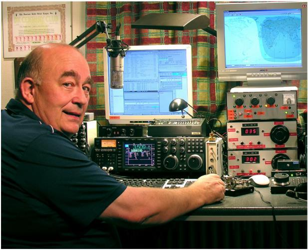
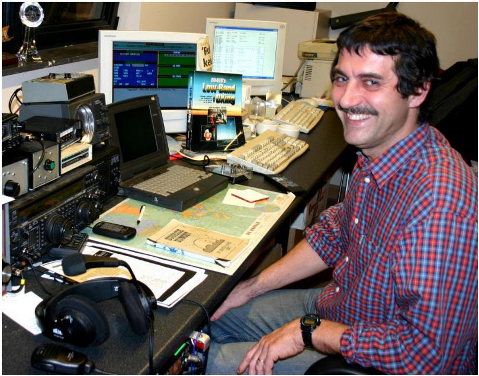

# Авторы

John **ON4UN** познакомился с радиолюбительским миром ещё в 10 лет благодаря своему дяде Gaston **ON4GV**. Позже, ведомый интересом к технологиям и науке, John стал инженером связи и развивал свою профессиональную деятельность в области телекоммуникаций, а на досуге был активным радиолюбителем, зарегистрировавшим в своём аппаратном журнале более полумиллиона связей.

В 1962 году John выиграл соревнования UBA CW, хотя эти соревнования были для него первыми, а свой радиолюбительский позывной он имел всего год. Эта победа положила начало долгому, более чем 50-летнему радиолюбительскому пути, в течение которого было всё — от простых соревнований до охоты за DX на низкочастотных КВ-диапазонах. Стоит упомянуть, что John — мировой лидер DXCC на диапазоне 80 метров, обладатель награды за первое место с 355 подтверждёнными странами, а на 160 м у него крупнейший багаж связей DXCC, если не считать американских операторов, — более 300 стран. Станция John — первая в мире, получившая престижную награду 5B-WAZ.

В 1996 году ON4UN вместе со своим другом Harry ON9CIB представлял Бельгию на соревнованиях WRTC (_World Radio Team Championship_) в Сан-Франциско. Соревнования WRTC иначе называют радиолюбительскими олимпийскими играми.

Самыми яркими моментами радиолюбительской карьеры John, без сомнения, были его включение в _CQ Contest Hall of Fame_ в 1997 году и в _CQ DX Hall of Fame_ в 2008 году, хотя эти почётные награды чаще всего присуждались только американским радиолюбителям. John написал много технических книг о любительской радиосвязи, немалая часть которых была издана при содействии ARRL (_American Radio Relay League_). В этих книгах описаны лучшие практики конструирования антенн, принципы распространения радиоволн и работы в эфире, особенно на низкочастотных КВ-диапазонах. Он создал немало программного обеспечения для механического моделирования антенн и мачт. Вместе с Rik ON7YD он выпустил учебник UBA для подготовки к лицензии HAREC. Уже в 1963 году, будучи ещё совсем молодым радиолюбителем, он начал работать в национальной радиолюбительской организации и некоторое время был координатором UBA по коротким волнам. Позже, с 1998 по 2007 год, John был избран президентом UBA.

John поделился своим опытом и знаниями со своим другом и коллегой Mark ON4WW, и результатом этого сотрудничества стал уникальный учебник — _Этика и порядок работы в эфире для радиолюбителя_. Истоки этой книги — в невероятном успехе ранее изданной статьи _Operating Practice_, вошедшей в учебник UBA HAREC. Эта статья переведена более чем на 15 языков; её можно найти на личной интернет-странице Mark и во многих радиолюбительских изданиях мира.

Mark **ON4WW** тоже было всего 10 лет, когда его впервые «укусил» радиолюбительский комар. Его первым позывным в 1988 году был ON4AMT, который через несколько лет сменился на ON4WW. С самых первых дней Mark очень интересовался радиосоревнованиями, что, вероятно, и привлекло внимание Mark к необходимости и возможности корректной работы в эфире. Встретив ON4UN в 1991 году, после нескольких визитов в гости к John он быстро освоил как CW, так и искусство работы на низких КВ-диапазонах, 80 и 160 метров. В последнее десятилетие Mark был одним из важнейших операторов соревновательной станции OTxT, принадлежавшей местному радиоклубу UBA — TLS. Не секрет, что эта соревновательная станция оборудована в доме ON4UN и за упомянутый период трижды завоёвывала первое место в мире в своей категории (_multi-single_), а также первые места в других соревнованиях CQ WW в Европе.

В 1995 году Mark присоединился к Организации Объединённых Наций и в качестве представителя участвовал в миссии в Руанде. Позже его направляли в несколько других африканских стран, и каждый раз он был активен в эфире, особенно на 160 м и 80 м (9X4WW, S07WW, EL2WW и т. д.). Затем его позывной зазвучал в Пакистане (AP2ARS), Афганистане (YA5T), а также в Ираке (YI/ON4WW). В этот период Mark использовал и множество других позывных, таких как JY8WW, J28WW и 9k/ON4WW. Последняя миссия ООН Mark в 2003 году была в Гамбии (C5WW).

В 2000 году Mark осуществил одну из своих мечт — отправиться в крупную DX-экспедицию. Он участвовал в рекордной поездке FO0AAA на остров Клиппертон в Тихом океане, где его команда всего за 6 дней провела более 75 000 связей. В том же году он участвовал в экспедиции A52A в Бутане и вместе с Peter ON6TT успел представить Бельгию на соревнованиях WRTC в Словении, где в категории SSB занял первое место в мире. Через два года та же команда снова представляла Бельгию на соревнованиях WRTC в Финляндии.

С годами Mark приобрёл впечатляющий багаж знаний и опыта работы в эфире. Специализация Mark — работа в больших, бесконечных очередях, как с одной, так и с другой их стороны. Он был свидетелем самых разных практик работы в эфире — практик, которые и сегодня буквально просятся быть улучшенными. Результатом этого стало соавторство статьи _Operating Practice_ и, наконец, это издание.
