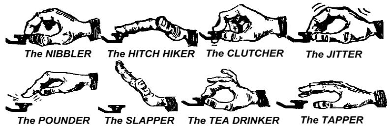
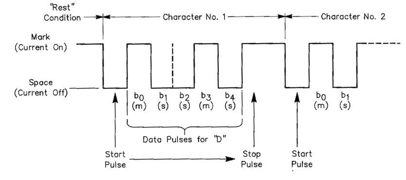
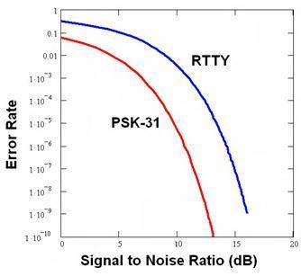
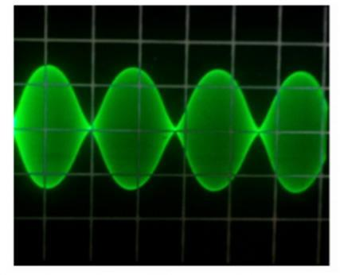
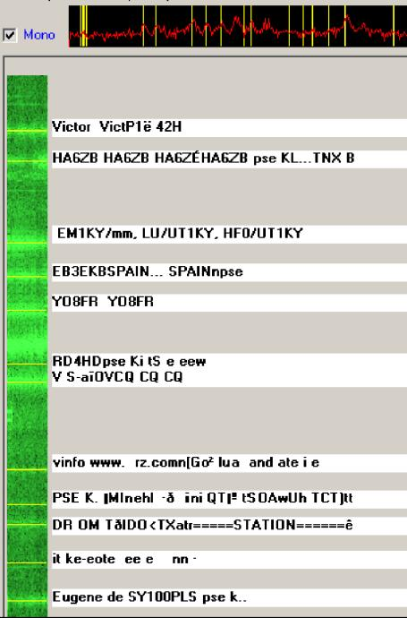
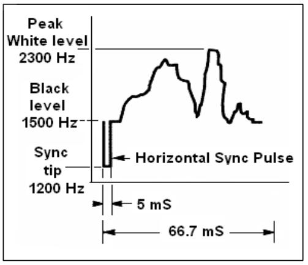
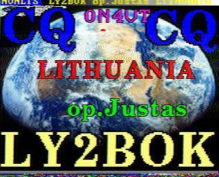

# Работа в радиоэфире

## Язык радиолюбителей

- По-английски радиолюбителя называют «**ham**» — сокращение, этимология которого до сих пор не ясна. В русском языке ему соответствует обычное слово «радиолюбитель».
- Как радиолюбители, мы всегда обращаемся друг к другу по имени (или по псевдониму), никогда не используем _господин_ или _госпожа_, не обращаемся по фамилии. Это верно и для письменного общения между радиолюбителями.
- Радиолюбительский этикет предписывает, что при письменном прощании мы используем `73` (но не `наилучших 73` или `самых больших 73`), а также не пишем формальных выражений, таких как _с уважением_.
- Если раньше вы работали в эфире CB-радио, откажитесь от тонкостей CB-языка и вместо них изучите язык радиолюбителей. От вас, как от члена радиолюбительского сообщества, ожидается, что вы знаете распространённые радиолюбительские выражения — они помогут вам влиться в это сообщество.
- Во время радиоразговора правильно используйте [Q-коды](/ru/q-code/), но старайтесь не перегибать палку, применяя эти коды. Вы всегда можете вместо них использовать понятные всем выражения. Однако некоторые Q-коды со временем стали естественным явлением даже в голосовых разговорах, например:

|                   |                                            |
| ----------------- | ------------------------------------------ |
| **QRG**           | частота                                    |
| **QRM**           | помехи от станций (человеческого происхождения) |
| **QRN**           | атмосферные помехи (статические разряды)   |
| **QRP**           | станция малой мощности                     |
| **QRT**           | покидаю эфир, заканчиваю сеанс связи        |
| **QRV**           | я готов                                    |
| **QRX**           | подождите, отхожу                          |
| **QRZ**           | кто меня вызывал?                          |
| **QSB**           | фединг                                     |
| **QSL (карточка)** | карточка, подтверждающая связь            |
| **QSL**           | я подтверждаю связь                        |
| **QSO**           | контакт                                    |
| **QSY**           | смена частоты                              |
| **QTH**           | место, где находится ваша радиостанция      |

- Кроме обычно используемых Q-кодов, в голосовых разговорах прижились и несколько [коротких фраз, пришедших из CW](#самые-популярные-сокращения-cw), таких как 73, 88, OM (друг, разг. старина, англ. _old man_), YL (девушка, женщина, англ. _young lady_).
- Правильно используйте один-единственный [международный фонетический алфавит](/ru/phonetic-alphabet/). Строго избегайте _выдумок_, которые могут звучать интересно или забавно на вашем языке, но не помогут корреспонденту понять, что вы хотели сказать. Не используйте разные фонетические слова в одном и том же предложении.

::: danger Пример
`CQ from ON9UN, oscar november nine uniform november, ocean nancy nine united nations...`
:::

- Самый распространённый язык в радиолюбительском эфире — английский. Если вы хотите связаться со станциями по всему миру, то большинство корреспондентов удастся «дозваться» именно на этом языке. Само собой разумеется, что два радиолюбителя, хорошо владеющие общим для них языком, прекрасно договорятся и без английского.
- Используя код Морзе (CW), связь можно установить, не зная ни одного слова на языке, на котором говорит корреспондент.
- Это хобби может помочь в изучении или практике языков. В эфире вы всегда найдёте корреспондентов, которые с удовольствием помогут или подскажут радиолюбителю, изучающему их родной язык.

## Слушайте

- Хороший радиолюбитель начинает работу с того, что много слушает.
- Слушая, можно многому научиться, однако будьте внимательны, ведь не всё, что вы услышите в эфире, будет _подходящим примером_. Вы наверняка услышите много корреспондентов, работающих неправильно.
- Если вы активны в радиоэфире, будьте **хорошим примером** и пользуйтесь рекомендациями, приведёнными в этом документе.

## Правильно используйте свой позывной

- Вместо **_полного позывного_** или **_букв позывного_** радиолюбители часто используют сокращённый
  **_позывной_**.
- В эфире всегда представляйтесь **полным позывным**, а не только суффиксом. Передавать часть позывного незаконно.
- В начале передачи **никогда не используйте** своё имя или имя корреспондента (например: `привет Иван, это Пётр...`).
- Во время разговора время от времени представляйтесь, так как этого требует регламент радиолюбительской работы.

## Всегда будьте джентльменом

- Никогда не используйте оскорблений, **оставайтесь вежливыми, ведите себя уважительно и снисходительно в любых случаях**.
- Джордж Бернард Шоу писал:

> «Нет лучшего способа чего-либо достичь, чем вежливость и бескорыстие».

## Работа через ретранслятор

- Прежде всего, ретрансляторы предназначены для увеличения дальности связи портативных и мобильных УКВ-радиостанций.
- Используйте простую связь (симплекс) всегда, когда это возможно. Связь между двумя стационарными радиостанциями через ретранслятор следует использовать только в исключительных случаях.
- Если вы хотите поговорить через ретранслятор в то время, когда им уже пользуются, дождитесь паузы между передачами, чтобы сообщить свой позывной.
- Используйте выражение `break` или ещё лучше `break break break` только в срочных или чрезвычайных ситуациях. Лучше всего сказать `break break break срочное сообщение`.
- Чтобы избежать случайного _перекрытия_ (когда одновременно передают несколько станций), пользователи ретранслятора должны подождать, пока не прервётся его несущая или не прозвучит сигнал (бип). Во время таких пауз могут включиться новые станции, а ретранслятор заново запускает таймер, который защищает от слишком долгой работы в режиме передачи (_time-out_).
- Не захватывайте ретранслятор! Ретрансляторы предназначены не только для вас и ваших друзей. Возможно, другие тоже хотят воспользоваться ретранслятором, будьте любезны и дайте возможность включиться другим.
- Говорите только по делу и коротко.
- Ретрансляторы не предназначены для того, чтобы сообщать XYL о том, что вы уже возвращаетесь домой и обед можно подавать... Все связи через любительскую радиосвязь должны касаться прежде всего вопросов радиосвязи.
- Не прерывайте разговор других радиолюбителей, если только вам не нужно добавить что-то важное. Вклиниваться в радиоэфир так же невежливо, как и при живом общении.
- Прерывание разговора без представления недопустимо и в принципе трактуется как незаконная помеха.
- Если вы часто пользуетесь конкретным ретранслятором, серьёзно рассмотрите возможность поддержать тех, кто его обслуживает и содержит.

## Как установить QSO?

- **QSO** — это связь между двумя или более радиолюбителями.
- Чтобы установить **QSO**, вы можете подать сигнал всеобщего вызова (CQ), можете ответить на чей-то CQ или вызвать кого-то, кто только что завершил связь с другой станцией. Подробнее об этом читайте в других разделах этой книжки.
- Какой позывной в вашем разговоре передаётся первым? Правильно звучит так: `W1ZZZ from LY9ZZZ` (LY9ZZZ — это ты, а W1ZZZ — собеседник, к которому ты обращаешься). Итак, сначала передай позывной человека, с которым ты разговариваешь, и только потом свой позывной.
- Как часто следует представляться?

В большинстве стран мира существует такое правило: _в начале передачи, в конце и не реже чем каждые 5 минут во время связи или испытаний радиостанции в эфире._ Несколько идущих подряд коротких «слушаю» (_over_) считаются как одна передача. В правилах соревнований нет строгого требования представляться во время каждого QSO. Это правило 5 минут нужно для того, чтобы станции, контролирующие радиоэфир, могли легче опознать всех работающих. [Однако лучше всего представляться во время каждого QSO](advanced-operating.md#юридическая-ответственность)

- _Пауза_ или _промежуток_: когда ваш корреспондент заканчивает передачу и передаёт микрофон вам, хорошая привычка — подождать секундочку перед началом своей передачи. Возможно, кто-то ещё захочет включиться в разговор или воспользоваться частотой.
- Короткая или длинная передача информации?

Лучше говорить чаще и короче, так как тогда ваш корреспондент будет иметь возможность прокомментировать то, что вы сказали.

## О чём говорить в любительском диапазоне?

Темы, о которых вы говорите при общении средствами любительской связи, всегда должны быть связаны с радиолюбительским хобби. Это хобби _в широком смысле_ связано с **технологиями радиосвязи**. Любительское радио мы не должны использовать для передачи списка продуктов, необходимых для сегодняшнего обеда.

Темы, которые особенно неуместны в радиолюбительском эфире:

- религия
- политика
- бизнес (можно говорить о своей профессии, но нельзя рекламировать свой бизнес)
- унизительные реплики, направленные на любую группу (этническую, религиозную, расовую, сексуальную и т. д.)
- «туалетный» юмор: если бы вы не рассказали шутку своему десятилетнему ребёнку, не рассказывайте её и в эфире
- любая тема, которая не имеет ничего общего с радиолюбительским хобби.

## Установление связи голосом

### Как давать CQ?

Иногда перед передачей необходимо настроить передатчик (или антенный тюнер). В первую очередь настройку следует выполнять, подключая идеальную нагрузку на месте антенны. Если передатчик нужно окончательно настроить, это можно сделать на свободной частоте, снизив мощность и спросив, свободна ли частота.

- Что делать с самого начала?
  - Выберите, какой диапазон использовать, чтобы достичь нужного расстояния и направления. Графики MUF (_Maximum usable frequency_) публикуются на множестве сайтов и могут помочь спрогнозировать прохождение на КВ.
  - Проверьте, какую часть диапазона вы можете использовать для работы голосом. Совет: на своём рабочем столе всегда держите план распределения частот IARU.
  - Помните, что для передачи SSB ниже 10 МГц используется модуляция LSB (Lower Sideband), выше 10 МГц — USB (Upper Sideband).
  - Также, когда вы передаёте на USB, передаваемый SSB-сигнал распределится минимум на 3 кГц выше установленной частоты. При использовании LSB всё будет наоборот, ваш сигнал распределится минимум на 3 кГц ниже частоты, которая отображается на радиостанции. _Это означает_: при использовании LSB никогда не передавайте ниже 1 843 кГц (1 840 кГц — начало диапазона); никогда не передавайте LSB ниже 3 603 кГц, или USB выше 14 347 кГц
- А потом?
  - Теперь вы готовы начать слушать частоту, на которой хотите работать.
  - Если вы считаете, что частота не занята, спросите, действительно ли это так (`Свободна ли частота?`).
  - **Если вы уже некоторое время слушали действительно незанятую частоту, почему время от времени всё же нужно спрашивать, используется ли частота?** Потому что одна из двух ведущих QSO станций может быть вам не слышна, но при этом тоже передавать на этой частоте. Если вы ничего не слышите, то и эта станция вас не слышит, потому что находится слишком далеко для прямого распространения радиоволн и слишком близко для распространения через ионосферные отражения. На более высоких КВ-диапазонах это обычно означает, что станция находится в нескольких сотнях километров от вас. Если вы спросите, используется ли частота, возможно, другой слышимый вам корреспондент ответит. Если бы вы начали передавать, не спросив, вы, вероятно, создали бы QRM как минимум одной станции, находящейся на той же частоте.
  - Если частота занята, её пользователи, вероятно, ответят: `Yes` или ещё вежливее: `Yes, thank you for asking`. В таком случае вам следует поискать другую свободную частоту для передачи CQ.
- А если никто не отвечает?
  - Спросите ещё раз: `Свободна ли частота?`
- И если всё равно никто не ответит?

**Передавайте CQ:** `CQ from LY9ZZZ, LY9ZZZ calling CQ, lima yankee nine zulu zulu zulu calling CQ and listening`. В самом конце передачи можно сказать: `... calling CQ and standing by`, вместо `... and listening`. Также можно сказать: `... and standing by for any call`.

- Всегда говорите ясно и выразительно, произнося все слова правильно.
- Передавая CQ, произносите свой позывной от **2 до 4 раз**.
- Используйте международный фонетический алфавит (для произнесения своего позывного) один или два раза при передаче CQ.
- Лучше подряд передать несколько коротких CQ, чем один длинный.
- Не заканчивайте передачу CQ словом `over`, как в примере: `CQ CQ LY9ZZZ lima yankee one zulu zulu calling CQ and standing by. Over`. `Over` означает _передаю вам_ (`over to you`). В конце передаваемого CQ вы не можете передать микрофон другому, потому что контакта ещё нет.
- Никогда не заканчивайте CQ, говоря `QRZ`. `QRZ` означает _кто меня вызывал?_. Очевидно, что никто вас не вызывал перед тем, как вы передали CQ. Совершенно неправильное завершение передачи CQ: `CQ 20 CQ 20 from LY9ZZZ lima yankee one zulu zulu calling CQ, LY9ZZZ calling CQ 20, QRZ` или `... calling CQ 20 and standing by. QRZ`.
- Если вы передаёте CQ на одной частоте, а принимать хотите на другой, заканчивайте **каждый CQ**, указывая частоту прослушивания, например: `... listening 5 to 10 up` или `... listening on 14295`. Сказать просто `listening up` или `up` недостаточно, потому что вы не указываете, где будете слушать. Такой метод проведения QSO называется _работой на разнесённых частотах_ (split frequency).
- Если вы планируете работать на разнесённых частотах, всегда проверяйте, свободны ли обе частоты, на которых вы хотите слушать и передавать CQ.
<!-- TODO: Translate one point here -->

### Что означает «CQ DX»?

- Если вы хотите связаться с _дальними_ станциями, передавайте `CQ DX`.
- **Что такое DX**
  - На коротких волнах: станции, которые находятся на других континентах или в странах, где радиолюбительская деятельность сильно ограничена (например: Гора Афон или Мальтийский орден).
  - На ультракоротких волнах: станции, которые находятся дальше чем 300 км.
- Передавая CQ, вы можете настойчиво требовать, чтобы работать только с DX-станциями: `CQ DX, outside Europe, this is...`.
- Всегда будьте любезны, ведь, возможно, местная станция, вызывающая вас после вашего CQ DX, может быть начинающей, и вы для неё будете _новой страной_. Почему бы не установить быстрое QSO?

### Вызов конкретной станции

- Представим, что вы хотите вызвать DL1ZZ, с которым у вас есть _скед_ (назначенная встреча). Вот как нужно передавать: `DL1ZZ, DL1ZZ this is LY9ZZZ calling on sked and listening for you`.
- Если, несмотря на ваш конкретный вызов, кто-то другой вызывает вас, оставайтесь вежливыми. Передайте ему рапорт о сигнале и ответьте `Sorry, I have a sked with DL1ZZ...`

### Как установить QSO голосом?

- Допустим, вы получили ответ на вызов CQ, например: `LY9ZZZ from W1ZZZ, whiskey one zulu zulu zulu is calling you and listening` или `LY9ZZZ from W1ZZZ, whiskey one zulu zulu zulu over`.
  - Мы уже выяснили, [почему в конце CQ нельзя передавать «over»](#как-давать-cq). Когда кто-то отвечает на ваш CQ, он одновременно хочет получить и ответ от вас, поэтому теперь уже можно передать «over» (означает «over to you»).
  - Если другая станция отвечает на вызов CQ, сначала вам следует подтвердить её позывной, и только потом вы можете передать информацию о её сигнале, своё имя и _QTH_ (местность): `W1ZZZ from LY9ZZZ (будьте внимательны, соблюдайте правильную очерёдность!), thanks for the call, I am receiving you very well, readability 5 and strenght 8 (показание S-метра приёмника). My QTH is London and my name is John (никаких «моё личное имя» («my personal name») или «моё первое личное»; нет такого понятия, как личное или неличное имя). How do you copy me? W1ZZZ from LY9ZZZ. Over`.
- Если вы вызываете станцию, которая передала CQ (или QRZ), вызовите её, передавая её позывной не более одного раза. В большинстве случаев лучше всего не передавать его вовсе, оператор радиостанции и так знает свой позывной. [Во время соревнований](#как-работать-в-соревнованиях-телефоном) позывной станции, которую вы вызываете, не передаётся.
- В голосовом разговоре мы обмениваемся рапортом о сигнале RS:
  - R — это разборчивость (**R**eadability), S — сила сигнала (**S**trength).
- Мы уже упоминали, что не следует чрезмерно использовать Q-коды в голосовых разговорах, но если вы их используете — используйте правильно. Q**R**K означает разборчивость, и это то же самое, что R в рапорте RS. Q**S**A означает силу сигнала, и это эквивалент буквы S в рапорте RS.
  - Одно всё же отличается: диапазон оценки S в рапорте RS начинается с 1 и заканчивается 9, тогда как в коде QSA диапазон начинается с 1 и заканчивается лишь 5
  - Итак, не говорите: `You‘re QSA 5 and QRK 9` (как иногда слышите), а если хотите использовать Q-код, говорите: `You are QRK 5 and QSA 5`. Конечно, гораздо легче сказать: `You‘re 5 and 9`. При работе телеграфом QRK и QSA почти не используются. Вместо этого при работе [телеграфом используется только рапорт RST](#продолжение-и-завершение-qso-в-cw).

| Разборчивость |                      | Сила сигнала      |                       |
| ------------- | -------------------- | ----------------- | --------------------- |
| **R1**        | неразборчиво         | **S1**            | едва слышимый сигнал  |
| **R2**        | отдельные слова      | **S2**            | очень слабый          |
| **R3**        | трудно разобрать     | **S3**            | слабый                |
| **R4**        | разборчиво без труда | **S4**            | терпимый              |
| **R5**        | отлично разборчиво   | **S5**            | достаточно хороший    |
|               |                      | **S6**            | хороший               |
|               |                      | **S7**            | умеренно сильный      |
|               |                      | **S8**            | сильный               |
|               |                      | **S9**            | очень сильный         |

Использовать словечко «over» в конце передачи рекомендуется, но не обязательно. QSO состоит из нескольких передач, или по-английски «overs», так что «over» просто означает _over to you_, т. е. _передаю тебе_.

Если ваши сигналы не очень сильные и разборчивость не идеальна, вы можете произнести своё имя по буквам, например: `My name is Simon, spelled Sierra India Mike Oscar November`. Не повторяйте буквы по нескольку раз, не используйте свои сокращения — это не поможет корреспонденту яснее понять, что вы хотите передать.

Во время большинства коротких и «стандартных» QSO принято кратко описать параметры своей радиостанции, антенны и другие, такие как погодные условия (особенно когда это связано с распространением радиоволн, например, на УКВ-диапазонах). Как правило, станция, которая вызывает на частоте, берёт на себя инициативу и первой передаёт такую информацию. С другой стороны, вызывающая станция может пожелать короткого контакта _привет и пока_.

Рассказывая о своей станции, используйте правильную терминологию. Не используйте фонетический алфавит там, где он не нужен, например, говоря: `I am working with 5 Whiskey`. Просто упомяните, что `I am running 5 Watts of power`.

Во время таких QSO часто можно услышать, как из короткого приветствия развивается длинная техническая дискуссия и операторы начинают делиться друг с другом полезными советами о радиотехнике. Ведь так иногда случается и в реальной жизни, когда встречаются два человека с похожими увлечениями и интересами! Как в жизни, так и в эфире часто завязываются многолетние дружбы, а любительская радиосвязь становится мостом между сообществами, культурами и даже цивилизациями.

Если вы хотите QSL (обменяться карточками связи), упомяните это: `Please QSL. I will send my card via bureau and would like to have your card as well.` QSL-карточка — документ размером с открытку, подтверждающий состоявшееся QSO.

QSL-карточки могут отправляться по почте напрямую другой станции или передаваться через QSL-бюро. Почти все радиолюбительские сообщества, будучи членами IARU, обеспечивают своих членов услугами QSL-бюро и следят за тем, чтобы QSL-карточки своевременно передавались и принимались. Некоторые не принадлежащие к сообществам радиостанции передают и принимают QSL только напрямую в свой почтовый ящик или через QSL-менеджеров, которые отвечают за рассылку карточек. Чаще всего такие станции о правилах QSL информируют своих корреспондентов на личном сайте или на страницах информации о позывных ([qrz.com](http://qrz.com) и т. п.).

Этика предполагает, что радиолюбители обмениваются QSL-карточками без какого-либо вознаграждения, за исключением тех случаев, когда просят покрыть расходы на отправку карточки, если карточка передаётся не через QSL-бюро.

Завершая QSO с одной станцией, говорите: `G3ZZZ, this is LY9ZZZ signing with you and listening for any other calls` или если хотите завершить работу в эфире: `... and closing down the station`.

Вы можете дополнить своё обращение словечком «out», это обозначит конец вашей _передачи_, однако это делается довольно редко. Не говорите «over and out», поскольку «over» означает, что вы передаёте микрофон корреспонденту, а в этом случае корреспондента уже нет!

::: tip SSB QSO для начинающего
`Is this frequency in use? This is LY9ZZZ`

`Is this frequency in use? This is LY9ZZZ`

`CQ CQ CQ from LY9ZZZ lima yankee one zulu zulu calling CQ and listening`

**`LY9ZZZ from ON6YYY oscar november six yankee yankee yankee calling and standing by`**

`ON6YYY from LY9ZZZ, good evening, thanks for your call, you are 59. My name is Zigmas, I spell Zulu India Golf Mike Alfa Sierra and my QTH is Klaipeda. How copy? ON6YYY from LY9ZZZ. Over.`

**`LY9ZZZ from ON6YYY, good evening Zigmas, I copy you very well, 57, readability 5 and strength 7. My name is John, Juliette Oscar Hotel November, and my QTH is near Ghent. Back to you Zigmas. LY9ZZZ from ON6YYY. Over.`**

`ON6YYY from LY9ZZZ, thanks for the report John. My working conditions are a 100 Watt transceiver with a dipole 10 meter high. I would like to exchange QSL cards with you, and will send you my card via the bureau. Many thanks for this contact, 73 and see you soon again, I hope. ON6YYY from LY9ZZZ.`

**`LY9ZZZ from ON6YYY, all copied 100%, on this side I am using 10 Watt with an inverted-V antenna with the apex at 8 meters. I will also send you my QSL card via the bureau, Zigmas. 73 and hope to meet you again soon. LY9ZZZ this is ON6YYY clear with you.`**

`73 John and see you soon from LY9ZZZ now clear (...and listening for any stations calling).`
:::

### Быстрая передача эфира корреспонденту и обратно

Если вы вовлечены в разговор короткими предложениями, необязательно объявлять свой позывной в конце каждого предложения. Правила требуют идентифицировать свою станцию позывным не реже чем каждые 5 (а в некоторых странах — 10) минут, а также в начале и в конце QSO.

Вы можете передать микрофон корреспонденту, просто сказав `over`, это означало бы, что вы передали ему право на эфир. Также нормально и полезно в конце передачи сделать паузу в 1 или 2 секунды, которая означала бы, что вы закончили передачу и корреспондент начнёт передачу своего сигнала.

### Как работать в соревнованиях телефоном?

- Понятие «**contest**» в радиоэфире чаще всего означает соревнования между радиолюбителями.
- **Что такое «контестинг»?** Это спортивная сторона радиолюбительской деятельности.
- **Зачем нужно «контестовать» или соревноваться между собой?** Соревнования — это своего рода проверка сил, во время которой радиолюбитель может проверить свои способности и сравнить эффективность работы своей радиостанции с другими радиолюбителями и их станциями.
- **Как стать хорошим «контестменом»?** Большинство чемпионов соревнований начинали работать в соревнованиях, будучи середнячками. Как и во всех видах спорта, стать чемпионом можно только постоянно практикуясь.
- **Сколько соревнований проходит за год?** Соревнований в радиоэфире так много, что они проходят постоянно, каждые выходные и даже в рабочие дни. За год проходит около 200 крупных радиолюбительских соревнований, из которых около 20 можно считать довольно важными международными соревнованиями (примерно как чемпионат мира по баскетболу).
- Календарь соревнований можно найти в различных интернет-источниках, например, [ng3k.com/Contest/](http://ng3k.com/Contest/), [sites.google.com/site/dl2nbycontestcalendar](https://sites.google.com/site/dl2nbycontestcalendar) или на [странице VDU RK](http://rk.vdu.lt).
- Основная задача большинства соревнований — установить как можно больше контактов с другими станциями. В некоторых соревнованиях требуется установить контакты с как можно большим числом разных стран, зон, штатов и т. п. Часто число установленных контактов ещё умножается на множитель, который зависит от специфики соревнований, часто это и есть число стран. Крупные международные соревнования длятся 24 или 48 часов, а малые местные соревнования — около 3–4 часов, так что выбор действительно немалый!
- Обычно соревнования организуются на многих диапазонах, от КВ до УКВ.
- На так называемых WARC-диапазонах (10 МГц, 18 МГц и 24 МГц) соревнования не проводятся, поскольку эти диапазоны довольно узкие, и всемирные соревнования на них создали бы огромные радиозаторы.
- Во время соревнований полное QSO чаще всего состоит из позывного, RST и чаще всего — номера связи в журнале (также может передаваться радиозона, локатор, возраст и т. п.).
- Работа в соревнованиях сильно зависит от скорости, эффективности и точности. При работе в телефонных соревнованиях важно говорить в эфире то и только то, что требуют соревнования. Соревнования — не место демонстрировать свою вежливость («Спасибо за приятный контакт», «Передаю микрофон вам» и т. п.). Ненужные фразы — трата времени соревнований.
- Если вы новичок в соревнованиях, желательно перед участием в соревнованиях побывать у опытного участника соревнований. Ещё один способ начать участвовать в соревнованиях — работать с коллективной станции или клуба.
- Если вы всё же решили самостоятельно поучаствовать в своих первых соревнованиях, очень важно, чтобы вы начали работу в них только слушая, постарайтесь услышать, как в эфире работают другие корреспонденты. Попробуйте определить, какими правилами и процедурами руководствуются в соревнованиях. Обратите внимание, что не всё, что вы услышите, будет хорошими примерами. Некоторые распространённые ошибки участников соревнований мы обсудим позже.
- Пример хорошего и эффективного вызова CQ во время соревнований: `LY9ZZZ Lima Yankee One Zulu Zulu Zulu contest`. Всегда передавайте свой позывной два раза, один раз возможно фонетическим алфавитом, если только перед вами не большая очередь участников, тогда достаточно лишь коротко в промежутках между корреспондентами передавать свой позывной. Словечко «contest» в конце передачи нужно для того, чтобы корреспондент, настроившийся на вашу частоту, сразу понял, что вы участвуете в соревнованиях и эта частота занята. Даже словечко CQ во время соревнований не нужно и чаще всего не используется. Представьте, что, вращая ручку настройки, вы услышите станцию, которая объявляет свой позывной в конце вызова. В таком случае вы проверяете свой журнал связей соревнований, однако если связь с этой станцией нужна, вам неясно, участвует ли упомянутая станция в соревнованиях. Поэтому, используя словечко «contest», вы экономите время других станций и не заставляете их ждать, пока снова вызовете CQ.
- Вызывающая станция обычно произносит свой позывной один раз. Если вы не отвечаете вызывающему, он снова объявит свой позывной (один раз).
- Если при вызове вы услышали позывной корреспондента, вам следует сразу ответить: `ON4XXX 59 001` или просто `ON4XXX 591` (если в соревнованиях можно использовать короткие номера). В большинстве соревнований обмениваются рапортом RS и порядковым номером (в приведённом выше примере 001 — это просто 1). Столько и нужно передать в соревнованиях. Всё остальное — ненужная информация.
- Если вы (LY9ZZZ) услышали только часть позывного (например, ON4X), отправьте ответ с неполным позывным: `ON4X 59 001`. Не вызывайте `QRZ ON4X` или что-то подобное. Станцию вы почти опознали, так что можете вызвать и частью позывного — хороший корреспондент обязательно уточнит позывной: `ON4XXX xray xray xray, you’re 59 012`
- Никогда не говорите: `ON4XXX прошу примите 59 001` или `Please copy 59 001`, поскольку любой ненужный текст во время соревнований — трата времени.
- Если вы уже обменялись позывными, опытный участник соревнований передаст только `59 012`. Если корреспондент не услышал или не полностью принял номер и/или рапорт о сигнале, он попросит: `Please again` или `Report again`.
- Это означает, что необязательно дополнять свой рапорт о сигнале ненужными словами: `Thanks 59 012`, `QSL 59 012` или `Roger 59 012`, что часто делают неопытные участники соревнований.
- Вызывающему оператору остаётся только завершить контакт словами «Thanks LY9ZZZ contest». Эта фраза выполняет три функции:
  - вы заканчиваете предыдущую связь («Thanks»);
  - идентифицируете себя для других станций в эфире («LY9ZZZ»);
  - вызываете для соревнований («contest»). Эффективнее быть не может!
- Никогда не заканчивайте свой вызов: `QSL QRZ`. Почему? QSL QRZ не идентифицирует вашу станцию, поэтому тем или иным образом оказавшиеся на вашей частоте участники соревнований не поймут, какая станция работает в эфире. Поэтому хороший способ завершения связи — `Спасибо LY9ZZZ contest` или `QSL LY9ZZZ contest` (если очень спешите — просто `LY9ZZZ contest`, однако это звучит недружелюбно и корреспондент может не понять, принята ли его связь). QSL означает — _подтверждаю_. **Никогда без надобности не говорите QRZ, потому что это означает кто меня вызывал.** `QRZ` вызывать следовало бы только в одном-единственном случае, когда на вашей частоте при проведении связи с ON4XXX ещё кто-то другой вызывает вас на связь.
- Конечно, этот описанный сценарий в реальной жизни может быть несколько иным, однако в соревнованиях всё же самое главное — скорость, эффективность, точность и корректное использование Q-кода.
- Большинство участников соревнований используют компьютерные программы, предназначенные для регистрации QSO соревнований. Перед соревнованиями убедитесь, что программа действительно работает так, как вам нужно, потому что во время соревнований не будет времени исправлять её параметры.
- Кроме того, что во время соревнований вы вызываете CQ, вы также можете поискать других корреспондентов, вращая ручку настройки. Возможно, с этими корреспондентами у вас ещё не было связи, или вы найдёте такого корреспондента, связь с которым поможет вам «заработать» больше очков. В соревнованиях связи нужны для того, чтобы получить множитель очков. Это называется _search and pounce_ (или S&P). Убедитесь, что вы находитесь на частоте корреспондента, и один раз передайте свой позывной. Не вызывайте корреспондента позывным, он прекрасно знает свой позывной и то, что вы вызываете именно его, потому что вы вызываете **на его частоте**!
- Просто передайте свой позывной один раз. Если корреспондент не отвечает дольше 1 секунды, вызывайте ещё раз (_один раз_) и т. д.

::: tip Пример QSO в соревнованиях телефоном
`whiskey one zulu zulu contest` (CQ вызывает W1ZZ)

**`oscar november six zulu zulu`** (отвечает ON6ZZ)

`ON6ZZ five nine zero zero one` (W1ZZ отвечает ON6ZZ)

**`five nine zero zero three`** (ON6ZZ отвечает своим рапортом о сигнале W1ZZ)

`thanks W1ZZ contest` (W1ZZ завершает связь, идентифицируется и вызывает дальше)
:::

- Во время некоторых международных соревнований (CQWW, WPX, ARRL DX, CQ-160m — во всех этих телефоном, а также и телеграфом) операторы, работая в эфире, не всегда соблюдают план частот IARU. Это чаще всего случается на диапазонах 160 м и 40 м, где диапазоны частот уже, чем обычно. Конечно, это радует, потому что показывает, что радиолюбители всё ещё активны и на арене международных соглашений помогают сохранить выделенные нам частоты всё ещё в радиолюбительских руках, а не отданными другим службам (use them or lose them). Так что такие возникающие во время соревнований временные неудобства следует оценивать положительно и позитивно, не только среди радиолюбителей.

### Правильное использование сокращения QRZ

- QRZ означает _кто меня вызывал?_ Ни больше, ни меньше.
- Обычно сокращение QRZ используется после вызова CQ, когда вы совсем не услышали станцию, которая пыталась вам ответить. В самом вежливом смысле QRZ означает: «Извините, я слышал, что меня вызывали, однако не услышал ваш позывной, прошу вызывайте ещё!».

::: warning ВНИМАНИЕ
Это **не означает**: _кто это?_, _кто на частоте?_, тем более — _прошу меня вызывать_.
:::

- Если, находясь на кажущейся свободной частоте, вы хотите убедиться, действительно ли частота свободна, не нужно говорить: `QRZ?`. Просто спросите, свободна ли частота: `Is this frequency in use, please?`.
- Если вы слышите корреспондента, который какое-то время не идентифицировал свою станцию позывным, и хотите узнать его позывной, вы можете спросить: `Your call please` или `Please identify`. Строго правильная форма такой просьбы должна быть дополнена вашим позывным (поскольку вам тоже нужно идентифицироваться).
- QRZ действительно не означает _прошу вызывайте меня_. Часто в эфире, например, на КВ-марафоне, мы слышим `QRZ LY9ZZ` и т. п. вызовы. Такие вызовы лексически бессмысленны.
- Во время соревнований слышится некорректное употребление QRZ при ответе на CQ. Станция, которая попала на частоту вызывающей станции, но не услышала её позывной, говорит: `QRZ`. Это — бестактное употребление сокращения QRZ. Никто эту заблудившуюся станцию не вызывал. Всё, что она может сделать, — дождаться вызова хозяина частоты. Так же следует вести себя и при связи телеграфом.
- Ещё одно довольно смешное, но неточное использование QRZ — спрашивать, свободна ли частота. `QRZ the frequency` или `QRZ is frequency in use?` — звучит действительно неграмотно.
- Часто QRZ некорректно используется и при вызове CQ: `CQ DX CQ DX this is UR5ZZZ QRZ DX`, о том, как правильно вызывать CQ, [мы уже писали](#как-давать-cq).
- Реже слышится это неправильное использование QRZ: `Give me your QRZ`, которое должно означать _представьтесь_. Хорошо хоть то, что большинство неправильных употреблений QRZ так или иначе связаны с вызовом или позывным. Однако напомним, что QRZ всего лишь означает — _кто меня вызывал?_, это и только это.
- Во время очередей (pileup) мы часто слышим, как DX-станция говорит QRZ, не потому, что её оператор не услышал ранее вызывавшие станции, а он так говорит очереди, что снова слушает эфир. Такое использование QRZ, к сожалению, тоже неуместно.

::: warning Пример
**`CQ ZK1DX`** станция ZK1DX вызывает CQ

`ON4YYY you’re 59` ON4YYY вызывает ZK1DX, та отвечает рапортом о сигнале

**`QSL QRZ ZK1DX`** станция ZK1DX подтверждает связь (QSL) и добавляет QRZ, что в этом случае означает я снова слушаю другие станции, но не означает кто меня вызывал?, хотя, к сожалению, должно бы означать именно это.
:::

::: danger Чаще слышим ещё худший случай
**`QSL QRZ`** В этом случае станция не идентифицирует себя. Новички в очереди больше не знают, кто работает в эфире.
:::

::: tip Правильная и наиболее эффективная процедура в такой ситуации
**`QSL ZK1DX`** DX-станция подтверждает связь и идентифицирует себя другим в очереди.
:::

### Проверка качества передаваемого сигнала

Правильно ли вы настроили передатчик? Не слишком ли велико усиление микрофона? Не превышает ли уровень обработки речи нормы? Вопросы, мучающие перед началом передачи сообщения!

- Уровень фонового шума должен быть ниже уровня громкости вашего голоса не менее чем на 25 дБ. Когда вы не говорите в микрофон, уровень звукового сигнала должен быть примерно в 300 раз меньше, чем тогда, когда вы говорите.
- Спросите местных коллег, радиолюбителей, не слышны ли в вашем сигнале перегрузки уровня сигнала (англ. _splatter_).
- Если в этот момент в эфире нет приятелей, вашим лучшим другом будет осциллограф, с помощью которого вы можете наблюдать за уровнем своего сигнала.

## Искусство работы телеграфом (CW, код Морзе)

- Код Морзе — это способ передачи текста. Код состоит из последовательности коротких и длинных звуковых сигналов. Короткие тоны обычно называются ти (англ. _dit_), а длинные — та (англ. _dah_). та в три раза длиннее, чем ти. Эти сигналы очень часто называют точками и тире, но это неправильная терминология для их описания, потому что мы начинаем представлять эти звуки визуально.
- Итак, код Морзе **не является** последовательностью письменных точек и тире, хотя в XIX веке его истоки и были на бумаге, на ленте телеграфного аппарата. Однако телеграфные операторы быстро поняли, что проще слышать сигнал телеграфной машины и на слух переводить в обычные буквы, чем читать точки и тире на ленте. Так что большинство CW-операторов согласятся, что буква **R** — это не _короткий длинный короткий_ или _точка тире точка_, а просто **ти-та-ти**.
- Иногда букву R записали бы просто ти-та-ти. В этой книжке мы будем использовать однозначные сокращения, так что короткий сигнал будем обозначать ти, а длинный — та.
- При работе телеграфом часто используются [Q-коды](/ru/q-code/), сокращения и служебные знаки (_прозайны_). С их помощью коммуникация проходит быстрее и эффективнее.
- Радиолюбители обычно называют работу телеграфом **CW**. Это понятие означает _continuous wave_, хотя CW на самом деле не является непрерывной волной, а скорее волной, которая постоянно прерывается в ритме телеграфа. Радиолюбители понятия _CW_ и _Morse_ используют рядом — это означает одно и то же.
- Ширина полосы красивого CW-сигнала при -6 дБ примерно равна скорости передачи в WPM (словах в минуту), умноженной на четыре. Например, передача CW на 25 WPM занимает 100 Гц (при -6 дБ). Спектр, необходимый для передачи одного SSB-сигнала, для сравнения, составляет 2,7 кГц — сравните, сколько CW-сигналов может уместиться в таком спектре.
- Узкополосная природа CW-сигнала имеет гораздо лучшее отношение S/N (_Signal-to-Noise_), чем при работе в тех же условиях широкополосными режимами, такими как SSB (более широкая полоса частот вмещает больше шума, чем узкая). Вот почему DX-связи в экстремальных условиях (например, при работе с другими континентами на 160 м или EME) часто выполняются на CW.
- Какова минимальная скорость приёма, которую следует освоить перед тем, как начать регулярно проводить QSO кодом Морзе?
  - 5 слов в минуту (WPM) — неплохо, однако много связей вы не сделаете, разве что будете пробовать на специальных QRS-частотах (QRS означает _замедли скорость передачи_). Эти частоты можно найти в плане частот IARU.
  - 12 слов в минуту — это минимум, однако опытные CW-операторы делают QSO около 20–30 WPM и даже быстрее.
- Нет никакого секретного рецепта, как выучить CW — как и в любом спорте, постоянно тренироваться, тренироваться и ещё раз тренироваться.
- CW — уникальный язык, на котором говорит весь мир!

### Компьютер — помощник в CW

- Вы никогда не научитесь CW, пользуясь компьютерной программой, которая помогает декодировать телеграфные сигналы.
- В наши дни допустимо **передавать** CW с помощью компьютера (заранее заданные короткие сообщения), эту функцию чаще всего выполняет программа журнала соревнований.
- Как новичок, вы, возможно, захотите воспользоваться программой декодирования CW, которая поможет вам проверить, правильно ли вы декодировали сигнал Морзе. Однако если вы действительно хотите выучить код Морзе, вам придётся учиться расшифровывать звуки с помощью своего слуха и знаний.
- В плохих условиях программы декодирования CW работают некачественно, тогда как наши уши и мозг — гораздо более совершенные устройства, чем все программы декодирования. Код Морзе не создавался для автоматической передачи или приёма, в отличие от RTTY, PSK и др. Код Морзе был создан для человеческих ушей.
- Большинство CW-операторов вместо простого ручного телеграфного ключа для генерации кода Морзе используют электронный манипулятор (англ. _paddle_), которым гораздо легче передавать качественный код Морзе, и в этом нет ничего постыдного.

### Даём CQ телеграфом

- **С чего начать?**
  - Решите, какой диапазон использовать. На каком диапазоне распространение радиоволн благоприятно для вашего места? Регулярно публикуемая информация об условиях распространения радиоволн поможет вам определиться с выбором частоты (англ. _MUF charts_).
  - Проверьте, какие части диапазона зарезервированы для работы CW. В большинстве диапазонов это низ (начало) диапазона. Если сомневаетесь, всегда можете проверить в плане частот IARU.
  - Некоторое время послушайте выбранную частоту. Убедитесь, что частота свободна.
- **Что тогда?**
  - Если частота покажется незанятой, на всякий случай спросите, так ли это. Передавайте: `QRL?` хотя бы пару раз, с промежутком в несколько секунд. Передавать просто `?` — неподходящий способ. Один вопросительный знак означает _я спросил_, однако вы ведь ничего не спросили.
  - `QRL?` (с вопросительным знаком) означает — _занята ли эта частота?_.
  - Не передавайте `QRL? K`, как иногда слышится. Такой запрос равнозначен _занята ли эта частота? Микрофон обратно_. Обратно кому? Достаточно передать просто `QRL?`.
  - Если частота занята, кто-то вам ответит: `R` (roger), `Y` (yes) или `R QSY`, или `QRL`, или `C` (confirm) и т. п.
  - QRL без вопросительного знака означает _эта частота **занята**_. В таком случае вам придётся поискать другую частоту.
- **Что делать, если частота всё же свободна?**
- **Вызывайте CQ. Как это делать?**
  - Передавайте CQ с той скоростью, с какой хотите получить ответ. Никогда не передавайте быстрее, чем можете понять. `CQ CQ LY9ZZZ LY9ZZZ AR`
  - AR означает — _конец сообщения_ или _я закончил сообщение_, тогда как K означает _передаю тебе_. Так что свой сигнал CQ всегда следует заканчивать AR и никогда не заканчивать K, потому что в этот момент на частоте ещё нет никого, кому вы могли бы передать эфир. Заканчивать CQ также не следует и с AR K. Даже если вы слышите так поступающих других операторов, это неправильная процедура!
  - Использование сокращения PSE (_please_) в конце CQ может показаться вежливым жестом, однако оно не обязательно. Оно не имеет никакой добавочной ценности, тем более когда мы слышим: `CQ CQ DE ... PSE K`, а это уже неправильная конструкция из-за K (см. выше). Просто добавьте AR в конце своего вызова и ничего больше.
  - В вызове повторите свой позывной от 2 до 4 раз, но не больше!
  - Не передавайте много раз `CQ CQ CQ CQ CQ CQ ...`, добавляя свой позывной только в конце. Вызывая и повторяя много раз CQ, вы точно не увеличите шансы дождаться ответа, даже наоборот. Слушающая станция интересуется вашим позывным, и, повторяя CQ бесчисленное количество раз, вы можете корреспондента просто отпугнуть, ведь кому не надоест много раз повторяемое предложение.
  - Гораздо эффективнее несколько раз повторить короткий вызов CQ, например: `CQ CQ de LY9ZZZ LY9ZZZ AR`, чем `CQ CQ CQ ...(ещё 15 раз) ... CQ de LY9ZZZ AR`.
  - Если вы хотите вызывать CQ и работать на двух разных частотах (_split_), укажите свою частоту прослушивания в конце **каждого** вызова CQ.

::: tip Пример
Заканчивайте свой вызов CQ с `UP 5/10` или `UP 5` или `QSX 1822` (это означает, что вы будете слушать на частоте 1.822 МГц). QSX означает _слушаю на частоте..._
:::

### Служебные знаки

Служебные знаки, сокращения (англ. _procedural signs, prosigns_) — это символы, сформированные из двух букв, между которыми не передаётся пробел

- AR — используется для завершения передачи, также является служебным знаком.
- Другие широко используемые служебные знаки:
  - [AS](#использование-служебного-знака-as)
  - [CL](#продолжение-и-завершение-qso-в-cw)
  - [SK](#продолжение-и-завершение-qso-в-cw)
  - [HH](#исправление-допущеннои-ошибки-в-cw)
- [BK](#использование-сокращения-bk) и [KN](#использование-сокращения-kn) не являются служебным знаком, поскольку между этими буквами обычно ставится пробел.

### Вызов CQ DX телеграфом

- Просто вызывайте: `CQ DX`, вместо того чтобы вызывать просто `CQ`. Если вы хотите работать с определённым краем мира, укажите это в вызове, например, `CQ JA CQ JA LY9ZZZ LY9ZZZ JA AR` (вызываете станции Японии) или `CQ NA CQ NA ...` (Северная Америка — _North America_) и т. д. Также в вызове вы можете подчёркнуто указать, что не хотите, чтобы вам отвечали определённые станции, например, `CQ DX CQ DX LY9ZZZ LY9ZZZ DX NO EU AR`, однако другим это может звучать агрессивно.
- Вы можете указать конкретный континент, с которым хотите установить контакт, например, NA — Северная Америка (_North America_), SA — Южная Америка (_South America_), AF — Африка, AS — Азия, EU — Европа, OC — Океания.
- Если вам неожиданно отвечает станция вашего континента, оставайтесь вежливыми, ответьте ей и зарегистрируйте связь в журнале. Возможно, этот оператор новичок или ваша станция для него новый DX!

### Прямой вызов станции телеграфом

- Представьте, что вы хотите вызвать на связь станцию DL0ZZZ, с которой вы договорились о связи (сделали _скед_). Это делается так: `DL0ZZZ DL0ZZZ SKED DE LY9ZZZ KN`. Вписывая в конце KN, вы дадите другим понять, что не хотите, чтобы вас вызывали другие станции.
- Если, несмотря на ваш прямой вызов, кто-то другой отвечает вам, вы можете лаконично переслать RST и дополнить: `SRI HVE SKED W DL0ZZZ 73 ...`.

### Продолжение и завершение QSO в CW

- Представьте, что W1ZZZ отвечает на ваш вызов CQ: `LY9ZZZ DE W1ZZZ W1ZZZ AR` или `LY9ZZZ DE W1ZZZ W1ZZZ K`, или просто `W1ZZZ W1ZZZ K`, или `W1ZZZ W1ZZZ AR`.
- Когда вы отвечаете на вызов CQ, не передавайте позывной вызываемого корреспондента более одного раза. Лучше всего не передавать его вовсе (поверьте, оператор станции знает свой позывной).
- **Должен ли вызов заканчиваться AR или K?** Оба варианта в этом случае приемлемы. AR означает _конец сообщения_, тогда как K означает _микрофон тебе_. Последний вариант более оптимистичен, поскольку ваш корреспондент внезапно может обратиться к другой радиостанции.
- Однако, несмотря на это, есть серьёзная причина использовать AR вместо K. AR — это [служебный знак](#служебные-знаки), который означает, что буквы A и R передаются без всякого пробела между ними. Если вы передаёте K вместо AR и если буква K передаётся очень близко к вашему позывному, корреспондент может принять эту букву K за часть вашего позывного (последнюю букву). Так случается очень часто! Однако так не случается с AR, поскольку технически это не буква. Часто завершающий код вообще не используется, так снижая вероятность ошибки.
- Допустим, вы хотите ответить станции W1ZZZ, которая вас вызвала. Вы можете сделать это так: `W1ZZZ DE LY9ZZZ GE (good evening) TKS (thanks) FER (for) UR (your) CALL UR RST 589 589 NAME JONAS JONAS QTH KLAIPEDA KLAIPEDA HW CPY (how copy) W1ZZZ DE LY9ZZZ K`. Вот здесь подходящий момент в конце связи использовать K, потому что это означает _микрофон вам_, т. е. W1ZZZ.
- Нет смысла заканчивать передачу AR K, такое сочетание означало бы _конец сообщения, микрофон вам_. Само собой разумеется, что микрофон передаётся только после окончания сообщения, так что не нужно это повторять. Заканчивайте свою передачу с K ([или KN, если нужно](#использование-сокращения-kn)). По правде говоря, в эфире часто можно услышать AR K, однако эта комбинация неправильна.
- Основная причина, по которой в эфире неправильно используются AR, K, KN, AR K или AR KN, в том, что большинство операторов просто действительно не знают точного значения этих сокращений и различий между ними. Будем использовать эти служебные знаки правильно!
- Необязательно использовать сокращение PSE (_прошу, please_) для вежливого завершения вызова CQ. Также не используйте это сокращение и в конце каждой передачи. Так что не нужно передавать PSE K или PSE KN, лучше коротко и ясно передать нужный служебный знак.
- На УКВ (и выше) диапазонах принято обмениваться QTH-локатором (также называемым локатором Мейденхед). QTH-локатор — это код, который указывает географическое положение радиостанции, например, KO24pq.
- Рапорт RST. R и S означают: разборчивость (readability) по шкале от 1 до 5 и силу сигнала (strength) от 1 до 9, как и [в телефонных связях](#как-установить-qso-голосом). Буква T (тон) по шкале от 1 до 9 указывает чистоту звучания CW-сигнала, который должен звучать как красивая синусоида звуковой волны, не загрязнённая никакими помехами.
- Эти оценки тона происходят из ранней радиолюбительской истории, когда красивые CW-сигналы в эфире были ещё скорее исключением, чем повседневностью. Ниже приводится таблица, которая описывает несколько более современные оценки тонов.

|        |                                                                       |
| ------ | --------------------------------------------------------------------- |
| **T1** | 60 Гц (или 50 Гц) переменный ток, очень грубый и широкий сигнал        |
| **T2** | Очень грубый переменный сигнал                                        |
| **T3** | Грубый переменный сигнал, выпрямленный, но нефильтрованный             |
| **T4** | Грубый сигнал, немного фильтрованный                                   |
| **T5** | Фильтрованный и выпрямленный переменный сигнал, сильно перемодулирован |
| **T6** | Фильтрованный сигнал, признаки переменной модуляции                    |
| **T7** | Почти красивый сигнал, немного переменной модуляции                    |
| **T8** | Почти совершенный сигнал, очень немного переменной модуляции           |
| **T9** | Совершенный CW-сигнал, никаких помех                                   |

> W4NRL, опубликовано в 1995 г.

- На практике используются всего лишь несколько уровней оценки тона, согласно определению современных технологий:
  - **T1**: сильно перемодулированный CW, особенно грубый переменный сигнал;
  - **T5**: очень заметный компонент сигнала переменного тока (обычно вызванный плохим блоком питания или усилителем);
  - **T7 - T8**: едва слышимый или почти незаметный сигнал переменного тока;
  - **T9**: совершенный CW-сигнал, идеальная синусоида;
- Чаще всего слышимые несовершенства CW-сигнала называются чирпами (англ. _chirp_), а ещё чаще встречаются [щелчки ключа](#есть-ли-в-моем-сигнале-щелчки-ключа-key-clicks) (англ. _key clicks_).
- Раньше чирпы и щелчки ключа были постоянными проблемами CW-сигналов. Каждый CW-оператор знал, что рапорт 579C означает, что сигнал чирпит, а 589K указывает, что слышны щелчки ключа CW. В наши дни очень немного радиолюбителей понимают, что означают буквы C и K в конце рапорта о сигнале, так что лучше всего передавать полные слова `CHIRP` (`BAD CHIRP`) или `CLICKS` (`BAD CLICKS`), которые дополнили бы рапорт о сигнале.
- Простой способ изящно завершить QSO: `TKS FER QSO 73 ES (and) CUL (see you later) W1ZZZ DE LY9ZZZ SK`. SK — служебный знак, означающий _конец связи_.
- `ти-ти-ти-та-ти-та` — это именно служебный знак SK, и он действительно не означает VA, как утверждается в некоторых источниках (SK при передаче без пробела звучит так же, как и VA без пробела).
- Не передавайте `... AR SK`. Это не имеет никакого смысла. Вы говорите: _конец передачи + конец связи_, что и так уже понятно после передачи просто SK. Комбинацию AR SK вы часто услышите в эфире, однако старайтесь её не употреблять.
- Если в конце QSO вы хотите выключить радиостанцию и закончить работу в эфире, вам следует предупредить об этом слушателей, передав CL: `W1ZZZ DE LY9ZZZ SK CL` (CL — служебный знак, означающий _closing_ или _closing down_ и означающий, что станция закрывается).

::: tip QSO телеграфом для начинающего
`QRL?`

`QRL?`

`CQ CQ LY9ZZZ LY9ZZZ CQ CQ LY9ZZZ LY9ZZZ AR`

**`LY9ZZZ DE ON6YYY ON6YYY AR`**

`ON6YY DE LY9ZZZ GE TKS FER CALL UR RST 579 579 MY NAME JONAS JONAS QTH KLAIPEDA KLAIPEDA HW CPY? ON6YYY DE LY9ZZZ K`

**`LY9ZZZ DE ON6YYY FB JONAS TKS FER RPRT UR RST 599 599 NAME JOHN JOHN QTH GENT GENT LY9ZZZ DE ON6YYY K`**

`ON6YYY DE LY9ZZZ MNI TKS FER RPRT TX 100W ANT DIPOLE AT 12M WILL QSL VIA BURO PSE UR QSL TKS QSO 74 ES GE JOHN ON6YYY DE LY9ZZZ K`

**`LY9ZZZ DE ON6YYY ALL OK JONAS, HERE TX 10W ANT INV V AT 8M MY QSL OK VIA BURO 73 ES TKS QSO CUL JONAS LY9ZZZ DE ON6YYY SK`**

`73 JOHN CUL DE LY9ZZZ SK`
:::

### Сводка завершающих кодов

| Код       | Значение                               | Употребление                                                                |
| --------- | -------------------------------------- | --------------------------------------------------------------------------- |
| **AR**    | Конец передачи                         | При вызове CQ и конкретной станции или при ответе вызывающему CQ или QRZ     |
| **K**     | Микрофон вам                           | При ответе другой станции и вызове конкретной станции, подавшей CQ или QRZ   |
| **KN**    | Микрофон только вам                    | После передачи (K) вам                                                      |
| **AR K**  | Конец передачи + микрофон вам          | **НЕ УПОТРЕБЛЯТЬ!**                                                          |
| **AR KN** | Конец передачи + микрофон только вам   | **НЕ УПОТРЕБЛЯТЬ!**                                                          |
| **SK**    | Конец связи (конец QSO)                | В конце QSO                                                                  |
| **AR SK** | Конец передачи + конец связи           | **НЕ УПОТРЕБЛЯТЬ!**                                                          |
| **SK CL** | Конец связи + выключение станции       | При выключении станции                                                       |

### Использование сокращения BK

- BK (_break_) используется для быстрого обмена сигналом между станциями без идентификации позывными после каждой передачи. Телефонный эквивалент этого сокращения — _over_.

::: tip Пример
W1ZZZ хочет узнать, как зовут оператора LY9ZZZ, и спрашивает: `UR NAME PSE BK`. LY9ZZZ сразу отвечает: `BK NAME JONAS JONAS BK`.
:::

- Прерывание объявляется с BK. Передача корреспондента также начинается с BK. Последний BK, к сожалению, не всегда слышен в эфире.

### Ещё быстрее…

Часто обходятся без сокращения BK. При работе CW в режиме прерывания в промежутках между словами и буквами можно слушать эфир, так предоставляя корреспонденту возможность просто начать передавать сообщение, как это делается в обычном живом разговоре, без всяких формальностей.

### Использование служебного знака AS

Если во время QSO кто-то вклинивается в разговор (передаёт свой позывной пока другая станция работает или вклинивается во время паузы), если вы хотите сообщить корреспонденту, что сначала желаете завершить QSO с текущим корреспондентом, просто передайте AS (ти-та-ти-ти-ти), этот знак будет означать _подождите_.

### Использование сокращения KN

- K означает _слушаю_. Передавая K после своего сообщения, вы предоставляете возможность вклиниться другим станциям. Если вы не хотите, чтобы другие станции вклинивались, и слушаете только своего корреспондента, передавайте KN.
- KN означает, что вы хотите слышать ТОЛЬКО того корреспондента, к которому вы только что обратились по позывному (это означало бы _говорите, а другие станции подождите, слушаю вас_), иначе говоря, вы не желаете, чтобы кто-либо мешал уже начатому разговору.
- KN обычно используется в тех ситуациях, когда на вашей частоте ощущается некоторый беспорядок. Частый сценарий, что большинство станций отвечают на ваш вызов CQ. Вы слышите только часть позывного и вызываете: `ON4AB? DE LY9ZZZ PSE UR CALL AGN K`. Станция ON4AB? отвечает вам, однако в это же время вас вызывают и другие станции, поскольку вы формально им разрешили вмешиваться. Правильное поведение в этой ситуации — завершить вызов с KN, так показывая, что вы желаете слышать только ту станцию, которую вызываете.

::: tip Пример
`ON4AB? DE LY9ZZZ KN` или `ONLY ON4AB? DE LY9ZZZ KN`. Если вы всё ещё не справляетесь с эфирной аудиторией, можете попробовать подчеркнуть символ N: `ON4AB? DE LY9ZZZ KN N N N`. Можете даже делать более длинные паузы между буквами N. Ну а если это не поможет — очень разозлитесь...
:::

### Как ответить на вызов CQ телеграфом?

Представим, что W1ZZZ вызывает CQ и вы хотите установить QSO с этой станцией. Как лучше всего поступить?

- Не передавайте с большей скоростью, чем вызывающая вас станция.
- Не передавайте позывной станции, которую вы вызываете, более одного раза. Чаще всего позывной не передаётся, потому что и так известно, кого вы вызываете.
- Вы можете использовать K или AR для [завершения своего вызова](#продолжение-и-завершение-qso-в-cw), возможные комбинации:
  - `W1ZZZ DE LY9ZZZ LY9ZZZ K`
  - `LY9ZZZ LY9ZZZ K`
  - `W1ZZZ DE LY9ZZZ LY9ZZZ AR`
  - `LY9ZZZ LY9ZZZ AR`
- Чаще всего передаётся только позывной отвечающего, без каких-либо дополнительных сокращений. Так происходит и во время соревнований.
- [Не заканчивайте свой вызов литаниями:](#продолжение-и-завершение-qso-в-cw) `PSE K`, `PSE AR`.

### Что делать, если корреспондент ошибся в вашем позывном?

- Представьте, что W1ZZZ не услышал часть букв вашего позывного. Его ответ такой: `LY9ZG DE W1ZZZ TKS FOR CALL ... K`.
- Вам следует ответить корреспонденту вот так: `W1ZZZ DE LY9ZZZ ZZ LY9ZZZ TKS FER RPRT ...`. Повторяя неправильно записанную часть позывного, вы подчеркнёте, что именно в этом месте корреспондент допустил ошибку, так обратите его внимание на этот факт.

### Вызов станции, только что завершившей QSO

- Две радиостанции в середине QSO, идущего к концу:
  - Если они обе заканчивают связь, передавая CL (_closing down_), это означает, что частота вот-вот будет свободна и обе станции выключаются;
  - Если одна (или обе) из них заканчивает связь, передавая SK (_конец связи_), может быть так, что одна из них ещё остаётся на частоте и хочет провести больше QSO (в принципе, это чаще всего бывает та станция, которая вызывала CQ).
- В этом упомянутом случае лучше всего подождать, пока одна из этих станций снова начнёт вызывать CQ.
- Например, W1ZZZ завершил QSO с F1AA: `...73 CUL F1AA DE W1ZZZ SK`.
- Если ни одна из этих станций после завершения QSO не вызывает CQ, вы можете вызвать любую из них.
- Представьте, что вы (LY9ZZZ) хотите вызвать на связь F1AA. Как поступить? Просто передайте: `F1AA DE LY9ZZZ LY9ZZZ AR`.
- Вызывать на связь, не упоминая позывной вызываемой станции, было бы совершенно некорректно. Вызывайте позывным конкретной станции, а также добавляйте свой позывной минимум один-два раза.

### Использование знака равенства = (та-ти-ти-ти-та)

- Иногда также называется BT, поскольку напоминает буквы B и T, передаваемые одна за другой без паузы. Обычно кодом Морзе это означает знак равенства (=).
- та-ти-ти-ти-та используется как заполнитель паузы, пока оператор думает, что дальше передавать корреспонденту. BT также используется как разделитель между порциями текста.
- Как заполнитель, этот служебный знак используется для того, чтобы удержать корреспондента от передачи, пока вы ищете способы, как изящно завершить мысль или предложение. Знак равенства также используется как эквивалент словечка _хмм_.
- Некоторые CW-операторы лихорадочно заполняют этим символом все промежутки между словами в своём QSO, надеясь, что переданный текст будет яснее.

::: tip Пример
`W1ZZZ DE LY9ZZZ = GM = TU FER CL = NAME CHRIS QTH SOUTHAMPTON = RST 599 = HW CPI? W1ZZZ DE LY9ZZZ KN`. Использование этого разделителя в наши дни не так популярно и большинством радиолюбителей считается тратой эфирного времени. `W1ZZZ DE LY9ZZZ GM TU FER CL NAME CHRIS QTH SOUTHAMPTON RST 599 HW CPI? W1ZZZ DE LY9ZZZ KN` — легко читается и без упомянутых разделителей.
:::

### Как передавать хорошо звучащий код CW?

- Слушать свой CW-сигнал должно быть так же приятно, как хорошую музыку, когда не нужно пытаться расшифровать непонятные звуки, головоломки, коды.
- Убедитесь, что промежутки между буквами и словами правильные. Передавая текст быстро и без ненужных промежутков, вы облегчите долю слушателя.
- Опытные CW-операторы обычно не слушают и не расшифровывают отдельные буквы, а слышат слова. Если передаваемые промежутки между буквами и словами правильной длины, нетрудно услышать повторяющиеся созвучия букв — слова. Вы передаёте именно так? Тогда вы уже опытный CW-оператор! Ведь участвуя в разговоре, вы слышите и произносите не отдельные буквы, а слова и предложения, так?
- Пользуясь автоматическим ключом, установите правильный «вес» CW — соотношение точка/пробел (англ. _DIT/space ratio_). Наиболее приятно человеческому уху звучит сигнал, когда упомянутое соотношение немного больше стандартного 1/1, т. е. когда точка немного длиннее пробела.

::: warning Примечание
«Вес» — это не соотношение длительности точки и тире — это фиксированное значение 1/3 и в большинстве электронных ключей не регулируется.
:::

### Я QRP-станция — станция, работающая малой мощностью

QRP-станция — это станция, передающая CW-сигнал не более 5 Вт или сигнал 10 Вт с SSB-модуляцией

- Не идентифицируйте себя в эфире как `LY9ZZZ/QRP`, это **НЕЗАКОННО** в большинстве стран мира (например, в Бельгии). Хотя в Литве это разрешено, лучше так не практиковать. Информация о том, что вы работаете QRP, не является частью вашего позывного, так что и не должна передаваться как его часть. В большинстве стран допустимые суффиксы позывного — `/P`, `/A`, `/M`, `/MM` и `/AM`.
- Если вы QRP-станция, вероятно, ваш сигнал будет относительно слабее сигнала станции, которую вы вызываете. Добавляя ненужный балласт к своему позывному (например, `/QRP`), вы затрудните расшифровку своего позывного в эфирном шуме.
- Но вы всегда можете во время QSO предупредить корреспондента о своей ситуации, например, `LY9ZZZ LY9ZZZ PWR 5W 5W ONLY`.
- Если вы вызываете CQ как QRP-станция и хотите это сообщить в своём вызове, вы можете сделать это так: `CQ CQ LY9ZZZ LY9ZZZ QRP AR`. Добавьте некоторый промежуток между своим позывным и QRP и ни в коем случае не передавайте символ `/` (та-ти-ти-та-ти).
- Если вы вызываете только QRP-станции, вызывайте CQ так: `CQ QRP CQ QRP CQ QRP LY9ZZZ LY9ZZZ QRP STNS (stations) ONLY AR`.

### Корректное использование сокращения QRZ при работе телеграфом

- QRZ означает _кто меня вызывал?_ и ничего больше. Употреблять это сокращение нужно тогда, когда вы не уверены, каков позывной вызвавшей вас станции.
- Работая CW, всегда дополняйте QRZ вопросительным знаком (`QRZ?`), так поступают со всеми сокращениями Q-кода при их употреблении в вопросительной форме.
- Типичный случай употребления сокращений: вызывая CQ, LY9ZZZ не услышал ни одного из позывных отвечающих ему станций. Тогда он вызывает: `QRZ? LY9ZZZ`.
- Если вы не расшифровали часть позывного (например, ON4...) или больше станций на той же частоте пытаются вам ответить, не передавайте QRZ, а лучше вызовите: `ON4 AGN (again) K` или `ON4 AGN KN` (KN в этом случае указывает, что вы вызываете только станцию ON4 и никого другого). Обратите внимание, здесь используются сокращения K и KN, а не AR, поскольку вы передаёте эфир одной конкретной станции, т. е. ON4, позывной которой вы не услышали. Не передавайте в этом случае QRZ, поскольку все другие станции вам снова ответят одновременно.
- QRZ **не означает** _кто в эфире?_ или _кто это?_. Представьте, что кто-то слушает занятую частоту и через какое-то время ни одна станция всё ещё не идентифицирует себя позывным. Правильный способ поинтересоваться, какие станции работают на данной частоте, — спросить: `CALL?` или `UR CALL?` (сокращённо `CL?` или `UR CL?`). В таком случае использовать QRZ некорректно. Между прочим, когда вы спрашиваете: `CALL?`, вам следует дополнить вопрос своим позывным, поскольку работать в эфире без идентификации запрещено и незаконно. Итак, `CL? LY9ZZZ`.

### Использование вопросительного знака вместо QRL?

- Перед использованием на первый взгляд свободной частоты нужно активно поинтересоваться, не работает ли уже на этой частоте кто-то (возможно, вы не слышите корреспондента из-за плохого распространения радиоволн).
- Принято спросить: `QRL?` (CW) или поинтересоваться: `Is this frequency in use?` микрофоном.
- При работе CW принято спросить: `?`, поскольку так гораздо быстрее и просто передача `?` создаёт меньше помех другим станциям, возможно, работающим в этот момент на этой частоте.
- Однако `?` может быть интерпретирован неоднозначно. Вопросительный знак означает _задаю вопрос_, но вы так и не задали вопроса. Поэтому всегда лучше и правильнее всего использовать `QRL?`. Тогда как отправленный вопросительный знак может вызвать путаницу в эфире.

### Передача двух точек («ти-ти») в конце QSO

- В конце QSO оба корреспондента QSO часто отправляют две точечки — ти-ти — с немного большим промежутком между ними (как будто «е е») как последний сигнал. Это означает и звучит как _bye bye_ (пока-пока).

### Исправление допущенной ошибки в CW

- Представьте, что при передаче CW вы допустили ошибку. Сразу прекратите передачу, подождите долю секунды и только тогда отправьте служебный знак HH (= 8 точек). Не всегда легко попасть и отправить ровно 8 точечек, тем более если вы уже нервничаете из-за допущенной ошибки, а тут ещё этот злополучный служебный регламент требует от вас больше не ошибиться и отправить ровно 8 точек, не 7 и не 9!
- На практике большинство радиолюбителей отправляют всего лишь несколько точечек, с более длинным промежутком между ними, например, `ти ... ти ... ти`. Эти дополнительные промежутки между точками обозначают, что оператор не передаёт никаких конкретных букв или сокращений.
- Заново повторите переданное слово, в котором вы допустили ошибку, и продолжите передачу.
- Часто эти три точки вовсе не передаются. Когда оператор понимает, что допустил ошибку, он прекращает передачу, делает паузу и повторяет передаваемое слово правильно.

### Соревнования в CW

- Также прочитайте [Как работать в соревнованиях телефоном?](#как-работать-в-соревнованиях-телефоном)
- Соревнования означают скорость, эффективность и точность. Так что во время них **передаётся только то, что необходимо**.
- Наиболее эффективный способ вызвать на связь во время соревнований — передавать: `LY9ZZZ LY9ZZZ TEST`. Слово TEST следует объявлять в конце вызова CQ.
  - Так делается для того, чтобы любой, попавший на частоту в конце вашего вызова, знал, почему вы вызываете CQ.
  - Если бы вы закончили вызов своим позывным, случайно попавший на частоту в середине вызова слушатель не понял бы, почему и что вы вызываете. Такому слушателю в этом случае пришлось бы дождаться ещё одного вашего вызова, а это уже полная трата времени!
  - Так что во время соревнований всегда заканчивайте вызов CQ словечком TEST. Обратите внимание, что во время соревнований словечко CQ обычно не употребляется, поскольку в контексте соревнований оно не имеет никакого смысла и не даёт никакой информации.
- Опытный участник соревнований ответит вам, просто отправив свой позывной, например, `GM3ZZZ`. Если примерно секунду вы ему не ответите, он повторит свой позывной, если только тем временем вы не ответите кому-то другому.
- Записав его позывной, ответьте ему так: `GM3ZZZ 599001` или `GM3ZZZ 5991` (только если правила соревнований позволяют пропускать ненужные нули). Ещё быстрее было бы передать [сокращённые номера](#сокращение-цифр-используемое-в-соревнованиях): `GM3ZZZ 5NNTT1` или `GM3ZZZ 5NN1`.
- В большинстве соревнований обмениваются рапортом RST и порядковым номером связи. Не передавайте ничего больше. Никакого K в конце, никакого 73, тем более никакого CUL (_до свидания_) или GL (_удачи_). Для такой болтовни в соревнованиях нет времени, а их чаще всего выигрывает самый быстрый и наиболее эффективно работающий оператор.
- В идеальном случае GM3ZZZ отвечает: `599012` или `5NNT12`.
- Если корреспондент не принял ваш рапорт о сигнале, он отправит: `AGN?`. Если этого не случилось, вы можете считать, что ваша информация принята успешно. Не нужно передавать: TU, QSL, R или что-то ещё, чем бы вы подтвердили установленную связь. **Это трата времени!**
- Остаётся только завершить связь. Во время соревнований вежливый способ это сделать — передать: `TU LY9ZZZ TEST`. TU означает _thank you_ (_благодарю_), LY9ZZZ идентифицирует вашу станцию для других станций, ожидающих в эфире, с TEST вы сообщаете, что вызываете CQ в соревнованиях. Если число QSO в минуту очень велико, вы можете пропустить TU.
- Без сомнения, можно всё выполнить и несколько иначе, однако в соревнованиях всегда всё нужно делать **быстро, эффективно и точно**.
- Большинство участников соревнований пользуются установленными на компьютере программами соревнований, которые кроме функции журнала соревнований также передают и заранее подготовленные короткие CW-сообщения (CQ, рапорты о сигнале и т. д.). Отдельный CW-ключ или манипулятор позволяет оператору вклиниться в QSO вручную. Такая конфигурация в длинных соревнованиях меньше утомляет и заметно повышает точность работы. Ведение журнала соревнований на бумаге — уже история.
- Если вы хотите искать множители или станции, с которыми ещё не установили связь, вам придётся искать их, вращая ручку трансивера. Если вы нашли такую станцию, при вызове просто сообщите свой позывной: `LY9ZZZ`. Не передавайте её позывной, потому что это снова была бы только трата времени. Уверяем, что оператор, работающий в соревнованиях, точно будет знать свой позывной и поймёт, что вы вызываете именно его, учитывая время и факт, что вы вызываете его на частоте, на которой он работает. Не передавайте `DE LY9ZZZ`, поскольку словечко DE в этом случае не даёт никакой дополнительной информации.
- Если одну секунду никто не отвечает, повторите свой позывной.

::: tip Пример QSO, проведённого во время соревнований
`DL0ZZZ TEST` (DL0ZZZ вызывает CQ)

**`G6XXX`** (G6XXX вызывает DL0ZZZ)

`G6XXX 599013` (DL0ZZZ передаёт рапорт о сигнале G6XXX)

**`5NN010`** (G6ZZZ передаёт рапорт о сигнале DL0ZZZ)

`TU DL0ZZZ TEST` (DL0ZZZ подтверждает связь и вызывает CQ дальше)
:::

### Сокращение цифр, используемое в соревнованиях

- Во время большинства соревнований, кроме RST, также обмениваются номерами связи, которые обычно состоят из трёх цифр.
- Экономя время, иногда при передаче цифр кодом CW можно их сокращать:
  - 1 = A (ти-та вместо ти-та-та-та-та);
  - 2, 3 и 4 обычно не сокращаются;
  - 5 = E (ти вместо ти-ти-ти-ти-ти);
  - 6, 7, 8 чаще всего не сокращаются;
  - 9 = N (та-ти вместо та-та-та-та-ти);
  - 0 = T (та вместо та-та-та-та-та);
- Например, вместо того чтобы передавать `599001`, вы можете передать `ENNTTN`. В эфире чаще всего вы услышите сокращение `5NNTTN`. Когда мы ожидаем услышать цифры, но слышим буквы, всё равно записываем цифры. Современные программы соревнований позволяют вводить в поле номера связи буквы и позже эти буквы автоматически преобразуют в цифры.
- A4 вместо 14 (или A5 вместо 15): в некоторых соревнованиях. Допустим, CQ WW, вы должны обменяться с корреспондентом номерами своих CQ-зон. Вместо того чтобы передавать `599015`, вы можете сократить до `ENNA5`.

### Настройка на одну частоту (zero beat)

Основное преимущество связей телеграфом (CW QSO) — крайне узкая полоса частот, которой достаточно для проведения такого QSO (несколько сотен герц). Такие QSO наиболее гладко проходят тогда, когда обе станции передают на одной и той же частоте.

- В стандартном случае обе станции передают и слушают на одной и той же частоте. По-английски это называется «_zero beat_», понятие, самым точным русским эквивалентом которого было бы _настроенная частота_.
- «Zero beat» возникает тогда, когда две станции передают сигнал на точно такой же частоте, разность частот этих двух сигналов была бы 0 Гц, по-английски это звучит: «These signals are said to be zero beat».
- В реальности такие идеальные условия складываются редко. Это обусловлено двумя основными причинами:
  - Одна из станций неправильно использует функцию RIT трансивера (Receiver Incremental Tuning). Большинство современных трансиверов имеют функцию RIT, которая позволяет слушать сигналы, находящиеся рядом с частотой передачи вашей станции.
  - Вторая возможная причина — оператор неточно настраивает свою частоту с частотой, используемой корреспондентом. В современных трансиверах процедура настройки частоты выполняется, убеждаясь, что (боковой) тон CW-сигнала передатчика полностью соответствует тону слышимой радиостанции. Если вы слушаете частоту 600 Гц, а боковой тон 1000 Гц, вероятнее всего, вы будете передавать свой сигнал не точно, а на 400 Гц в сторону от сигнала слышимой станции.
- Современные радиоаппараты позволяют регулировать боковой тон CW, который учитывает частоту BFO (англ. _beat frequency oscillator_ — генератора телеграфной частоты).
- Большинство опытных CW-операторов вместо 600–1000 Гц слушают относительно низкий тон — 400–500 Гц, иногда даже такой низкий, как 300 Гц. Большинство операторов при долгом прослушивании эфира меньше устают от более низкого тона частоты и легче различают сигналы с более низким тоном, находящиеся очень близко друг к другу.

### Где можно услышать медленно передающие CW-станции (QRS)?

| Диапазон   | Полоса частот (кГц) |
| ---------- | ------------------- |
| **80m**    | 3 550 – 3 570       |
| **20m**    | 14 055 – 14 060     |
| **17m**    | 18 095 – 18 105     |
| **15m**    | 21 055 – 21 060     |
| **10m**    | 28 055 – 28 060     |

- QRS означает _передавайте медленнее_;
- QRQ означает _передавайте быстрее_.

### Есть ли в моём сигнале щелчки ключа (key clicks)?

При передаче CW нужно обращать внимание не только на содержание и формат сообщений. Самое главное, чтобы качество передаваемых CW-сигналов было безупречным. Качество сигнала могут портить щелчки ключа.

- Побочные сигналы (_key clicks_) на графике волны передаваемого сигнала всегда будут видны из-за почти идеально прямоугольной волны, не имеющей никаких скруглённых углов, с явным усилением сигнала (пиком) в начале и в конце. Такая ситуация часто вызывает широкие боковые волны, которые слушателю звучат как трески левее и правее CW-сигнала. Можно выделить три основные технические причины этой проблемы:
  - Первая причина — неправильное формирование сигнала, содержащего много гармоник, в радиопередатчике. Чаще всего этот неправильный сигнал вызван плохой конструкцией радиопередатчика. Однако если у вас заводской радиопередатчик, в интернете вы наверняка найдёте много информации о том, как устранить такие проблемы, выполнив определённые конструктивные изменения.
  - Вторая причина: слишком большая мощность в усилителе, вместе с неправильной настройкой ALC (_automatic level control_) в радиопередатчике, поэтому в начале и в конце сигнала формируются пики. Всегда рекомендуется вручную отрегулировать мощность усилителя и не полагаться на настройки ALC.
  - Третий случай — когда неправильно соединяется секвенсер и реле открываются и закрываются в неправильной последовательности.
- Как обнаружить генерируемые (создаваемые) вашей станцией щелчки ключа? Нужно, чтобы опытный радиолюбитель, живущий по соседству с вами, внимательно послушал, нет ли в вашем сигнале щелчков ключа.
- Конечно, гораздо удобнее наблюдать за формой своего передаваемого сигнала, используя осциллограф.
- Обратите внимание, что среди некоторых популярных и сравнительно современных трансиверов можно найти такие, которые генерируют щелчки ключа.
- Если вы замечаете, что ваш сигнал некрасив или об этом вас информируют другие радиолюбители, как можно скорее решите эту проблему. Если ваш сигнал создаёт трудности другим радиолюбителям, привести себя в порядок в этой ситуации — вопрос этики и чести радиолюбителя. Так что если самостоятельно не удаётся устранить эту проблему сигнала, найдите того, кто мог бы это сделать.

### Слишком быстро?

Скорость вашей передачи CW недостаточна, чтобы сделать столько QSO, сколько вы хотите?

- Чтобы увеличить свою скорость работы CW, вам нужно тренироваться на такой скорости, которая находится на пределе ваших возможностей, понемногу увеличивая эту скорость (как в [программе RUFZ](#программы-для-развития-навыков-cw))
- До скорости 15 WPM (слов в минуту) вы должны уметь записать весь переданный CW-текст по буквам.
- Свыше 15 и около 20 WPM вам следует узнавать слова и записывать только то, что важно (имя, QTH, мощность, антенна и т. д.).

### Программы для развития навыков CW

- [Курс CW UBA на сайте UBA](http://uba.be)
- [Тренажёр метода Коха G4FON](http://g4fon.net)
- [Just learn Morse code](http://justlearnmorsecode.com)
- [Симулятор соревнований](http://dxatlas.com/MorseRunner)
- [Увеличьте свою скорость CW с RUFZ](http://rufzxp.net)
- И другие программы, такие как QRQ и т. п.

::: warning Несколько важных замечаний

- Никогда не учите CW, считая ти и та
- Никогда не учите CW, группируя вместе похожие буквы, например, e, i, s, h, 5 — это не поможет вам избавиться от привычки считать ти и та!
- Никогда не пытайтесь описать код передаваемой CW-буквы, используя слова _точка_ и _тире_, обязательно употребляйте словечки ти и та. Точки и тире заставляют нас думать визуально, тогда как, слыша ти и та, мы думаем о звуках.
  :::

### Самые популярные сокращения CW

|          |                                                                              |
| -------- | ---------------------------------------------------------------------------- |
| **AGN**  | снова, заново (_again_)                                                      |
| **ANT**  | антенна                                                                       |
| **AR**   | конец передачи (служебный знак)                                              |
| **AS**   | подождите секундочку, подождите (проц. сокр.)                                |
| **B4**   | раньше (была связь)                                                          |
| **BK**   | вклинивание (_break_)                                                        |
| **BTW**  | между прочим (_by the way_)                                                  |
| **CFM**  | подтверждаю (_confirm_)                                                      |
| **CL**   | позывной (_call_)                                                            |
| **CL**   | закрывается станция (когда проц. сокр.)                                      |
| **CQ**   | вызов на связь                                                              |
| **CU**   | увидимся (_see you_)                                                         |
| **CUL**  | до свидания позже (_see you later_)                                         |
| **CPI**  | принимаю (_copy_)                                                           |
| **CPY**  | принимаю (_copy_)                                                           |
| **DE**   | от (например, `W1ZZZ DE LY9ZZZ`)                                            |
| **DWN**  | вниз (_down_)                                                                |
| **ES**   | и                                                                            |
| **FB**   | замечательно, отлично (_fine business, fabulous_)                            |
| **FER**  | за (`TNX FER CALL`)                                                          |
| **GA**   | вперёд (_go ahead_)                                                          |
| **GA**   | добрый вечер (_good afternoon_)                                             |
| **GD**   | хорошо (_good_)                                                             |
| **GD**   | добрый день (_good day_)                                                    |
| **GE**   | добрый вечер (_good evening_)                                               |
| **GL**   | удачи (_good luck_)                                                          |
| **GM**   | доброе утро (_good morning_)                                                |
| **GN**   | доброй ночи (_good night_)                                                  |
| **GUD**  | хорошо (_good_)                                                             |
| **HI**   | хи (смех)                                                                    |
| **HNY**  | с новым годом (_happy new year_)                                            |
| **HR**   | здесь (_here_)                                                              |
| **HW**   | как (_how_)                                                                 |
| **K**    | слушаю                                                                       |
| **KN**   | микрофон вам и только вам                                                    |
| **LP**   | длинный путь в распространении волн (long path)                              |
| **LSN**  | слушаю (_listening_)                                                        |
| **MX**   | весёлого Рождества (_merry xmas_)                                            |
| **N**    | нет (отрицание)                                                             |
| **NR**   | номер                                                                        |
| **NR**   | близко (_near_)                                                             |
| **NW**   | сейчас (_now_)                                                              |
| **OM**   | старина (_old man_) — вежливое обращение к радиолюбителю муж. пола (прим. перев.) |
| **OP**   | оператор                                                                     |
| **OPR**  | оператор                                                                     |
| **PSE**  | прошу (_please_)                                                            |
| **PWR**  | мощность (_power_)                                                          |
| **R**    | roger, да, подтверждаю, принимаю                                            |
| **RCVR** | приёмник                                                                     |
| **RX**   | приёмник                                                                     |
| **RX**   | слушай (_receive_) (прим. перев.)                                          |
| **RIG**  | оборудование (_rig, equipment_)                                            |
| **RPT**  | повторить (_repeat_)                                                        |
| **RPRT** | рапорт о сигнале (_report_)                                                |
| **SK**   | конец связи (проц. сокр.)                                                   |
| **SK**   | умерший радиолюбитель (_silent key_)                                       |
| **SP**   | короткий путь в распространении волн (_short path_)                          |
| **SRI**  | извините, простите (_sorry_)                                               |
| **TMW**  | завтра (_tomorrow_)                                                        |
| **TMRW** | завтра                                                                       |
| **TKS**  | спасибо (_thanks_)                                                         |
| **TNX**  | спасибо                                                                      |
| **TRX**  | трансивер                                                                    |
| **TU**   | спасибо (_thank you_)                                                       |
| **TX**   | передатчик (_transmitter_)                                                 |
| **UFB**  | замечательно (_ultra fine business_)                                        |
| **UR**   | ваш (_Your_)                                                               |
| **VY**   | очень (_very_)                                                             |
| **WX**   | погода (_weather_)                                                         |
| **XMAS** | Рождество                                                                    |
| **XYL**  | бывшая молодая любовь (жена)                                                 |
| **YL**   | молодая любовь (_young lady, young love_)                                   |
| **51**   | CB-жаргон. **Не употребляйте его!**                                         |
| **55**   | CB-жаргон. **Не употребляйте его!**                                         |
| **73**   | наилучшие пожелания                                                         |
| **88**   | люблю и целую                                                               |

::: warning ВНИМАНИЕ
73 также используется и в голосовых связях. **Не говорите** и
**не пишите** _Желаю 73_ или _Хороших вам 73_. Любое другое употребление, кроме
просто **семь три**, неправильно. Правила употребления 88 такие же, как и в случае с 73.
:::

#### Сводка важнейших Q-кодов и служебных знаков:

|          |                                                                                                                          |
| -------- | ------------------------------------------------------------------------------------------------------------------------ |
| **AR**   | конец передачи: указывает, что заканчивается передача, которой не обращаются к конкретной станции, например, в конце вызова CQ |
| **K**    | слушаю: обозначает конец передачи во время QSO между 2 или более станциями                                               |
| **KN**   | микрофон вам: обозначает, что вы передаёте микрофон станции, к которой обратились                                        |
| **SK**   | конец QSO: используется в конце QSO (SK — _stop keying_)                                                                 |
| **CL**   | станция выключается (_closing_): последний код, отправляемый перед выключением передатчика радиостанции                  |
| **QRL?** | занята ли эта частота? Вы всегда должны это поинтересоваться перед вызовом CQ на выбранной новой частоте.                |
| **QRZ?** | кто меня вызывает? Сокращение QRZ не имеет никакого другого значения.                                                    |
| **QRS**  | уменьшите скорость передачи                                                                                              |
| **AS**   | минутку, секундочку подождите                                                                                            |
| **=**    | думаю, подождите, хмм... (также используется как разделитель между фрагментами текста)                                   |

## Другие виды работы

В этой книге мы уделили много внимания специфике голосового и телеграфного видов работы, потому что эти два вида работы чаще всего используются в радиолюбительском эфире. Вероятно, вы уже заметили, что правила как одного, так и другого вида работы в эфире очень похожи и различаются лишь несколькими деталями в употреблении Q-кода, служебных знаков и другой специфической терминологии.

Частые процедуры, акцентируемые при работе в голосовом и CW режимах, также применяются и к большинству других видов работы, таких как RTTY, PSK (31), SSTV и др.

Радиолюбители используют и очень специфические виды работы, такие как факс, Hell (Schreiber), связь с помощью спутников, EME (связь Земля — Луна — Земля), связь через отражения от метеоров, аврору, ATV (любительское телевидение) и многие другие, которые требуют определённых, специфических только для данного вида работы действий.

Ниже мы обсудим несколько перечисленных здесь видов работы.

### RTTY (радиотелетайп)

#### Что такое RTTY?

- RTTY — старейший используемый радиолюбителями вид цифровой работы в эфире, если не обращать внимания на факт, что CW тоже цифровой вид работы. RTTY предназначен для приёма и передачи текста. Код, используемый в RTTY, был создан для несложной генерации и расшифровки с помощью машин. В старые (телексные) времена работу RTTY выполняли механические машины, которые генерировали и расшифровывали код _Baudot_. Этот код — оригинальный код удалённой печати, изобретённый ещё в 1870 году! Каждый символ на клавиатуре машины конвертировался в 5-битный код, перед которым вставлялся стартовый, а после него — стоповый бит. Имея 5 бит, мы можем получить 32 разных комбинации (25 = 2x2x2x2x2). Поскольку в алфавите у нас 26 букв (в RTTY есть только заглавные буквы) и 10 цифр, код _Baudot_ каждому набору из 5 бит присваивает два разных значения, которые зависят от режима работы RTTY-машины, или иначе — состояния. Эти два состояния — так называемые состояния LETTERS (букв) и FIGURES (символов). Если машина работает в состоянии передачи букв, но вдруг должна передать цифры, то первым отправленным символом RTTY будет инструкция, переключающая машину в режим FIGURES. Если инструкция потеряется в передаче, цифры будут приниматься в режиме букв. Опытные RTTY-операторы часто с этим сталкиваются, скажем, вместо `599` RST получают `TOO`. В наши дни RTTY почти всегда генерируется с помощью специального программного обеспечения и компьютера со звуковой картой.

- На радиолюбительских диапазонах код _Baudot_ передаётся с использованием FSK (частотной манипуляции, англ. _Frequency shift keying_). Несущая смещается на 170 Гц между позициями **включено** и **выключено**, или **mark** и **space**. Раньше эта разность частот составляла 850 Гц. К сожалению, код _Baudot_ не имеет никакой системы исправления ошибок.

- Стандартная скорость передачи кода — 45 Бод, или RTTY-45. При использовании разности частот 170 Гц ширина полосы канала FSK при -6 дБ составляет примерно 250 Гц.

<!-- TODO: translate

- As RTTY is simply the shifting of a (constant) carrier, the duty cycle of the transmitted signal is 100% (versus approximately 50% in CW and 30 to 60 % in SSB depending on the degree of speech processing). This means that we shall never push a 100 W transmitter (100 W in SSB or CW) over 50 W output in RTTY (for transmissions lasting longer than a few seconds).

-->

#### Частоты RTTY

До 2005 года IARU делила различные радиолюбительские диапазоны частот по видам работы (телефония, телеграф, RTTY и т. п.). С 2005 года план частот составлен с учётом ширины передаваемого сигнала, а не режима. Такое изменение облегчило понимание плана частот и новичкам, и старожилам.

Ниже приведены наиболее часто используемые диапазоны частот RTTY. Эти частоты могут незначительно отличаться от официального плана частот IARU, однако это всего лишь фактические участки, где работают на RTTY. Они не имеют никакого преимущества перед представляемым IARU планом частот, однако помогут легче найти сигналы RTTY в спектре частот.

| Диапазон   | Полоса частот (кГц) |
| ---------- | ------------------- |
| **160m**   | 1 838 – 1 840       |
| **80m**    | 3 580 – 3 600       |
| **40m**    | 7 035 – 7 043       |
| **30m**    | 10 140 – 10 150     |
| **20m**    | 14 080 – 14 099     |
| **17m**    | 18 095 – 18 105     |
| **15m**    | 21 080 – 21 110     |
| **12m**    | 24 915 – 24 929     |
| **10m**    | 28 080 – 28 150     |

На диапазоне 160 метров вы услышите очень немного RTTY. В США на RTTY работают 1800–1810 кГц (это неразрешённый в Европе участок). В Японии работают около 3525 кГц.

#### Особенности работы RTTY

- Прежде всего, к RTTY применяются все стандартные процедуры работы телефоном и телеграфом.
- RTTY особенно чувствителен к QRM (различным помехам и интерференции). [Очередями связей RTTY (англ. _pileups_) следует управлять, работая в режиме «_split_».](advanced-operating.md#очереди-pileup)
- Q-код прежде всего был создан для работы телеграфом. Позже радиолюбители начали использовать этот код и при работе в голосовом режиме, где он прекрасно прижился. Поэтому мы не найдём причин не использовать Q-код и в цифровых видах работы, таких как RTTY или PSK, ведь использовать уже существующий код гораздо проще, чем создавать новый такого же назначения.
- При работе цифровыми видами работы компьютеры помогают создавать заранее подготовленные шаблоны сообщений, которые можно использовать при проведении QSO. Один из таких шаблонов называется «тирада хвастуна», который отправляет бесконечную информацию о вашей радиостанции и перечисляет все параметры компьютера, даже имена всех домашних питомцев. Так что если можете, не отправляйте такую информацию, если только ваш корреспондент об этом не спрашивает. Чаще всего сдержанного `TX 100W and a dipole` — достаточное количество информации. Передавайте такую информацию, которой ваш корреспондент интересуется. При завершении QSO не нужно передавать местное время (которое можно определить по позывному — прим. перев.) или порядковый номер QSO, потому что это ненужная информация. Она не имеет никакой ценности для большинства корреспондентов, потому что они используют компьютер для определения вашего (а заодно и своего) местного времени и, вероятнее всего, им безразлично, сколько связей вы уже зарегистрировали в журнале. Уважайте своих корреспондентов и не заставляйте их читать бесполезный текст.

<!-- TODO: missing section? -->

#### Номинальная частота передачи RTTY

- Были установлены два конкретных определения:
  - Частота сигнала знака, или _mark_, — это номинальная частота сигнала RTTY;
  - Сигнал знака должен передаваться на максимально возможной частоте.
- **Как при прослушивании сигнала RTTY различить, который из двух тонов является сигналом знака?** Если вы принимаете звук с USB-модуляцией, то знак — это сигнал, тон которого выше. При LSB-модуляции наоборот.
- RTTY обычно использует один из трёх способов генерации сигнала:
  - **FSK (_Frequency Shift Keying_)** Несущая сигнала смещается в зависимости от модуляции (знак или пробел). RTTY по сути является частотной модуляцией (FM). Большинство современных трансиверов имеют режим работы FSK. В таком режиме работы трансивер на экране показывает точную частоту сигнала знака (как рабочую частоту), конечно, только тогда, когда полярность передаваемого сигнала (кодировки _Baudot_) правильная. Эту полярность можно менять либо в программе RTTY, либо в трансивере, либо и там, и там. Перепутав полярность, может случиться так, что при передаче вы передадите перевёрнутый сигнал.
  - **AFSK (Audio FSK)** При этом методе код Baudot передаётся через звуковой генератор, выделяя два звуковых тона, один для знака и другой для пробела. Эти сигналы попадают в трансивер через звуковой вход и должны пройти полосу пропускания звука (passband). Программы RTTY на компьютере генерируют этот звуковой сигнал с помощью простейшей звуковой карты. Тогда как трансивер передаваемый звуковой сигнал модулирует SSB-модуляцией:
    - Сигнал передатчика, в режиме USB настроенный на работу в верхней части полосы частот, модулируется звуковыми тонами AFSK. Скажем, при передаче на частоте 14090 кГц (точной частоте прослушивания корреспондента, в режиме SSB — на той частоте, на которой была бы воображаемая несущая SSB (англ. _suppressed carrier_). При модуляции передатчика двумя звуковыми тонами, скажем, для знака — 2295 Гц, для пробела — 2125 Гц, сигнал знака передавался бы на частоте 14 092 295 Гц, а сигнал пробела — 14 092 125 Гц. Это соответствует описанному ранее правилу, которое гласит, что сигнал знака должен быть на максимально возможной частоте. Однако трансивер в любом случае на своей шкале будет показывать вам частоту 14090 кГц! Иначе говоря, при правильной модуляции (не переворачивая тоны наоборот) и использовании сигналов пробела 2125 Гц и знака 2295 Гц как тонов модуляции, номинальную частоту RTTY вы узнаете, прибавив 2295 Гц к тому, что показывает ваш трансивер.
    - LSB — так же, как и описано выше, только передатчик настроен на работу в нижней части полосы частот. Так, частоты обоих передаваемых сигналов попадут ниже воображаемой частоты несущей. Если для тонов знака и пробела мы будем использовать те же частоты, что и в USB (знак 2295 Гц и пробел 2125 Гц), сигнал знака мы обнаружим на частоте 14 090 000 - 2295 = 14 087 705 Гц, а 14 087 875 Гц. Складывается ситуация, противоречащая эмпирическому правилу, гласящему, что сигнал знака должен быть на максимально возможной частоте. Поэтому, используя режим LSB, мы должны поменять местами тоны модулирующего сигнала. Важно знать то, что индикатор частоты передатчика в этом случае будет показывать 14 090 кГц! Итак, 2125 Гц становится частотой знака, а 2295 Гц становится частотой передаваемого пробела. Вычтем частоту тона знака из номинальной частоты SSB (которую показывает трансивер) и получим номинальную частоту RTTY: 14 090 кГц – 2,125 кГц = 14 087,875 кГц.
- **Почему так важно знать точную номинальную частоту RTTY?** Если вы хотите поставить так называемую метку DX-кластера (spot), лучше указать точную частоту, а не частоту с погрешностью в несколько кГц.
- Ещё одна причина — необходимо уместиться в границах RTTY плана частот IARU.

::: tip Пример
Согласно плану частот, 14 099 – 14 101 кГц зарезервированы для маяков (например, для сети маяков NCDXF). Это означает, что при использовании AFSK-модуляции с тонами пробела 2125 Гц и знака 2295 Гц (USB) вы никогда не должны передавать на частоте выше, чем 14 099 - 2,295 = 14 096,705 кГц. Учитывая и особенности SSB-модуляции, безопаснее всего было бы округлить это значение до 14 096,5 кГц.
:::

- **Почему для AFSK-генератора мы используем такие высокие частоты (2125 и 2295 Гц)?** Так делается для того, чтобы дополнительно подавить любые гармоники этих звуковых сигналов (они просто не проходят через узкополосный SSB-фильтр).
- Всегда, если только это возможно, вместо AFSK старайтесь для работы RTTY использовать режим работы FSK. Качество FSK-сигналов гораздо выше, чем сигналов, сгенерированных с помощью внешних звуковых устройств.

### PSK31 (Phase Shift Keying)

#### Что такое PSK31?

PSK31 — цифровой вид работы, предназначенный именно для общения от клавиатуры к клавиатуре, между ними задействуя радиоволны. Этот вид работы использует звуковую карту, находящуюся в вашем компьютере (или находящийся в трансивере USB-звуковой интерфейс, например, TS-590), и текст, написанный в программе связи, переводит в модулированный звуковой сигнал, а также демодулирует полученные по радиоволнам сообщения PSK-31 других радиолюбителей.

Сигнал PSK31, скорость передачи данных которого составляет 31,25 бод и теоретически имеет исключительно узкую ширину полосы сигнала, равную 31 Гц при -6 дБ, на практике — 80 Гц. PSK31 сам по себе не имеет алгоритма исправления ошибок, однако при отношении сигнал/шум больше 10 дБ PSK31 работает без ошибок. При меньшем отношении PSK31 примерно в 5 раз устойчивее к ошибкам, чем RTTY.

Каждая буква кода _Baudot_, используемого в RTTY, использует двоичный код, состоящий из фиксированного числа в 5 бит, т. е. длина всех значений кода одинакова. Тогда как PSK31 использует кодирование переменной длины. Например, буква _q_ кодируется не менее чем 9 битами, тогда как буква _e_ кодируется всего двумя битами. В среднем буква кодируется примерно 6,15 бита. Большинство строчных букв в коде PSK31 кодируются меньшим числом бит, чем заглавные буквы, так что передать строчные буквы можно гораздо быстрее.

В отличие от RTTY, для передачи сигналов PSK31 не используются стартовые и стоповые биты. Вместо использования двух частот для передачи кода, как в RTTY (используя FSK), PSK31 использует одну, фаза которой меняется на 180 градусов, чтобы передать логические 1 и 0.

#### Частоты PSK31

Ниже приводятся наиболее часто используемые диапазоны частот PSK31 в официальном плане частот IARU

| Диапазон   | Полоса частот (кГц) |
| ---------- | ------------------- |
| **160m**   | 1 838 – 1 840       |
| **80m**    | 3 580 – 3 585       |
| **40m**    | 7 035 – 7 037       |
| **30m**    | 10 130 – 10 150     |
| **20m**    | 14 070 – 14 075     |
| **17m**    | 18 100 – 18 102     |
| **15m**    | 21 070 – 21 080     |
| **12m**    | 24 920 – 24 925     |
| **10m**    | 28 070 – 28 080     |

#### Настройка передатчика для работы PSK31

PSK31 — один из самых популярных цифровых видов работы, с помощью которого можно провести больше дальних связей, не используя большой мощности передачи. Принципиальная ширина полосы частот этого вида работы очень узкая, но чтобы получить очень широкий сигнал, перемодулировать передатчик очень просто. По этой причине очень важно правильно подготовить оборудование к работе. Несколько советов при работе PSK31:

- Всегда выключайте звуковой и речевой процессор;
- Настройте трансивер в режим USB (можно использовать и LSB, но чаще всего используется USB);
- Для установления связи используйте как можно меньше мощности;
- Если у вас есть осциллограф, наблюдайте за формой передаваемого сигнала. Это изображение показывает форму правильно настроенного сигнала PSK31, которая напоминает двухтональный тестовый сигнал, используемый для измерения мощности PEP при SSB-модуляции;

- Если передатчик не перемодулирован при работе на 100 Вт PEP, измеритель мощности трансивера должен показывать 50 Вт. 100-ваттный передатчик может фактически работать 100 Вт PEP долгое время (ваттметр будет показывать 50 Вт). Так происходит потому, что цикл нагрузки этой модуляции составляет 50%.
- При работе PSK31 крайне рекомендуется использовать либо осциллограф, либо аналогичные приборы наблюдения. Можно приобрести небольшие проверочные устройства, которые способны наблюдать за состоянием передаваемого сигнала, например, PSKMETER (KF6VSG) или IMDmeter (KK7UQ).

#### Приём сигналов PSK31

- Большинство программного обеспечения способны одновременно декодировать несколько сигналов PSK31. Если в приёмнике вы используете широкий фильтр, с помощью такого программного обеспечения вы можете наблюдать широкий участок спектра (около 2,7 кГц). Водопад спектра будет показывать все сигналы наблюдаемого участка частот и декодировать их на экране одновременно. Такой способ наиболее удобен при работе в режиме наблюдения или при поиске операторов в соревнованиях, прыгая от одного оператора к другому (англ. _search and pounce_).

- Чтобы погрузиться в белый шум или работать со станциями только на одной частоте, самый узкий фильтр вашего трансивера (около 200 Гц) поможет провести более дальние связи (будет лучше отношение сигнал/шум, чувствительность приёмника высокая из-за эффекта AGC, вызываемого соседними станциями, меньше вероятность интермодуляции и т. д.). В таком случае водопад спектра, вероятнее всего, будет показывать всего лишь один слышимый сигнал одновременно.

#### Номинальная частота PSK31

- При работе в широкополосном режиме, т. е. примерно 2,7 кГц, легче всего установить довольно круглое значение частоты трансивера, например, 14070,000 кГц. Когда вы выберете станцию в водопаде спектра (щёлкнув мышью), программное обеспечение покажет вам номинальную звуковую частоту выбранной станции, например, 1 361 Гц. Так что если вы работаете USB, частота передачи этой станции — 14 070,000 кГц + 1 361 Гц = 14 071,361 кГц.

#### Система рапортов RSQ

Традиционный рапорт RST не подходит для описания качества сигнала цифрового вида работы. Из-за этого большинство операторов передают рапорты в стиле соревнований 599, не обращая внимания на фактическое качество установленной цифровым способом связи. RSQ (_Readability_ — разборчивость, _Strength_ — сила, _Quality_ — качество) аналогичен рапорту RST и даёт цифровым видам работы более осмысленную оценку.

- **Разборчивость RSQ**: приведённая в таблице ниже шкала разборчивости примерно соответствует общему показателю разборчивости QSO любого вида работы.
- **Сила сигнала RSQ**: большинство программ цифровой связи на коротких волнах имеют функцию водопада спектра или ещё какой-то способ отображения спектра. Поэтому сила сигнала, с учётом фонового шума, обычно отображается не на S-метре (который измеряет общую силу сигнала всего входящего канала), а выражается определённым цветом в конкретном месте диаграммы спектра.
- **Качество RSQ**: этот параметр описывает, сколько в составе получаемого сигнала ненужных компонентов, которые появляются из-за перемодуляции или других причин. Это основная шкала оценки качества цифровых сигналов.

|                   |        |                                                     |
| ----------------- | ------ | --------------------------------------------------- |
| Разборчивость     | **R5** | > 95% отлично разборчиво                             |
|                   | **R4** | 80% нетрудно понять, несколько нечитаемых символов  |
|                   | **R3** | 40%, трудно понять, немало нечитаемых символов      |
|                   | **R2** | 20%, можно понять только случайные фрагменты        |
|                   | **R1** | 0%, неразборчиво                                     |
| Сила сигнала      | **S9** | Очень сильный сигнал                                |
|                   | **S7** | Сильный сигнал                                      |
|                   | **S5** | Сигнал средней силы                                 |
|                   | **S3** | Слабый сигнал                                       |
|                   | **S1** | Едва слышимый сигнал                                |
| Качество          | **Q5** | Чистый сигнал — нет побочных сигналов               |
|                   | **Q4** | Пара едва заметных побочных сигналов                |
|                   | **Q3** | Пара ясно видимых побочных сигналов                 |
|                   | **Q2** | Несколько пар видимых побочных сигналов             |
|                   | **Q1** | Сигнал размыт по большой части спектра              |

### Телевидение с медленной развёрткой (SSTV)

#### Что такое SSTV?

Телевидение с медленной развёрткой (SSTV) — это режим передачи изображений по радиоволнам, иначе называемый также узкополосным телевидением. Аналоговое телевидение обычного качества требует полосы от 5 до 10 МГц и передаёт около 25–30 изображений в секунду. Максимальная ширина полосы, которой можно передавать SSTV, — около 2,7 кГц (такая же, как у SSB-сигнала). Чёрный цвет обозначается тоном 1500 Гц, а белый — тоном 2300 Гц вместе с синхронизирующим импульсом 1200 Гц, который находится ниже чёрного цвета, поэтому невидим. Синхронизирующие импульсы, отправляемые после каждой строки, длятся 5 миллисекунд, а в конце кадра — 30 миллисекунд.

SSTV — не цифровой вид работы, как RTTY или PSK31. SSTV — аналоговый вид работы, как и SSB. SSTV использует частотную модуляцию, где значение яркости каждой точки на экране обозначается разной звуковой частотой. Цвет получается отдельной и последовательной пересылкой значения каждого из цветовых компонентов (красного, зелёного и синего цветов). На коротких волнах такой звуковой сигнал передаётся SSB-модуляцией, а на ультракоротких волнах также используется и FM-модуляция. Всего SSTV имеет около 27 разных способов передачи сигнала (иногда называемых протоколами), а самые популярные протоколы — Scottie One и Martin One. Большинство пакетов программного обеспечения прекрасно справляются со всеми популярными протоколами SSTV.

В XXI веке стало естественным для кодирования и декодирования сигнала SSTV использовать простые домашние компьютеры. Программа SSTV генерирует звуковой сигнал, который после передачи по радиоволнам аналогичная система декодирует и переводит полученный сигнал в цифровое изображение, отображаемое в программе SSTV.

Поскольку SSTV — это модуляция несущей переменной частоты, амплитуда которой постоянна, то цикл нагрузки этой модуляции стопроцентный (100%). На большинстве трансиверов следовало бы уменьшить мощность передачи до 50%, как и в RTTY.

#### Частоты SSTV

Приведённая ниже таблица не заменит план частот IARU, однако позволит быстро найти распространяющиеся сигналы SSTV.

| Диапазон   | Полоса частот (кГц)                    |
| ---------- | -------------------------------------- |
| **80m**    | 3 730 – 3 740 (LSB)                    |
| **40m**    | 7 035 – 7 050 (LSB)                    |
| **30m**    | Очень немного SSTV (Узкий диапазон)    |
| **20m**    | 14 220 – 14 235 (USB)                  |
| **17m**    | Очень немного SSTV                     |
| **15m**    | 21 330 – 21 346 (USB)                  |
| **12m**    | Очень немного SSTV                     |
| **10m**    | 28 670 – 28 690 (USB)                  |

#### Работа в режиме SSTV

Стремясь оставаться в рамках правил и надлежащего поведения, в SSTV вам следует передавать такие картинки, которые связаны с нашим хобби (предназначенные для тестирования картинки, схемы, чертежи, радиооборудование, станция, фотография оператора, антенны и т. д.) или естественные виды (пейзажи, цветы, животные, QSL-карточки). К содержанию картинок применяются те же правила, которые перечислены в разделе [О чём говорить в любительском диапазоне?](#о-чем-говорить-в-любительском-диапазоне).

Интересуетесь SSTV, но не знаете, с чего начать? Уделите больше времени наблюдению за частотами SSTV и испытанию программного обеспечения. Несколько советов перед тем, как начать передавать/вызывать CQ в режиме SSTV:

- Проверьте, свободна ли частота, несколько раз спросите голосом: `Is this frequency in use?`. Если никто не отвечает, вызывайте CQ.
- Всегда приветствуется мысль перед передачей сигнала SSTV вызвать CQ голосом (`CQ SSTV, this is ...`), только не забудьте сообщить, каким именно протоколом вы передаёте изображение SSTV.
- SSTV не используется для вклинивания в чужое QSO. Если очень нужно вклиниться, используйте SSB.
- **Никогда не передавайте** картинку другой станции без её вызова или согласия.
- **Никогда не передавайте** ряд картинок без паузы между ними.
- Цель SSTV — установить QSO, а не показать презентацию слайдов!
- Всегда спрашивайте корреспондента, готов ли он получить вашу трансляцию SSTV.
- DX-станции чаще всего передают картинки по списку, который заранее составили, слушая частоту.
- Если вы отвечаете корреспонденту, всегда приятно и этично отобразить его и ваш позывной в передаваемом изображении.
- Старайтесь использовать яркие картинки, а если в них есть текст, используйте крупный и жирный (**bold**) шрифт.

#### Рапорт RSV, используемый в SSTV

При передаче сигналов SSTV мы не используем ни рапортов RS (телефон), ни RST (телеграф), а передаём RSV — рапорт о сигнале, где V соответствует слову _video_ и описывает качество полученного изображения.

R означает разборчивость (англ. _readability_), измеряемую (от 1 до 5), S означает силу (от 1 до 9), так же как и в описанных выше режимах работы телефоном и телеграфом.

|        |                                                                        |
| ------ | ---------------------------------------------------------------------- |
| **V1** | Сильный QRM и деформация изображения, большая часть изображения неузнаваема |
| **V2** | Сильно искажённое изображение, в изображении едва читается позывной     |
| **V3** | Изображение среднего качества                                          |
| **V4** | Изображение хорошего качества с небольшими деформациями, немного интерференции |
| **V5** | Изображение отличного качества без искажений                           |
